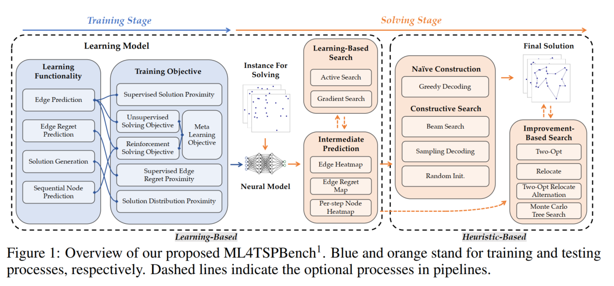

<embed src="f79587e2/Unify_ML4TSP_Drawing_Meth.pdf" width="100%" height="600px" type="application/pdf">

### Key Points
- 解耦训练和求解过程，并分别模块化
- 提出组合优化问题采样不独立的解决方案

### Abstract
本文针对机器学习求解组合优化问题缺乏统一框架的问题，以旅行商问题（TSP）为研究对象，提出模块化框架ML4TSPBench。该框架将主流学习型求解器分解为可组合的设计空间（训练阶段的学习功能/目标 + 求解阶段的构造/改进方法），通过重组技术库验证了四项核心设计原则：  
1. 联合概率估计（Joint Probability Estimation）  
2. 对称解表示（Symmetry Solution Representation）  
3. 在线优化（Online Optimization）  
4. 搜索友好性（Search Friendliness）  
基于原则提出新方法（如节点归一化、对称扩散模型），重组后求解器在TSP-50/100/500上达到SOTA（gap 0.000%/0.001%/0.142%），并验证原则上可推广至车辆路径（CVRP）和最大独立集（MIS）问题。代码已开源。  

### 1. Introduction
背景与问题  
- TSP是ML4CO的典型问题，现有方法包括监督学习、强化学习、生成模型等，但学习与搜索组件交织，难以分析各自贡献。  
- 核心矛盾：训练阶段优化历史实例平均性能，而求解阶段需针对新实例优化，二者目标不一致。  

现有方案局限  
- 方法实现差异大（如自回归 vs. 非自回归），效果不透明，缺乏统一评估框架。  
- 未回答关键问题：学习如何提升求解？什么是优秀学习设计的原则？  

本文方案  
- ML4TSPBench框架：将主流方法分解为模块化设计空间（图1），支持技术重组和透明消融。 
 
- 贡献：  
  - 提炼四项设计原则，通过消融验证其有效性。  
  - 提出新方法（如节点归一化、对称RL目标）。  
  - 重组技术库达到SOTA，开源代码。  

### 2. Background
TSP问题定义  
- 输入：$n$个城市的坐标，边距阵 $\mathbf{D}_{i,j}$。  
- 目标：最小化哈密顿回路长度 $f(\mathbf{X};G)=\sum_{i,j}\mathbf{D}_{i,j}\cdot\mathbf{X}_{i,j}$。  

ML4TSP方法分类  
| 范式             | 代表工作           | 特点                         |
| ---------------- | ------------------ | ---------------------------- |
| 纯在线求解       | LKH-3, Concorde    | 无预训练，依赖手工启发式     |
| 离线学习直接求解 | GCN (Joshi et al.) | 预测解后无搜索               |
| 离线支持在线求解 | 本文框架重点       | 学习引导搜索（如MCTS、扩散） |

与现有框架对比  
- Berto et al. (2023)：仅统一RL模型实现，未分析学习范式。  
- Joshi et al. (2020)：仅分析基础方法，未提设计原则。  

### 3. Method
#### 3.1 训练与求解的模块化  
训练阶段（学习如何从数据中提取启发式规则）  
| 组件     | 选项                            | 功能说明                                                                                           | 代表方法               |
| -------- | ------------------------------- | -------------------------------------------------------------------------------------------------- | ---------------------- |
| 学习功能 | 1. 边预测 (Edge Prediction)     | 预测每条边是否在最优解中（输出热力图 $\mathbf{H}_{i,j}$）                                          | GCN (Joshi et al.)     |
|          | 2. 边遗憾预测 (Edge Regret)     | 预测选择某边的代价增益（$\mathbf{R}_{i,j}=\frac{\text{固定该边后的最优解}}{\text{全局最优解}}-1$） | GNNGLS (Hudson et al.) |
|          | 3. 解生成 (Solution Generation) | 建模高质量解分布 $p(\mathbf{S}                                                                     | G)$（可采样多个解）    | 扩散模型 (Sun & Yang) |
|          | 4. 序列节点预测 (Sequential)    | 自回归生成节点序列（Step-by-Step决策）                                                             | POMO (Kwon et al.)     |
| 训练目标 | 1. 监督解接近 (SL)              | 热力图拟合参考解（交叉熵损失）                                                                     | Att-GCN (Fu et al.)    |
|          | 2. 无监督目标 (UL)              | 直接优化路径长度+约束惩罚（无需参考解）                                                            | UTSP (Min et al.)      |
|          | 3. 强化目标 (RL)                | REINFORCE策略梯度优化期望路径长度                                                                  | AM (Kool et al.)       |
|          | 4. 生成目标 (Generative)        | 扩散模型最大化解似然 $p_\theta(\mathbf{S}\mid G)$                                                  | DIFUSCO (Sun & Yang)   |

求解阶段（利用训练好的模型解决新问题）  
| 组件           | 选项                           | 功能说明                                            |
| -------------- | ------------------------------ | --------------------------------------------------- |
| 基于学习的搜索 | 1. 主动搜索 (Active Search)    | 测试时微调模型参数/热力图                           |
|                | 2. 梯度搜索 (Gradient Search)  | 扩散模型添加目标引导（如T2T的噪声-去噪优化）        |
| 构造方法       | 1. 贪心 (Greedy)               | 选最高置信度边/节点                                 |
|                | 2. 采样 (Sampling)             | 按热力图概率采样边/节点                             |
|                | 3. 波束搜索 (Beam Search)      | 保留Top-K候选解                                     |
| 改进搜索       | 1. 2-opt/重定位 (Local Search) | 交换/移动节点优化路径                               |
|                | 2. MCTS变体                    | 蒙特卡洛树搜索（本文解耦为：构造初始解 + 局部搜索） |

> 传统方法将学习与搜索耦合（如RL序列生成），而本框架将其解耦为独立模块，支持自由重组（例如：扩散模型生成热力图 + MCTS搜索）。

#### 3.2 四项设计原则
##### 原则1：联合概率估计（解决变量独立性假设问题）  
问题：传统边预测方法（如GCN）将每条边 $E_{i,j}$ 是否被选中的概率视为独立事件，使用二元交叉熵损失单独优化：
$$\mathcal{L} = -\sum_{i,j} \left[ \mathbf{S}_{i,j} \log(\hat{\mathbf{H}}_{i,j}) + (1-\mathbf{S}_{i,j}) \log(1-\hat{\mathbf{H}}_{i,j}) \right]$$
其中 $\hat{\mathbf{H}}_{i,j}$ 是模型对边 $E_{i,j}$ 的独立预测概率。

TSP的解必须满足全局约束：每个节点的度（相连边数）必须为 2（入度=出度=1）。边的选择高度相关（例如：若 $E_{i,k}$ 被选，则同节点 $i$ 的其他边概率需调整）。

方案:

节点归一化 (Node Norm)

节点归一化对神经网络原始输出 $\mathbf{F} \in \mathbb{R}^{n\times n}$ 进行以下操作：
$$\mathbf{F}_{i,j}' = \frac{\exp(\mathbf{F}_{i,j})}{\sum_{k=1}^n \exp(\mathbf{F}_{i,k})} \cdot \begin{bmatrix} n-2 \\ 2 \end{bmatrix}$$

第一步：Softmax归一化（行方向）
$$\text{For each node } i: \quad \mathbf{P}_{i,j} = \frac{\exp(\mathbf{F}_{i,j})}{\sum_{k=1}^n \exp(\mathbf{F}_{i,k})}$$
此时 $\sum_{j=1}^n \mathbf{P}_{i,j} = 1$，表示节点 $i$ 的所有出边概率之和为1。

第二步：概率重加权

将 $\mathbf{P}_{i,j}$ 拆分为 “选中概率” 和 “未选中概率” 两个通道：
$\mathbf{F}'_{i,j} = \mathbf{P}_{i,j} \cdot \begin{bmatrix} n-2 & 0 \\ 0 & 2 \end{bmatrix}$
物理意义：

“选中概率”通道：所有边概率和强制为 2（满足节点度=2）。
“未选中概率”通道：所有边概率和强制为 $n-2$（排除其他边）。

最终热力图：$\hat{\mathbf{H}}_{i,j} = \text{Clip}(\mathbf{F}'_{i,j}[\text{selected}])$

效果：TSP-100上SL+Node Norm比原始SL的gap从**7.078%→2.721%**

##### 原则2：对称解表示（解决解的空间对称性）  
问题：同一TSP解有 $2n$ 种等效表示（如不同起点/方向），但模型可能因训练数据偏好特定形式。  
方案：  
  - 生成模型：将扩散模型监督信号从有向图改为无向图（天然对称）。  
  - RL方法：训练时强制随机起点解码（REINFORCE从任意节点开始采样）。  
  - 效果：扩散模型引入对称后，TSP-500构造解gap从**9.639%→6.695%**  

##### 原则3：在线优化（弥合训练与求解目标差异）  
问题：训练优化历史数据平均性能，但求解需针对新实例特化。  
方案：  

| 技术                       | 适用场景        | 操作                                     |
| -------------------------- | --------------- | ---------------------------------------- |
| 主动搜索 (Active Search)   | 边预测/序列预测 | 测试时用RL目标微调热力图（类似训练阶段） |
| 梯度搜索 (Gradient Search) | 生成模型        | 在扩散去噪过程注入目标梯度（见公式5）    |

##### 原则4：搜索友好性（提升学习与搜索协同效率）  
- 方案：  
  - 预测多样性：生成模型采样多个解供改进搜索选择（表2：8×Greedy比单解gap降3.25%）。  
  - 信息增强：预测边遗憾（$\mathbf{R}_{i,j}$）比二值热力图更易引导局部搜索（表5）。  
  - MCTS解耦：将原MCTS拆分为"构造初始解 + 改进搜索"（图8），支持与贪心/采样等方法组合。  

#### 3.3 对问题的泛化性
| 原则         | 泛化问题 | 适配方法                                                       | 效果                                       |
| ------------ | -------- | -------------------------------------------------------------- | ------------------------------------------ |
| 联合概率估计 | MIS      | 用 LinSAT 层 替代节点归一化，约束相邻节点概率和 ≤ 邻接组大小-1 | MIS 构造解 Size↑ 421.692 → 422.098（表10） |
| 对称解表示   | CVRP     | RL 训练时强制 随机起点解码 + 多方向采样                        | CVRP-50 长度 ↓11.138 → 10.605（表11）      |
| 在线优化     | MIS      | 扩散模型添加 梯度搜索（目标引导去噪）                          | MIS 解 Size↑ 424.496 → 425.006（表12）     |
| 搜索友好性   | MIS      | 生成模型 + 8× 贪心采样（提升多样性）                           | MIS 解 Size↑ 424.496 → 425.142（表13）     |

问题适配的技术库组件

| ML4TSPBench 模块 | CVRP 适配                   | MIS 适配                      | 复用性 |
| ---------------- | --------------------------- | ----------------------------- | ------ |
| 学习功能         | 边预测 → 节点-路径分配预测  | 边预测 → 节点选择预测         | 高     |
| 训练目标         | 同 SL/RL/生成目标           | 同 SL/RL/生成目标             | 高     |
| 构造方法         | 贪心/采样需加入容量约束校验 | 贪心/采样需加入独立集约束校验 | 中     |
| 改进搜索         | 2-opt → Relocate/交换路径   | 局部搜索 → 节点增删           | 低     |

> 适配示例：  
> - CVRP：将 TSP 的边热力图 $\mathbf{H}$ 替换为节点-路径分配矩阵，构造时校验车辆容量（如 $\sum \text{需求} \leq \text{容量}$）。  
> - MIS：将扩散模型输出改为 节点选择概率，约束条件改为“相邻节点不同时选中”（LinSAT 实现）。

### 4. Evaluation
实验设置  
- 数据集：TSP-50/100/500（随机均匀坐标），TSP-1000/TSPLIB（泛化测试）。  
- 基线：Concorde（最优解）、LKH-3、GCN、DIMES、DiffUSCO等。  
- 评估指标：相对最优解的gap（Drop↓）、求解时间。  

核心结论  
1. 四项原则的有效性：  
   - 联合概率估计：SL+节点归一化比原始SL在TSP-100上gap降低4.357%（表1）。  
   - 对称性：扩散模型引入对称表示后，TSP-500 gap从9.639%→6.695%（表2）。  
   - 在线优化：主动搜索使RL方法在TSP-50上gap从5.238%→0.823%（表4）。  
   - 搜索友好性：预测边遗憾比预测解在引导搜索上更有效（表5）。  

2. 重组求解器性能：  
   - 最佳组合：SL+节点归一化 + Random_MCTS，TSP-50/100/500 gap达0.000%/0.001%/0.142%（表7）。  
   - 生成模型+梯度搜索：非自回归方法在速度与精度平衡中表现最佳（TSP-500 gap 0.187%）。  

3. 泛化性：  
   - TSPLIB上重组方法gap 1.416%（表8），设计原则在CVRP/MIS问题同样有效（附录C）。  

### 5. Conclusion
1. 框架价值：ML4TSPBench统一了学习与搜索组件的设计空间，首次实现透明消融和技术重组。  
2. 设计原则：联合概率估计、对称性、在线优化和搜索友好性是提升ML4TSP性能的关键。  
3. 性能优势：重组方法在TSP上达SOTA，监督学习与非自回归范式更具优势。  