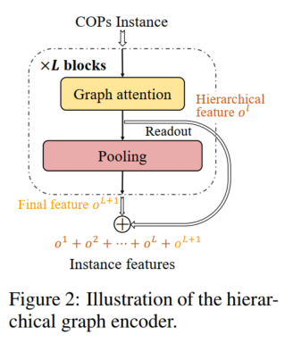

<embed src="366154f0/Neural_Solver_Selection_.pdf" width="100%" height="600px" type="application/pdf">

### Key Points
- 提出在提取问题特征时使用重要性池化来捕捉层次信息
- 提出组件选择时采用排序损失代替分类损失以获得足够优的解

### Abstract
论文提出首个神经求解器协调框架，用于解决组合优化问题（COPs）。核心发现：现有神经求解器在不同问题实例上表现互补，无单一求解器始终最优（图1a）。框架包含：  
1. 特征提取：图注意力编码器 + 分层池化编码器（捕获COP层次结构）  
2. 选择模型：基于分类/排序损失预测求解器适配度  
3. 选择策略：贪心/Top-k/拒绝/Top-p策略平衡效率与效果  
实验结果：在TSP和CVRP上，相比最佳单求解器，最优性差距降低（TSPLIB: 0.88%, CVRPLIB: 0.71%），时间开销仅增2-10%。  

### 1. Introduction
背景与问题：  
- 组合优化问题（COPs，如TSP/CVRP）在物流、制造等领域关键，但传统方法依赖专家设计启发式规则。  
- 神经求解器（如Attention Model, Diffusion Solver）通过端到端学习自动求解，但存在局限：  
  - 不同求解器因归纳偏好差异，在特定实例分布或规模下表现不同（图1a-b）。  
  - 现有集成方法（如Poppy）多样性不足（同架构）且计算开销大（需运行所有求解器）。  

解决方案：  
- 提出框架：首次实现实例级神经求解器选择，包含特征提取、选择模型、策略三组件。  
- 核心贡献：  
  1. 设计分层图编码器提取COP层次特征（优于传统GAT）。  
  2. 验证排序损失比分类损失更鲁棒（利用求解器间优劣关系）。  
  3. 自适应策略（如Top-p）在低额外开销下逼近Oracle性能（表1-2）。  

### 2. Background  
#### 2.1 端到端神经求解器  
| 类型       | 代表方法                  | 原理                          | 局限性                    |
| ---------- | ------------------------- | ----------------------------- | ------------------------- |
| 自回归式   | AM (Kool et al. 2019)     | 逐步扩展解（Encoder-Decoder） | 泛化性差（分布/规模变化） |
|            | Omni (Zhou et al. 2023)   | 元学习提升跨分布泛化          | 训练复杂                  |
| 非自回归式 | GCN (Joshi et al. 2019)   | 热力图预测解分布              | 解质量受限                |
|            | DIFUSCO (Sun & Yang 2023) | 扩散模型生成解分布            | 推理慢                    |

#### 2.2 多求解器协调方法  
- Ensemble Learning (Jiang et al. 2023)：同架构集成 → 多样性不足。  
- Poppy (Grinsztajn et al. 2023)：共享编码器的多解码器 → 计算开销大。  
- 本文创新点：异构求解器池 + 选择而非全运行 → 兼顾性能与效率。  

### 3. Method  

#### 3.1 特征提取
问题：  
- 传统方法局限：普通图注意力网络（GAT）对节点嵌入平均池化 → 丢失空间层次信息（如TSP中的城市集群结构）。  
- 关键观察：COP最优解常具层次性（如CVRP中先服务密集区域，再连接偏远节点）。  

设计：分层图编码器  

为什么有效？  
- 池化层作用：自动识别代表性节点（如聚类中心、边界点）→ 图6可视化显示其捕获空间结构（集群/几何模式）。  
- 多级聚合：融合局部细节（Block1）与全局抽象（Block2）→ 提升跨分布泛化（表3：CVRPLIB差距↓0.11%）。  

> 实验验证：对比手工特征（统计量）和普通GAT，分层编码器在TSPLIB上差距降低32%（1.83%→1.33%），证明其对复杂空间模式的建模能力。Figure 6 展示了编码器保留的点，可以看出其确实捕获了问题的层次结构信息。

#### 3.2 排序损失
问题：  
- 分类损失局限：仅预测最优求解器 → 忽略次优求解器的价值（图1a显示前两名求解器差距常<5%）。  
- 关键需求：需利用求解器间相对优劣关系提升鲁棒性。  

设计：排序损失
- 输入：实例特征 $h_I$ + 规模 $N$ → MLP输出求解器评分 $s_i = \text{MLP}(h_I, N)$  
- 排序损失函数（Listwise Ranking）：  
  $$  
  \mathcal{L} = -\mathbb{E}_I \left[ \sum_{i=1}^M \log \frac{\exp(s_{\phi_I(i)})}{\sum_{j=i}^M \exp(s_{\phi_I(j)})} \right]  
  $$  
  - $\phi_I$：实例 $I$ 上求解器的真实排序（按目标值升序）  
  - $s_{\phi_I(i)}$：排名第 $i$ 的求解器得分  

为什么比分类损失更好？  
1. 利用子排序信息：强制模型学习“第2名比第3名更适配”的细粒度关系。  
2. 错误选择缓冲：当最优求解器预测失败时，高分次优求解器仍可能产出优质解（表1：Top-k策略下排序损失比分类差距↓0.3%）。  
3. 跨分布稳定性：在TSPLIB上，排序损失错误选择率比分类低15%（附录A.8）。  

#### 3.3 选择策略
问题：  
- 计算-效果权衡：Top-k策略虽可靠但开销大（$k=2$ 时时间翻倍）。  
- 关键洞察：选择模型置信度方差大（图4：Softmax响应在[0.1,0.9]波动）→ 需区分高低风险实例。  

设计创新：拒绝策略 & Top-p策略  
| 策略      | 数学表达                                                                | 解决什么问题？                   |
| --------- | ----------------------------------------------------------------------- | -------------------------------- |
| 拒绝策略  | 若 $\max(\text{Softmax}(s)) < \tau$ → 启用Top-k                         | 隔离低置信度实例（20%阈值）      |
| Top-p策略 | 选最小集合 $\mathcal{S}$ 满足 $\sum_{i \in \mathcal{S}} p_i \geq \beta$ | 动态调整求解器数量（按概率质量） |

意义：  
- 拒绝策略：仅对20%高风险实例启用Top-k → 时间开销仅增40%，覆盖80%错误选择风险（图4曲线）。  
- Top-p策略：概率质量阈值 $\beta$ 取代固定 $k$ → 适配求解器置信度分布差异（如TSP需 $\beta=0.5$，CVRP需 $\beta=0.8$）。  

> 设计依据：图1a显示5个求解器在CVRP实例上胜率均<35% → 单一求解器失败率高 → 必须多求解器后备。  

### 4. Evaluation  
#### 实验设置  
- 数据集：  
  - 训练：10k合成实例（高斯混合分布，$N\sim U[50,500]$）。  
  - 测试：合成测试集 + 跨分布基准（TSPLIB/CVRPLIB, $N\leq1002$）。  
- 求解器池：7个TSP求解器（BQ, LEHD, DIFUSCO等）+ 5个CVRP求解器（表4）。  
- 对比基准：Oracle（全运行选最优）、单求解器、静态Portfolio。  

#### 关键结果  
| 指标                 | TSP (合成) | CVRP (合成) | TSPLIB | CVRPLIB |
| -------------------- | ---------- | ----------- | ------ | ------- |
| 最佳单求解器差距     | 2.33%      | 6.82%       | 1.95%  | 6.10%   |
| 本文框架差距         | 1.51%      | 4.82%       | 1.07%  | 5.39%   |
| 时间开销 vs 单求解器 | +80%       | +180%       | +42%   | +95%    |

核心结论：  
1. 泛化性：在分布外数据（TSPLIB）差距降低45%（1.95%→1.07%）。  
2. 策略对比：  
   - Top-k(k=2) 效果最优 → 但贪心 + 拒绝策略性价比更高（时间增40%，差距降30%）。  
3. 组件消融：  
   - 分层编码器比普通GAT在CVRPLIB差距降0.11%（表3）。  
   - 排序损失比分类损失在跨分布数据更稳定（表2）。  

### 5. Conclusion  
1. 技术亮点：  
   - 分层图编码器捕获COP层次结构 → 提升特征表达能力。  
   - 排序损失 + 自适应策略 → 平衡效率与效果。  
2. 未来方向：  
   - 求解器特征提取：用LLM编码求解器代码/参数，支持零样本泛化（附录A.9）。  
   - 运行时感知选择：权衡求解器时间成本与解质量（针对学习搜索类求解器）。  
   - 求解器池增强：微调或训练新求解器最大化互补性。  
