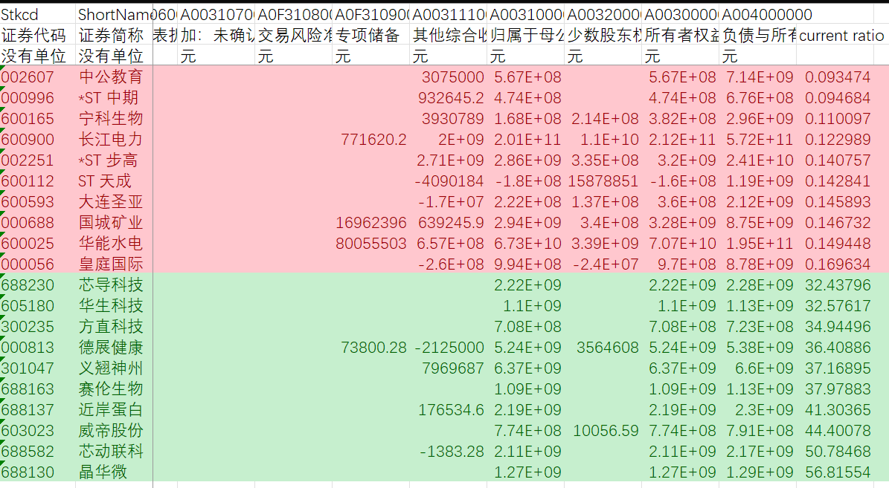

# Class 2: Investing and Financing Decisions and the Accounting System

## 1. 课程核心与框架
- 本节课旨在理解会计系统如何记录企业的**投资**（购买长期资源）和**融资**（获取资金）活动。
- 整个课程围绕**会计恒等式**展开，并引入了记录交易的核心工具：**会计分录**和**T型账户**。

## 2. 会计基础概念
- **关键会计假设**：
    - 会计主体假设：界定会计记录的空间范围。
    - 持续经营假设：假定企业会持续运营下去。
    - 会计分期假设：将连续经营划分为等长的期间。
    - 货币计量假设：以货币为统一计量单位。
- **资产负债表要素**：
    - **资产**：企业拥有或控制的、能带来未来经济利益的资源。
        - **流动资产**（如现金、应收账款）
        - **非流动资产**（如房产、设备、无形资产）
    - **负债**：企业需在未来偿付的现时义务。
        - **流动负债**（一年内到期）
        - **非流动负债**（一年后到期）
    - **所有者权益**：资产扣除负债后由所有者享有的剩余权益。
        - **实收资本**：所有者投入的资本（如普通股、资本公积）。
        - **留存收益**：企业经营赚取的、未以股利形式分配的累计净利润。
        - **库存股**：公司回购的自身股票，是所有者权益的**减项**。
- **商业交易**：能够改变企业财务状况（即影响资产、负债或所有者权益）的事件。

## 3. 核心工具与方法论
- **交易分析原则**：
    - **双重影响原则**：每一笔交易都**至少**影响两个会计项目，保持会计恒等式始终平衡。
    - **分析三步法**：
        - **步骤1**：识别“收到了什么？”（账户、分类、增减方向）
        - **步骤2**：识别“付出了什么？”（账户、分类、增减方向）
        - **步骤3**：验证会计等式是否仍然平衡。
- **会计分录**：
    - 按时间顺序记录交易的正式会计方法。
    - 规则：**有借必有贷，借贷必相等**。
    - **借贷规则**：
        - **资产**和**费用**：增加记**借方**，减少记**贷方**。
        - **负债**、**所有者权益**和**收入**：增加记**贷方**，减少记**借方**。
- **T型账户**：
    - 用于汇总特定账户在特定期间内所有增减变化的工具。
    - 左边为**借方**，右边为**贷方**。
    - 期末余额 = 期初余额 + 同侧发生额 - 异侧发生额。

## 4. Chipotle交易案例详解

所有交易均被设定发生在Chipotle公司2019年资产负债表日（12月31日）之后的第一季度（2020年1月至3月）。

### **交易 (a)：通过增发股票进行股权融资**

*   **交易情景**： Chipotle公司向市场**公开发行了100股新的普通股**。投资者为每股支付0.17美元，尽管其面值仅为0.01美元。公司成功募集了17美元的现金。
*   **会计本质**： **融资活动**。
*   **交易分析**：
    *   **收到什么？** 现金（资产增加）。
    *   **给出什么？** 公司股票的所有权（所有者权益增加）。面值部分计入“普通股”，超额部分计入“资本公积”。
*   **会计分录**：
    *   借：现金 (+A) 17
    *   贷：普通股 (+SE) 1 (100股 × $0.01面值)
    *   贷：资本公积 (+SE) 16 (100股 × $0.16溢价)
*   **T型账户变动**：
    *   **现金 (Asset)**
        *   借方 (增加)： 17
    *   **普通股 (Stockholders' Equity)**
        *   贷方 (增加)： 1
    *   **资本公积 (Stockholders' Equity)**
        *   贷方 (增加)： 16

### **交易 (b)：从银行获取长期贷款**

*   **交易情景**： Chipotle从其当地银行**获得了400万美元的贷款**，并签署了一份正式票据，承诺在三年后偿还。
*   **会计本质**： **融资活动**。
*   **交易分析**：
    *   **收到什么？** 现金（资产增加）。
    *   **给出什么？** 一个在未来付款的承诺（负债增加）——应付票据。
*   **会计分录**：
    *   借：现金 (+A) 4
    *   贷：应付票据 (+L) 4
*   **T型账户变动**：
    *   **现金 (Asset)**
        *   借方 (增加)： 4
    *   **应付票据 (Liability)**
        *   贷方 (增加)： 4

### **交易 (c)：用现金购买长期经营资产**

*   **交易情景**： Chipotle**用现金购买了价值2600万美元的新厨房设备和500万美元的无形资产**。
*   **会计本质**： **投资活动**。
*   **交易分析**：
    *   **收到什么？** 设备（资产增加）和无形资产（资产增加）。
    *   **给出什么？** 现金（资产减少）。
*   **会计分录**：
    *   借：设备 (+A) 26
    *   借：无形资产 (+A) 5
    *   贷：现金 (-A) 31
*   **T型账户变动**：
    *   **设备 (Asset)**
        *   借方 (增加)： 26
    *   **无形资产 (Asset)**
        *   借方 (增加)： 5
    *   **现金 (Asset)**
        *   贷方 (减少)： 31

### **交易 (d)：通过租赁获得新餐厅场地**

*   **交易情景**： Chipotle签署了多份租赁协议，租用了价值2000万美元的土地和4000万美元的建筑物。公司为此**支付了2900万美元的首期租金**，并将剩余的1.17亿美元确认为租赁负债。
*   **会计本质**： 混合活动（**投资**与**融资**）。
*   **交易分析**：
    *   **收到什么？** 土地的使用权、建筑物的使用权、以及租赁协议赋予的“使用权资产”（资产增加）。
    *   **给出什么？** 部分现金（资产减少），以及签署租赁合同所产生的付款义务（负债增加）。
*   **会计分录**：
    *   借：土地 (+A) 20
    *   借：建筑物 (+A) 40
    *   借：经营租赁使用权资产 (+A) 86
    *   贷：现金 (-A) 29
    *   贷：流动租赁负债 (+L) 6
    *   贷：长期租赁负债 (+L) 111
*   **T型账户变动**：
    *   **土地 (Asset)**
        *   借方 (增加)： 20
    *   **建筑物 (Asset)**
        *   借方 (增加)： 40
    *   **经营租赁使用权资产 (Asset)**
        *   借方 (增加)： 86
    *   **现金 (Asset)**
        *   贷方 (减少)： 29
    *   **流动租赁负债 (Liability)**
        *   贷方 (增加)： 6
    *   **长期租赁负债 (Liability)**
        *   贷方 (增加)： 111

### **交易 (e)：出售短期投资以获取现金**

*   **交易情景**： Chipotle**出售了其原始成本为1900万美元的短期投资**，出售时市价也是1900万美元，因此不产生盈亏。
*   **会计本质**： **投资活动**。
*   **交易分析**：
    *   **收到什么？** 现金（资产增加）。
    *   **给出什么？** 短期投资（资产减少）。
*   **会计分录**：
    *   借：现金 (+A) 19
    *   贷：短期投资 (-A) 19
*   **T型账户变动**：
    *   **现金 (Asset)**
        *   借方 (增加)： 19
    *   **短期投资 (Asset)**
        *   贷方 (减少)： 19

### **交易 (f)：偿还部分银行借款本金**

*   **交易情景**： Chipotle**向银行偿还了100万美元的贷款本金**。
*   **会计本质**： **融资活动**。
*   **交易分析**：
    *   **收到什么？** 债务的减少（负债减少）。
    *   **给出什么？** 现金（资产减少）。
*   **会计分录**：
    *   借：应付票据 (-L) 1
    *   贷：现金 (-A) 1
*   **T型账户变动**：
    *   **应付票据 (Liability)**
        *   借方 (减少)： 1
    *   **现金 (Asset)**
        *   贷方 (减少)： 1

### **交易 (g)：回购公司自身股票（库存股）**

*   **交易情景**： Chipotle在公开市场上**回购了价值1.03亿美元的自身股票**。
*   **会计本质**： **融资活动**。
*   **交易分析**：
    *   **收到什么？** 公司自身的股票（库存股，是所有者权益的**抵减项**，其增加意味着所有者权益**减少**）。
    *   **给出什么？** 现金（资产减少）。
*   **会计分录**：
    *   借：库存股 (-SE) 103
    *   贷：现金 (-A) 103
*   **T型账户变动**：
    *   **库存股 (Stockholders' Equity)**
        *   借方 (增加/权益减少)： 103
    *   **现金 (Asset)**
        *   贷方 (减少)： 103

### **交易 (h)：董事会宣告发放现金股利**

*   **交易情景**： Chipotle的**董事会宣告**，将在下一季度向股东支付总计200万美元的现金股利。请注意，这只是**宣告**，并非实际支付。
*   **会计本质**： **融资活动**。
*   **交易分析**：
    *   **收到什么？** 在宣告日，公司**产生了一项法定的支付义务**（负债增加）。
    *   **给出什么？** 由于这笔未来的支付来源于公司的累积利润，因此宣告的瞬间，留存收益就减少了（所有者权益减少）。
*   **会计分录**：
    *   借：留存收益 (-SE) 2
    *   贷：应付股利 (+L) 2
*   **T型账户变动**：
    *   **留存收益 (Stockholders' Equity)**
        *   借方 (减少)： 2
    *   **应付股利 (Liability)**
        *   贷方 (增加)： 2

## 5. 从交易到财务报表
- **试算平衡表**：
    - 在将所有交易过入T型账户后，汇总计算每个账户的期末余额。
    - 目的是**检验所有分录的借贷方总额是否相等**，确保记账过程的数学准确性。
- **分类资产负债表**：
    - 根据试算平衡表的数据，按照**流动性**对资产和负债进行分类编制。
    - **关键变化分析（对比2019年底和2020年第一季度末）**：
        - **现金**减少：因大规模投资和股票回购。
        - **总资产**微升：通过租赁和再投资，抵消了现金流出。
        - **总负债**上升：主要因长期租赁负债增加。
        - **所有者权益**下降：主要因大规模股票回购超过了净收益和发行新股的影响。

## 6. 财务分析与国际视角
- **流动性比率**：
    - **流动比率** = 流动资产 / 流动负债。衡量短期偿债能力。
    - **速动比率** = (流动资产 - 存货) / 流动负债。更严格的短期偿债能力指标。
    - 银行常通过债务契约要求借款企业维持特定流动性比率。
- **国际视角**：
    - **GAAP（美国准则）** 与 **IFRS（国际准则）** 在资产负债表列报顺序上不同。
        - GAAP按流动性**降序**排列（流动资产在前）。
        - IFRS按流动性**升序**排列（非流动资产在前）。

## 7. 总结
- 本节课通过Chipotle案例，完整展示了企业投资和融资活动的会计循环：
    **商业交易发生** → **双重影响分析** → **会计分录记录** → **T型账户汇总** → **试算平衡表检验** → **分类资产负债表生成**。
- 这是财务会计的基石，对于理解财务报表和决策影响至关重要。

# 作业
请计算FS_Combas数据中各公司的流动比率；找出流动比率最高的前5家公司和最低的后5家公司；并结合你的研究，尝试解释这些公司为何具有极端的流动性比率。

计算结果如下：

基于流动比率数据，极端值公司可归因于其行业特性、经营状况与资本结构。

**流动比率最低的五家公司**（如中公教育、*ST中期、宁科生物、长江电力、*ST步高）普遍面临短期偿债压力。其中，中公教育受政策调整影响，预收款项大幅下降；多家ST公司因持续亏损、资产质量恶化，导致流动资产严重缩水；长江电力虽盈利稳定，但属重资产公用事业企业，长期负债高、流动资产占比低，故流动比率天然偏低。

**流动比率最高的五家公司**（如晶华微、芯动联科、近岸蛋白、赛伦生物、威帝股份）多为近年上市的科技或生物医药企业。其高比率主要源于IPO募集资金尚未大规模投入项目，账面现金及等价物充裕，同时短期负债极少。此类公司处于轻资产、低杠杆阶段，流动性充裕但未必反映运营效率。

综上，极端流动比率并非孤立财务现象，而是企业所处生命周期、行业属性及融资策略的综合体现。低比率需警惕流动性风险，高比率则应关注资金使用效率。