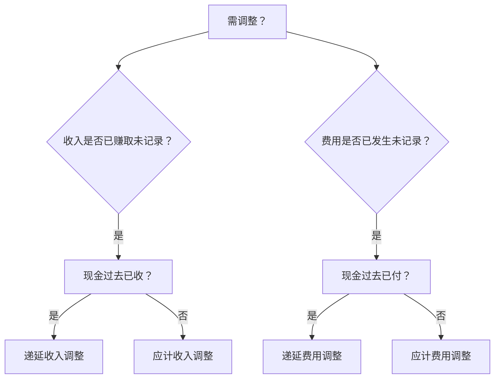

# Class 4: Adjustments, Financial Statements, and the Closing Process

## **第一部分：调整分录（Adjustments）**
### **1. 调整目的与原则**
- **核心目标**：
  - 确保收入在赚取时记录（收入确认原则）
  - 确保费用在发生时记录（费用匹配原则）
  - 准确计量资产（未来经济利益）和负债（未来义务）
- **操作逻辑**：
  - 现金交易与收入/费用确认时间错位时需调整
  - **现金从不参与调整分录**（已在过去记录或将在未来记录）

### **2. 四种调整类型及决策树**


## **Chipotle公司9个调整分录案例**

### **A. 递延收入（Deferred Revenues）**
#### **AJE 1：礼品卡兑换（$52）**
1. **情景描述**  
   - 期初预收账款（Unearned Revenue）余额$130（客户购买礼品卡支付的现金）
   - 本季度客户兑换$52礼品卡消费餐饮服务

2. **分析逻辑**  
   - 现金已在过去收到 → 属于递延收入调整  
   - 需将已赚取部分从负债转为收入：$52

3. **账户变化**  
   | 账户名称                                 | 调整方向     | 金额 | 调整后余额   |
   | ---------------------------------------- | ------------ | ---- | ------------ |
   | 预收收入（Unearned Revenue）             | 借 (-L)      | 52   | $78（贷）    |
   | 餐厅销售收入（Restaurant Sales Revenue） | 贷 (+R, +SE) | 52   | $1,411（贷） |


### **B. 应计收入（Accrued Revenues）**
#### **AJE 2：短期投资利息（$1）**
1. **情景描述**  
   - 短期投资产生$1利息收入  
   - 现金将在下季度收到

2. **分析逻辑**  
   - 收入已赚取但现金未收 → 属于应计收入调整  
   - 需确认应收利息资产和利息收入

3. **账户变化**  
   | 账户名称                        | 调整方向     | 金额 | 调整后余额 |
   | ------------------------------- | ------------ | ---- | ---------- |
   | 应收利息（Interest Receivable） | 借 (+A)      | 1    | $1（借）   |
   | 利息收入（Interest Revenue）    | 贷 (+R, +SE) | 1    | $4（贷）   |


### **C. 递延费用（Deferred Expenses）**
#### **AJE 3：物料消耗（$462）**
1. **情景描述**  
   - 物料账户期初余额$485（食品/饮料存货）  
   - 期末盘点剩余$23 → 消耗$462

2. **分析逻辑**  
   - 现金已付但费用未确认 → 属于递延费用调整  
   - 消耗物料转为费用

3. **账户变化**  
   | 账户名称                     | 调整方向     | 金额 | 调整后余额 |
   | ---------------------------- | ------------ | ---- | ---------- |
   | 物料费用（Supplies Expense） | 借 (+E, -SE) | 462  | $462（借） |
   | 物料存货（Supplies）         | 贷 (-A)      | 462  | $23（借）  |

#### **AJE 4：预付费用摊销（$185）**
1. **情景描述**  
   - 预付费用$292包含：  
     - 预付租金$128（每月$32，已用3个月）  
     - 预付保险$96（6个月保单，已用3个月）  
     - 预付广告$41（本季发生）  

2. **分析逻辑**  
   - 现金已付但服务已消耗 → 按比例确认费用  
   - 租金：$32×3=$96；保险：$96×3/6=$48

3. **账户变化**  
   | 账户名称                        | 调整方向     | 金额 | 调整后余额 |
   | ------------------------------- | ------------ | ---- | ---------- |
   | 租金费用（Rent Expense）        | 借 (+E, -SE) | 96   | $96（借）  |
   | 保险费用（Insurance Expense）   | 借 (+E, -SE) | 48   | $48（借）  |
   | 广告费用（Advertising Expense） | 借 (+E, -SE) | 41   | $41（借）  |
   | 预付费用（Prepaid Expenses）    | 贷 (-A)      | 185  | $107（借） |

#### **AJE 5：折旧费用（$58）**
1. **情景描述**  
   - 年折旧额$232 → 季度折旧$58（$232×3/12）  
   - 影响建筑物和设备净值

2. **分析逻辑**  
   - 固定资产成本分摊 → 属于递延费用调整  
   - 累计折旧是资产抵减账户（XA）

3. **账户变化**  
   | 账户名称                             | 调整方向     | 金额 | 调整后余额   |
   | ------------------------------------ | ------------ | ---- | ------------ |
   | 折旧费用（Depreciation Expense）     | 借 (+E, -SE) | 58   | $58（借）    |
   | 累计折旧（Accumulated Depreciation） | 贷 (+XA, -A) | 58   | $1,259（贷） |


### **D. 应计费用（Accrued Expenses）**
#### **AJE 6：应付工资（$52）**
1. **情景描述**  
   - 季末2天工资未支付（$26/天）  
   - 现金将在下季度支付

2. **分析逻辑**  
   - 费用已发生但现金未付 → 属于应计费用调整  
   - 确认负债（应付工资）

3. **账户变化**  
   | 账户名称                  | 调整方向     | 金额 | 调整后余额 |
   | ------------------------- | ------------ | ---- | ---------- |
   | 工资费用（Wages Expense） | 借 (+E, -SE) | 52   | $394（借） |
   | 应付工资（Wages Payable） | 贷 (+L)      | 52   | $132（贷） |

#### **AJE 7：应付利息（$1）**
1. **情景描述**  
   - 长期债务$80（利率5%）  
   - 季度应付利息：$80×5%×3/12=$1

2. **分析逻辑**  
   - 利息随时间累积 → 需计提未付利息

3. **账户变化**  
   | 账户名称                     | 调整方向     | 金额 | 调整后余额 |
   | ---------------------------- | ------------ | ---- | ---------- |
   | 利息费用（Interest Expense） | 借 (+E, -SE) | 1    | $1（借）   |
   | 应付利息（Interest Payable） | 贷 (+L)      | 1    | $1（贷）   |

#### **AJE 8：应付水电费（$15）**
1. **情景描述**  
   - 收到水电费账单$15（本季消耗）  
   - 现金下季度支付

2. **分析逻辑**  
   - 服务已使用但未付款 → 确认应计负债

3. **账户变化**  
   | 账户名称                        | 调整方向     | 金额 | 调整后余额 |
   | ------------------------------- | ------------ | ---- | ---------- |
   | 水电费用（Utilities Expense）   | 借 (+E, -SE) | 15   | $132（借） |
   | 应付水电费（Utilities Payable） | 贷 (+L)      | 15   | $146（贷） |

#### **AJE 9：应付所得税（$15）**
1. **情景描述**  
   - 本季度利润产生所得税$15  
   - 税款将在下季度缴纳

2. **分析逻辑**  
   - 税费基于已实现利润 → 需计提未付税款

3. **账户变化**  
   | 账户名称                           | 调整方向     | 金额 | 调整后余额 |
   | ---------------------------------- | ------------ | ---- | ---------- |
   | 所得税费用（Income Tax Expense）   | 借 (+E, -SE) | 15   | $15（借）  |
   | 应交所得税（Income Taxes Payable） | 贷 (+L)      | 15   | $15（贷）  |


### **调整分录核心总结**
| **特征**       | **说明**                                                                       | **案例体现**                       |
| -------------- | ------------------------------------------------------------------------------ | ---------------------------------- |
| **现金处理**   | 调整分录永不涉及现金账户（现金已在过去记录或将在未来记录）                     | 所有9个AJE均无现金科目             |
| **账户组合**   | 每个调整分录至少包含1个利润表账户（收入/费用）和1个资产负债表账户（资产/负债） | AJE 1：收入+负债；AJE 3：费用+资产 |
| **伦理风险**   | 管理层可能操纵调整（如延迟确认费用或虚增收入）                                 | 安然事件（提前确认收入）           |
| **折旧特殊性** | 累计折旧是资产抵减账户（XA），净值=原值-累计折旧                               | AJE 5：净值$1,466（$2,725-$1,259） |
| **漏调后果**   | 未做应计费用调整 → 费用低估、净利润高估、股东权益虚增                          | 未做AJE 6：工资费用少计$52         |

> **关键结论**：调整分录是权责发生制的核心工具，确保收入/费用在发生时（而非现金收付时）被记录，解决时间错配问题。所有调整均通过"情景→分析→账户变化"逻辑实现会计等式平衡。


## **第二部分：财务报表编制（Financial Statements）**
### **1. 利润表（Income Statement）**
**情景**：基于Chipotle公司调整后数据编制季度利润表  
**分析**：收入与费用匹配原则，展示经营成果  

**关键数据表格**：  
| 项目                                     | 金额（百万美元） | 计算逻辑                 |
| ---------------------------------------- | ---------------- | ------------------------ |
| 餐厅销售收入（Restaurant Sales Revenue） | 1,411            | 含AJE 1调整$52           |
| **减：营业费用**                         |                  |                          |
| 物料费用（Supplies Expense）             | 462              | AJE 3调整                |
| 工资费用（Wages Expense）                | 394              | 含AJE 6调整$52           |
| 租金费用（Rent Expense）                 | 96               | AJE 4调整                |
| 水电费用（Utilities Expense）            | 132              | 含AJE 8调整$15           |
| 折旧费用（Depreciation Expense）         | 58               | AJE 5调整                |
| **营业利润（Income from Operations）**   | 71               | =1,411 - 1,340           |
| 加：利息收入（Interest Revenue）         | 4                | AJE 2调整                |
| 减：利息费用（Interest Expense）         | (1)              | AJE 7调整                |
| **税前利润（Income Before Tax）**        | 74               | =71 +4 -1                |
| 减：所得税费用（Income Tax Expense）     | (15)             | AJE 9调整                |
| **净利润（Net Income）**                 | **59**           |                          |
| 每股收益（EPS）                          | $0.39            | =59 ÷ 流通股数（未披露） |


### **2. 股东权益变动表（Statement of Stockholders' Equity）**
**情景**：展示股东权益季度变化（Chipotle公司）  
**分析**：净利润转入留存收益，其他权益项目不变  

**账户变化表格**：  
| 项目                                   | 期初余额（2019.12.31） | 本期变动 | 期末余额（2020.3.31） |
| -------------------------------------- | ---------------------- | -------- | --------------------- |
| 普通股（Common Stock）                 | 1                      | 0        | 1                     |
| 资本公积（Additional Paid-in Capital） | 1,466                  | 0        | 1,482                 |
| 库存股（Treasury Stock）               | (2,699)                | (103)    | (2,802)               |
| **留存收益（Retained Earnings）**      | 2,914                  | **+59**  | **2,973**             |
| **股东权益合计**                       | 1,684                  | -44      | 1,655                 |

> **注**：留存收益增加$59（净利润），库存股回购导致权益减少$103。


### **3. 资产负债表（Balance Sheet）**
**情景**：基于调整后试算平衡表编制（Chipotle公司）  
**分析**：反映期末资产、负债及股东权益  

**关键项目表格**：  
| **资产（Assets）**                   | 金额      | **负债与权益（Liabilities & Equity）**      | 金额      |
| ------------------------------------ | --------- | ------------------------------------------- | --------- |
| **流动资产**                         |           | **流动负债**                                |           |
| 现金（Cash）                         | 500       | 应付账款（Accounts Payable）                | 130       |
| 短期投资（Short-term Investments）   | 381       | 预收收入（Unearned Revenue）                | 78        |
| 应收账款（Accounts Receivable）      | 64        | 应付工资（Wages Payable）                   | 132       |
| **物料存货（Supplies）**             | **23**    | 应交所得税（Income Taxes Payable）          | **15**    |
| **流动资产合计**                     | **1,076** | **流动负债合计**                            | **683**   |
|                                      |           |                                             |           |
| **非流动资产**                       |           | **非流动负债**                              |           |
| 不动产（PPE）净值                    | 1,466     | 长期票据（Notes Payable）                   | 80        |
| 累计折旧（Accumulated Depreciation） | (1,259)   | 长期租赁负债（Long-term Lease Liabilities） | 2,789     |
| **总资产**                           | **5,207** | **负债与权益总计**                          | **5,207** |

> **注**：  
> - 物料存货$23（AJE 3调整后）  
> - 应交所得税$15（AJE 9新增）  
> - 资产=负债+股东权益严格平衡（$5,207）


## **第三部分：结账流程（Closing Process）**
### **1. 结账目的与步骤**
**情景**：会计期末关闭临时账户  
**分析**：  
1. 归零所有临时账户（收入、费用）  
2. 将净利润转入留存收益  

**结账分录（Chipotle案例）**：  
```markdown
借：餐厅销售收入（-R）      1,411  
    利息收入（-R）            4  
贷：各类费用账户（-E）        1,356  # 9项费用总和  
    留存收益（+SE）            59  
```

### **2. 结账前后账户对比**
| 账户类型     | 代表账户     | 调整前余额   | 结账操作      | 结账后余额       |
| ------------ | ------------ | ------------ | ------------- | ---------------- |
| **收入账户** | 餐厅销售收入 | $1,411（贷） | 借方转出      | $0               |
|              | 利息收入     | $4（贷）     | 借方转出      | $0               |
| **费用账户** | 物料费用     | $462（借）   | 贷方转出      | $0               |
|              | 工资费用     | $394（借）   | 贷方转出      | $0               |
|              | 所得税费用   | $15（借）    | 贷方转出      | $0               |
| **永久账户** | 留存收益     | $2,914（贷） | 接受净利润$59 | **$2,973（贷）** |

### **3. 结账后试算平衡表（Post-Closing Trial Balance）**
**作用**：验证结账后借贷平衡（仅永久账户有余额）  
**Chipotle关键账户余额**：  
| 账户                                 | 余额方向 | 金额      |
| ------------------------------------ | -------- | --------- |
| 现金（Cash）                         | 借       | 500       |
| 物料存货（Supplies）                 | 借       | 23        |
| 累计折旧（Accumulated Depreciation） | 贷       | 1,259     |
| 应付工资（Wages Payable）            | 贷       | 132       |
| 留存收益（Retained Earnings）        | 贷       | **2,973** |
| **总计**                             |          | **5,207** |

> **验证**：借贷总额相等（$5,207），临时账户余额为零。


## **第四部分：总资产周转率（Total Asset Turnover Ratio）**
### **1. 公式与解读**
**情景**：评估资产使用效率（Chipotle公司）  
**公式**：  
$$ \text{总资产周转率} = \frac{\text{销售收入}}{\text{平均总资产}} $$  
**其中**：  
$$ \text{平均总资产} = \frac{\text{期初资产} + \text{期末资产}}{2} $$  

### **2. Chipotle计算案例**
| 项目                     | 金额（百万美元） | 数据来源               |
| ------------------------ | ---------------- | ---------------------- |
| 销售收入                 | 1,411            | 利润表                 |
| 期初总资产（2019.12.31） | 5,106            | 资产负债表（上期期末） |
| 期末总资产（2020.3.31）  | **5,207**        | 本期资产负债表         |
| **平均总资产**           | **5,156.5**      | =(5,106 + 5,207)/2     |
| **周转率**               | **0.27**         | =1,411 ÷ 5,156.5       |

### **3. 陷阱题解析**
**问题**：年末购入大型资产对周转率的影响？  
**选项**：  
- A. 提高  
- B. 不变  
- C. 降低  
- D. 不确定  

**答案**：C（降低）  
**推理**：  
- 分母（平均总资产）因期末资产增加而上升  
- 分子（销售收入）不变 → 比率下降  

**案例模拟**：  
- 若期末额外购入$500资产 → 平均资产=$5,406.5  
- 新周转率=1,411 ÷ 5,406.5 ≈ 0.26（原0.27）  


## **综合总结**
| **模块**         | **核心要点**                                                     | **Chipotle案例关键值**    |
| ---------------- | ---------------------------------------------------------------- | ------------------------- |
| **财务报表编制** | 三大报表钩稽关系：利润表净利润→股东权益变动表→资产负债表留存收益 | 净利润$59 → 留存收益增$59 |
| **结账流程**     | 关闭临时账户（收入/费用），净利润转入留存收益                    | 9个费用账户归零           |
| **资产周转率**   | 比率=销售收入/平均总资产，衡量资产创收效率                       | 季度周转率0.27            |
| **实务警示**     | 未调整应计费用→低估负债/高估利润；年末突击购资产→人为降低周转率  | 未做AJE 6虚增利润$52      |

> **结论**：会计调整确保权责发生制执行，财务报表真实反映企业状况，结账流程为下一周期重置账户，周转率则量化资产运营效率。四部分环环相扣，构成完整会计循环。


# 作业
## M4-1
| Definition | Term                                                           |
| ---------- | -------------------------------------------------------------- |
| D          | (1) A revenue not yet earned; collected in advance.            |
| C          | (2) Rent not yet collected; already earned.                    |
| A          | (3) Property taxes incurred; not yet paid.                     |
| D          | (4) Rent revenue collected; not yet earned.                    |
| A          | (5) An expense incurred; not yet paid or recorded.             |
| B          | (6) Office supplies on hand to be used next accounting period. |
| B          | (7) An expense not yet incurred; paid in advance.              |
| C          | (8) A revenue earned; not yet collected.                       |


## E4-2
Facebook, Inc.（也拥有Instagram、Messenger、WhatsApp和Oculus等虚拟现实产品）的收入主要来源于向营销人员出售广告位。下表是Facebook使用的账户列表，假设这些余额在最近一个财年12月31日结束时尚未调整。

**FACEBOOK, INC.**  
**Unadjusted Trial Balance (in millions of dollars)**  
**At December 31**

| Account                                         | Debit       | Credit      |
| ----------------------------------------------- | ----------- | ----------- |
| Cash                                            | 17,576      |             |
| Marketable securities (short-term investments)  | 44,378      |             |
| Accounts receivable                             | 11,335      |             |
| Prepaid expenses and other current assets       | 2,381       |             |
| Land                                            | 1,326       |             |
| Buildings                                       | 35,264      |             |
| Network, computer, and office equipment         | 24,461      |             |
| Accumulated depreciation                        |             | 15,418      |
| Operating lease right-of-use assets             | 9,348       |             |
| Intangible assets                               | 19,673      |             |
| Other assets                                    | 2,758       |             |
| Accounts payable                                |             | 1,331       |
| Operating lease liabilities, current            |             | 1,023       |
| Accrued expenses and other current liabilities  |             | 11,152      |
| Deferred revenue and deposits                   |             | 382         |
| Other current liabilities                       |             | 1,093       |
| Operating lease liabilities, noncurrent         |             | 9,631       |
| Other liabilities                               |             | 6,414       |
| Common stock                                    |             | 1           |
| Additional paid-in capital                      |             | 50,017      |
| Retained earnings                               |             | 42,892      |
| Revenue                                         |             | 85,965      |
| Interest and other income                       |             | 509         |
| Cost of revenue                                 | 16,692      |             |
| Research and development expense                | 18,447      |             |
| Marketing and sales                             | 11,591      |             |
| General and administrative                      | 6,564       |             |
| Provision for income taxes (income tax expense) | 4,034       |             |
| **Totals**                                      | **225,828** | **225,828** |

**要求：**

1. 根据未调整试算表中的信息，列出截至12月31日资产负债表上可能需要调整的项目类型，并指出相关的损益表账户（无需计算）。你可能需要做出一些假设。

2. 哪些账户应在年末结账？为什么？


**解答：**

**1. 需要调整的资产负债表项目及对应的损益表账户：**

| 资产负债表账户                                 | 调整类型说明                                                     | 对应的损益表账户                                                                        |
| ---------------------------------------------- | ---------------------------------------------------------------- | --------------------------------------------------------------------------------------- |
| Prepaid expenses and other current assets      | 可能包含预付费用，需摊销部分计入当期费用                         | 相关费用账户（如“General and administrative”或新增“Prepaid expense expense”）           |
| Accumulated depreciation                       | 需计提本期折旧，增加累计折旧                                     | Depreciation expense（需新增或归入“General and administrative”）                        |
| Accounts receivable                            | 可能存在未收但已赚取的收入，需确认应收账款及收入                 | Revenue（或新增“Accrued revenue”相关收入账户）                                          |
| Deferred revenue and deposits                  | 可能包含预收款项，部分已提供服务需确认收入                       | Revenue                                                                                 |
| Accrued expenses and other current liabilities | 可能包含已发生但未支付的费用（如工资、利息），需计提应付费用     | 相关费用账户（如“General and administrative”、“Interest and other income”若为利息支出） |
| Operating lease right-of-use assets            | 若采用新租赁准则，需按月计提折旧和利息（本表无对应费用，需调整） | Lease expense / Interest expense（需新增）                                              |
| Intangible assets                              | 可能需摊销（如专利、商誉等），若存在摊销义务                     | Amortization expense（需新增或归入“General and administrative”）                        |


**2. 应在年末结账的账户及原因：**

**应结账账户（临时性账户）：**

- **Revenue** —— 收入账户，期末需结转至“Retained earnings”，以计算当期净收益。
- **Interest and other income** —— 其他收入账户，属于收入类，需结转。
- **Cost of revenue** —— 销售成本，属于费用类，需结转。
- **Research and development expense** —— 研发费用，费用类，需结转。
- **Marketing and sales** —— 销售与市场费用，费用类，需结转。
- **General and administrative** —— 管理费用，费用类，需结转。
- **Provision for income taxes (income tax expense)** —— 所得税费用，费用类，需结转。

**不应结账账户（永久性账户）：**

- 所有资产类账户（Cash, Marketable securities, Accounts receivable, Prepaid expenses, Land, Buildings, Network equipment, Operating lease ROU assets, Intangible assets, Other assets）
- 所有负债类账户（Accounts payable, Operating lease liabilities, Accrued expenses, Deferred revenue, Other current/noncurrent liabilities）
- 所有所有者权益账户（Common stock, Additional paid-in capital, Retained earnings）

**原因：**

根据权责发生制和会计周期原则，**临时性账户**（即收入、费用、利得、损失）仅反映一个会计期间的经营成果，必须在期末通过“结账分录”将其余额清零并转入“留存收益”（Retained earnings），以便下一会计期间重新开始记录。而**永久性账户**（资产、负债、所有者权益）反映的是企业持续经营的财务状况，其余额会结转至下一期，因此不需结账。

## E4-15
Campbell Soup Company 是一家生产和销售品牌食品及饮料的公司，包括知名产品如 Campbell's 汤、Swanson 高汤、Prego 意大利面酱、V8 果汁和 Pepperidge Farm 烘焙食品。以下信息来自其最近一份年度报告（单位：百万美元）：

| Accrued Income Taxes Payable | Accrued Compensation and Benefits Payable | Accrued Interest Payable |
| ---------------------------- | ----------------------------------------- | ------------------------ |
| 15 Beg. bal.                 | 234 Beg. bal.                             | 97 Beg. bal.             |
| (a) ?                        | (c) ?                                     | (e) 363                  |
| 174 (b)                      | 429 (d)                                   | ? (f)                    |
| 24 End. bal.                 | 252 End. bal.                             | 79 End. bal.             |

**要求：**

1. 识别交易 (a) 至 (f) 的性质。具体说明哪些活动导致账户增加或减少？
2. 对于交易 (a)、(c) 和 (f)，计算金额。


**解答：**

### **1. 交易 (a) 至 (f) 的性质说明**

| 交易    | 账户                                      | 性质说明                                                                                                           |
| ------- | ----------------------------------------- | ------------------------------------------------------------------------------------------------------------------ |
| **(a)** | Accrued Income Taxes Payable              | **增加**：表示当期应计但尚未支付的所得税费用。这是由于公司在会计期间产生了应税利润，按权责发生制计提了所得税负债。 |
| **(b)** | Accrued Income Taxes Payable              | **减少**：表示公司实际支付了之前计提的应付所得税。属于现金流出，用于清偿负债。                                     |
| **(c)** | Accrued Compensation and Benefits Payable | **增加**：表示当期员工薪酬和福利已发生但尚未支付（如工资、奖金、退休金、医疗保险等），根据权责发生制计提负债。     |
| **(d)** | Accrued Compensation and Benefits Payable | **减少**：表示公司实际支付了之前计提的员工薪酬与福利，属于现金流出，清偿负债。                                     |
| **(e)** | Accrued Interest Payable                  | **增加**：表示当期利息费用已发生但尚未支付（如借款利息），按权责发生制计提利息负债。                               |
| **(f)** | Accrued Interest Payable                  | **减少**：表示公司实际支付了之前计提的应付利息，属于现金流出，清偿负债。                                           |

> ✅ **总结**：  
> - 所有“Accrued XXX Payable”账户的**借方（左方）**代表**支付/清偿**（负债减少）。  
> - 所有“Accrued XXX Payable”账户的**贷方（右方）**代表**计提/发生**（负债增加）。


### **2. 计算交易 (a)、(c) 和 (f) 的金额**

#### **(a) Accrued Income Taxes Payable 增加额**

公式：  
**期末余额 = 期初余额 + 增加额 - 减少额**  
→ **增加额 = 期末余额 + 减少额 - 期初余额**

代入数据：  
= 24 + 174 - 15  
= **183**


#### **(c) Accrued Compensation and Benefits Payable 增加额**

公式：  
**期末余额 = 期初余额 + 增加额 - 减少额**  
→ **增加额 = 期末余额 + 减少额 - 期初余额**

代入数据：  
= 252 + 429 - 234  
= **447**

#### **(f) Accrued Interest Payable 减少量**

公式：  
**期末余额 = 期初余额 + 增加额 - 减少量**  
→ **减少量 = 期初余额 + 增加额 - 期末余额**

代入数据：  
= 97 + 363 - 79  
= **381**

## P4-7
Tunstall, Inc. 是一家小型服务公司，未聘请会计师，自行记账。年末（12月31日），外部会计师整理出以下未调整试算表：

**TUNSTALL, INC.**  
**Unadjusted Trial Balance at December 31**

| 账户                                                       | 借方        | 贷方        |
| ---------------------------------------------------------- | ----------- | ----------- |
| Cash                                                       | 42,000      |             |
| Accounts receivable                                        | 11,600      |             |
| Supplies                                                   | 900         |             |
| Prepaid insurance                                          | 800         |             |
| Service trucks                                             | 19,000      |             |
| Accumulated depreciation                                   |             | 9,200       |
| Other assets                                               | 8,300       |             |
| Accounts payable                                           |             | 3,000       |
| Wages payable                                              |             | 0           |
| Income taxes payable                                       |             | 0           |
| Note payable (3 years; 10% interest due each September 30) |             | 17,000      |
| Common stock (5,000 shares outstanding)                    |             | 400         |
| Additional paid-in capital                                 |             | 19,000      |
| Retained earnings                                          |             | 6,000       |
| Service revenue                                            |             | 61,360      |
| Wages expense                                              | 16,200      |             |
| Remaining expenses (not detailed; excludes income tax)     | 17,160      |             |
| Income tax expense                                         | 0           |             |
| **Total**                                                  | **115,960** | **115,960** |

**截至12月31日尚未记录的数据包括：**

a. 12月31日盘点显示剩余存货 $300，将用于下一年度。

b. 本年度已过期的保险费用为 $800。

c. 本年度折旧费用为 $3,700。

d. 截至12月31日，员工应得但尚未支付的工资为 $640。

e. 本年度10月1日起计息的三个月利息费用（对应长期借款）已发生。

f. 所得税费用为 $5,540。

**要求：**

1. 编制调整分录。
2. 编制损益表（含“营业利润”和“其他项目”部分）和分类资产负债表，反映上述六项调整的影响。
3. 编制结账分录。

**解答：**


### **1. 调整分录（Adjusting Entries）**

#### **(a) 供应品使用**
> 期初供应品 $900，期末剩余 $300 → 已耗用 = $900 - $300 = $600

**Dr. Supplies Expense** 600  
**Cr. Supplies** 600  
*（记录本年消耗的供应品）*


#### **(b) 保险费过期**
> 预付保险 $800 全部过期，应确认为费用

**Dr. Insurance Expense** 800  
**Cr. Prepaid Insurance** 800  
*（记录本年保险费用）*


#### **(c) 折旧费用**
> 计提折旧 $3,700

**Dr. Depreciation Expense** 3,700  
**Cr. Accumulated Depreciation** 3,700  
*（记录本年固定资产折旧）*


#### **(d) 应付工资**
> 应付未付工资 $640

**Dr. Wages Expense** 640  
**Cr. Wages Payable** 640  
*（记录本期应付工资）*


#### **(e) 利息费用（Note Payable）**
> 本金 $17,000 × 10% 年利率 × 3/12 = $425

**Dr. Interest Expense** 425  
**Cr. Interest Payable** 425  
*（记录本年10月1日至12月31日三个月的利息费用）*


#### **(f) 所得税费用**
> 所得税费用 $5,540

**Dr. Income Tax Expense** 5,540  
**Cr. Income Taxes Payable** 5,540  
*（记录本期所得税费用）*


✅ **调整后总账余额摘要（用于编制财务报表）：**

| 账户                       | 调整后借方  | 调整后贷方  |
| -------------------------- | ----------- | ----------- |
| Cash                       | 42,000      |             |
| Accounts receivable        | 11,600      |             |
| Supplies                   | 300         |             |
| Prepaid insurance          | 0           |             |
| Service trucks             | 19,000      |             |
| Accumulated depreciation   |             | 12,900      |
| Other assets               | 8,300       |             |
| Accounts payable           |             | 3,000       |
| Wages payable              |             | 640         |
| Income taxes payable       |             | 5,540       |
| Interest payable           |             | 425         |
| Note payable               |             | 17,000      |
| Common stock               |             | 400         |
| Additional paid-in capital |             | 19,000      |
| Retained earnings          |             | 6,000       |
| Service revenue            |             | 61,360      |
| Wages expense              | 16,840      |             |
| Supplies expense           | 600         |             |
| Insurance expense          | 800         |             |
| Depreciation expense       | 3,700       |             |
| Interest expense           | 425         |             |
| Remaining expenses         | 17,160      |             |
| Income tax expense         | 5,540       |             |
| **Total**                  | **123,105** | **123,105** |


### **2. 财务报表编制**

#### **TUNSTALL, INC.**  
**Income Statement**  
**For the Year Ended December 31**

| 项目                             | 金额       |
| -------------------------------- | ---------- |
| **Service Revenue**              | 61,360     |
| **Less: Operating Expenses**     |            |
| &nbsp;&nbsp;Wages Expense        | 16,840     |
| &nbsp;&nbsp;Supplies Expense     | 600        |
| &nbsp;&nbsp;Insurance Expense    | 800        |
| &nbsp;&nbsp;Depreciation Expense | 3,700      |
| &nbsp;&nbsp;Remaining Expenses   | 17,160     |
| **Total Operating Expenses**     | **39,100** |
| **Operating Income**             | **22,260** |
| **Other Items:**                 |            |
| &nbsp;&nbsp;Interest Expense     | (425)      |
| **Income Before Income Taxes**   | **21,835** |
| **Income Tax Expense**           | (5,540)    |
| **Net Income**                   | **16,295** |

> ✅ **每股收益（EPS）** = 净利润 ÷ 流通股数 = $16,295 ÷ 5,000 = **$3.26**

#### **TUNSTALL, INC.**  
**Classified Balance Sheet**  
**At December 31**

**Assets**

**Current Assets:**  
Cash | 42,000  
Accounts Receivable | 11,600  
Supplies | 300  
**Total Current Assets** | **53,900**

**Property, Plant, and Equipment:**  
Service Trucks | 19,000  
Less: Accumulated Depreciation | (12,900)  
**Net Property, Plant, and Equipment** | **6,100**

**Other Assets** | 8,300  

**Total Assets** | **68,300**


**Liabilities and Stockholders’ Equity**

**Current Liabilities:**  
Accounts Payable | 3,000  
Wages Payable | 640  
Interest Payable | 425  
Income Taxes Payable | 5,540  
**Total Current Liabilities** | **9,605**

**Long-term Liabilities:**  
Note Payable | 17,000  
**Total Liabilities** | **26,605**

**Stockholders’ Equity:**  
Common Stock | 400  
Additional Paid-in Capital | 19,000  
Retained Earnings（6,000 + 16,295） | 22,295  
**Total Stockholders’ Equity** | **41,695**

**Total Liabilities and Stockholders’ Equity** | **68,300**


### **3. 结账分录（Closing Entries）**

#### **步骤一：结转收入账户至“本年利润”**

**Dr. Service Revenue** 61,360  
**Cr. Income Summary** 61,360  
*（结转所有收入）*


#### **步骤二：结转费用账户至“本年利润”**

**Dr. Income Summary** 45,065  
**Cr. Wages Expense** 16,840  
**Cr. Supplies Expense** 600  
**Cr. Insurance Expense** 800  
**Cr. Depreciation Expense** 3,700  
**Cr. Interest Expense** 425  
**Cr. Remaining Expenses** 17,160  
**Cr. Income Tax Expense** 5,540  
*（结转所有费用）*


#### **步骤三：结转“本年利润”至“留存收益”**

> Net Income = 61,360 - 45,065 = 16,295

**Dr. Income Summary** 16,295  
**Cr. Retained Earnings** 16,295  
*（将净利润转入留存收益）*
