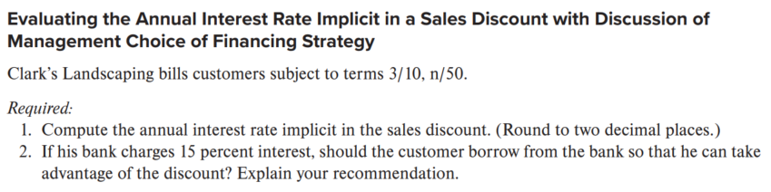
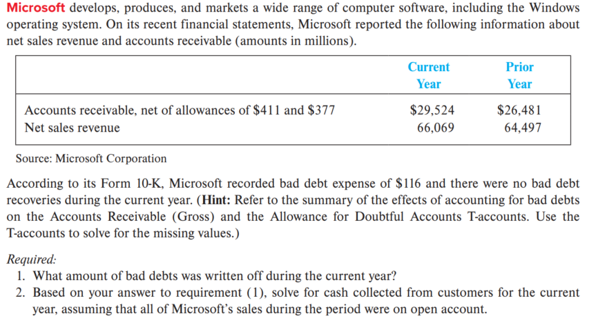
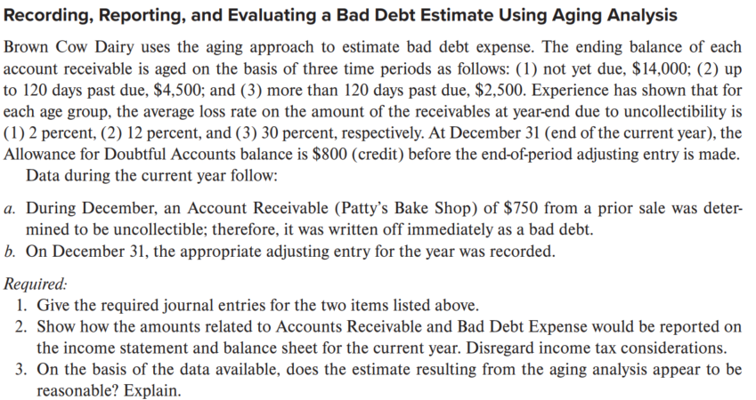
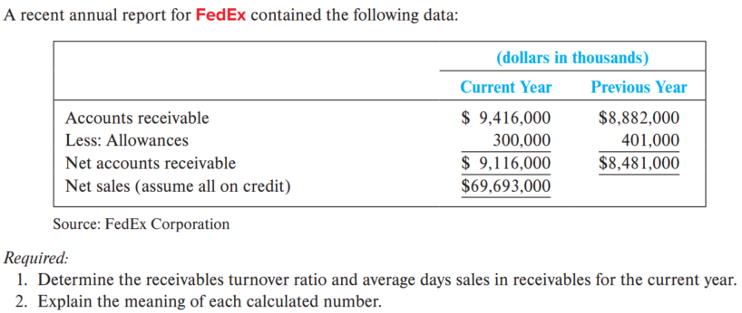
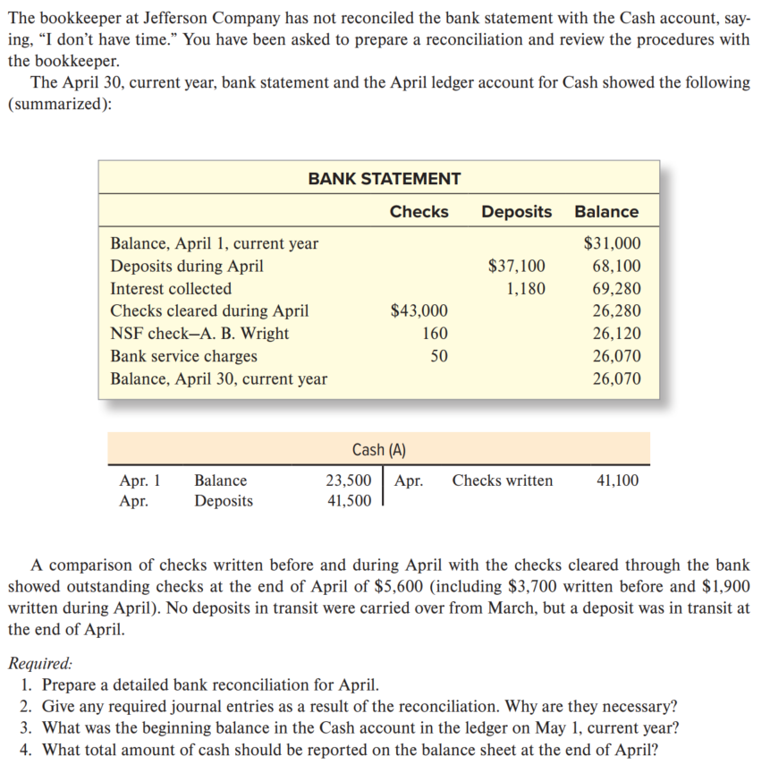

# 销售收入、应收款项及现金的报告与解读

## 第一部分：课程整体概述

本节课的核心主题是 **销售收入、应收款项和现金的会计处理、报告与解读**。围绕四个主要目标展开：

1.  **分析各种销售活动对净销售额的影响**：学习如何将收入确认原则应用于现实商业场景，如信用卡销售、销售折扣、销售退回以及捆绑销售，并计算最终的净销售额。
2.  **处理坏账费用**：理解并应用**备抵法 (Allowance Method)** 来估计、记录和报告无法收回的应收账款（坏账）对财务报表的影响。
3.  **分析与解读应收款项**：学习**应收账款周转率 (Receivables Turnover Ratio)** 的计算与分析，并理解应收账款对现金流量的影响。
4.  **报告与控制现金**：掌握现金及现金等价物的定义、内部控制的关键原则以及银行余额调节表 **(Bank Reconciliation)** 的编制。

本节课的内容是企业日常运营和财务报告的核心，涉及从销售发生到现金收回的完整循环。

## 第二部分：核心方法总结与示例

### 一、 销售收入（Sales Revenue）的确认与计量

#### 1. 收入确认原则 (Revenue Recognition Principle)
*   **定义**：收入应在以下两个条件满足时确认：(1) 公司将商品或服务的控制权转移给客户时；(2) 按公司预计有权收取的金额确认。
*   **货物销售**：通常在**所有权和风险转移时**确认收入。
    *   **FOB 目的港交货 (FOB destination)**：所有权在货物送达目的地时转移给买方。卖方承担运输途中的风险。
    *   **FOB 装运港交货 (FOB shipping point)**：所有权在货物装船/装运时转移给买方。买方承担运输途中的风险。
*   **服务销售**：通常在提供服务时确认收入。

#### 2. 影响净销售额的项目
净销售额 = 销售收入 - 销售抵减项目 (Contra-Revenue)
*   **信用卡折扣 (Credit Card Discount)**
    *   **定义**：零售商为使用信用卡支付服务而向信用卡公司支付的费用。
    *   **处理**：作为销售收入的抵减项。
    *   **示例 (PPT P.8)**：
        > 销售收入 \$3,000
        > 减：信用卡折扣 (0.03 × \$3,000) \$90
        > **净销售额 \$2,910**
        >
        > **分录**：
        > 借：现金 \$2,910
        > 借：信用卡折扣（抵减收入） \$90
        > 贷：销售收入 \$3,000

*   **销售折扣 (Sales Discount)**
    *   **定义**：为鼓励客户尽早付款而提供的价格减让，常见表达如 `2/10, n/30`（10天内付款享2%折扣，30天内付全款）。
    *   **处理**：作为销售收入的抵减项。
    *   **财务分析**：评估是否接受折扣。
        *   **计算 (PPT P.10)**：客户选择在第10天而非第30天付款，相当于为20天获得了利息。
        > 节省金额 / 支付金额 = 20天利率
        > \$2 / \$98 = 2.04% (20天利率)
        > **年化利率 = (365天 / 20天) × 2.04% = 37.23%**
        > 结论：只要公司的借款利率低于此年化利率，就应该接受折扣。

*   **销售退回与折让 (Sales Returns and Allowances)**
    *   **定义**：因商品不满意或损坏而退还给卖方或获得价格调整。
    *   **处理**：作为销售收入的抵减项。
    *   **示例 (PPT P.11)**：
        > 销售收入 \$2,000
        > 减：销售退回与折让 \$500
        > **净销售额 \$1,500**

*   **净销售额报告示例 (PPT P.12)**
    > 销售收入 \$6,000
    > 减：信用卡折扣 \$90
    > 减：销售折扣 \$20
    > 减：销售退回与折让 \$500
    > **净销售额 \$5,390**

#### 3. 捆绑销售的收入确认（五步法）
当合同中包含多项商品或服务时，适用以下步骤：
1.  **识别合同**。
2.  **识别履约义务**。
3.  **确定交易价格**。
4.  **将交易价格分摊至各履约义务**。
5.  **在履行履约义务时（或服务期内）确认收入**。
*   **示例 (PPT P.18-19)**：苹果公司以 \$500 销售 iPad，其中 \$450 对应硬件和基础软件，\$50 对应未来5年的软件升级服务。
    *   **步骤4分摊**：硬件\$450；升级服务\$50。
    *   **步骤5确认**：
        *   第1年：确认硬件收入 \$450 + 升级服务收入(\$50/5年) \$10 = **\$460**
        *   第2-5年：每年确认升级服务收入 **\$10**

### 二、 应收款项 (Receivables) 与坏账 (Bad Debts)

#### 1. 应收款项分类
*   **应收账款 (Accounts Receivable / Trade Receivable)**：因赊销商品或服务而产生。
*   **应收票据 (Notes Receivable)**：有正式书面承诺，在未来特定日期支付本金和利息。
*   **非商业应收款 (Nontrade Receivables)**：因非主营业务交易产生。

#### 2. 坏账会计处理：备抵法 (Allowance Method)
*   **原理**：遵循配比原则，在销售发生的当期估计并记录坏账费用，而不是等到具体客户确定无法付款时。
*   **核心账户**：**坏账准备 (Allowance for Doubtful Accounts)**，是应收账款的备抵资产账户。
*   **两步流程**：
    *   **步骤A：期末调整，记录估计的坏账费用**
        *   **分录**：借：坏账费用 (Bad Debt Expense)；贷：坏账准备。
        *   **影响**：**减少净利润和股东权益**，**减少资产总额**（因为坏账准备增加使应收账款净额减少）。
    *   **步骤B：期间内，冲销特定无法收回的应收账款**
        *   **分录**：借：坏账准备；贷：应收账款。
        *   **影响**：**不影响利润表，不影响资产总额和股东权益**（应收账款和其备抵账户同减，净额不变）。
*   **已冲销坏账的收回 (Bad Debt Recoveries)**：
    > 1.  恢复应收账款：借：应收账款；贷：坏账准备。
    > 2.  记录收款：借：现金；贷：应收账款。
    > *   **影响**：这两个分录也不影响资产总额和净收入。

#### 3. 坏账估计方法
*   **赊销百分比法 (Percentage of Credit Sales Method)**
    *   **方法**：直接用当期赊销净额乘以历史坏账损失率，得出当期**坏账费用**。
    *   **计算 (PPT P.35)**：
        > 赊销收入 \$1,970,000 × 坏账损失率 (1.0%) = **本期坏账费用 \$19,700**
    *   **分录**：直接按此金额做调整分录。

*   **账龄分析法 (Aging of Accounts Receivable Method)**
    *   **方法**：根据每笔应收账款拖欠的时间（账龄）来估计期末**坏账准备的应有余额**。当期坏账费用是使坏账准备账户从调整前余额调整到应有余额的金额。
    *   **示例计算 (PPT P.36)**：
        > **步骤1：计算坏账准备期末应有余额**
        > 未逾期 \$450,000 × 1% = \$4,500
        > 逾期90天内 \$170,000 × 6% = \$10,200
        > 逾期90天以上 \$50,000 × 30% = \$15,000
        > **坏账准备应有期末余额 = \$29,700**
        >
        > **步骤2：计算本期需确认的坏账费用**
        > 坏账准备应有期末余额 \$29,700
        > 减：调整前余额 (\$24,106期初 - \$14,106本期冲销) \$10,000
        > **本期坏账费用 = \$19,700**

#### 4. 报表列示与披露
*   **资产负债表**：应收账款以**净额**列示。
    > **示例 (PPT P.31)**：
    > 应收账款（毛额） \$669,409
    > 减：坏账准备 \$24,106
    > **应收账款（净额） \$645,303**
*   **报表附注**：通常披露坏账准备的变动表（期初余额 + 本期计提坏账费用 - 本期冲销 = 期末余额）。

### 三、 财务比率分析与现金流量影响

#### 1. 应收账款周转率 (Receivables Turnover Ratio)
*   **定义**：衡量企业在一个会计期间内收回应收账款的平均次数，反映收款效率。
*   **公式**：`应收账款周转率 = 净销售额 / 平均应收账款净额`
    *   平均应收账款净额 = (期初应收账款净额 + 期末应收账款净额) / 2
*   **示例计算 (PPT P.43)**：斯凯奇公司2019年。
    > 净销售额 \$5,220,051 / [(\$645,303 + \$501,913)/2] = **9.1次**
*   **解读**：比率越高，通常说明收款速度越快。需进行横向（与竞争对手）和纵向（与历史数据）比较。

#### 2. 应收账款对现金流量的影响
*   **间接法现金流量表**：应收账款余额的变动会影响经营活动现金流量。
    *   **应收账款增加**：意味着销售收入中未收到现金的部分增加，应从净利润中**减去**。
    *   **应收账款减少**：意味着当期收回的现金多于当期产生的销售收入，应加回到净利润中。

### 四、 现金 (Cash) 的报告与控制

#### 1. 现金及现金等价物 (Cash and Cash Equivalents)
*   **定义**：
    *   **现金**：货币及银行接受并可立即存入企业账户的工具（如支票、银行汇票等）。
    *   **现金等价物**：期限短（通常≤3个月）、流动性强、易于转换为已知金额现金且价值变动风险很小的投资（如国库券、货币市场基金等）。
*   **报表列示**：通常在资产负债表合并为“现金及现金等价物”一项。

#### 2. 现金的内部控制 (Internal Control)
*   **核心原则**：
    1.  **职责分离**：现金保管、记录和授权职责应由不同人员担任。
    2.  **及时存款**：每日收入应及时、完整地存入银行。
    3.  **付款控制**：所有付款尽可能使用支票或电子转账，并需经授权人员批准。
    4.  **定期核对**：定期将银行存款日记账与银行对账单进行核对。

#### 3. 银行余额调节表 (Bank Reconciliation)
*   **目的**：找出并解释公司账面现金余额与银行对账单余额之间的差异。
*   **差异原因**：
    *   **在途存款 (Deposits in Transit)**：公司已记录存入，银行尚未入账。
    *   **未兑现支票 (Outstanding Checks)**：公司已签发并记录支出，银行尚未兑付。
    *   **银行服务费 (Bank Service Charges)**：银行已扣除，公司尚未记录。
    *   **存款不足支票 (NSF Checks)**：客户支票因账户余额不足被银行退回。
    *   **银行利息 (Interest Paid by Bank)**：银行已支付利息，公司尚未记录。
    *   **记账错误 (Errors)**：公司或银行任何一方可能发生的错误。
*   **调节表示例与分录 (PPT P.54-55)**：
    > **ROW.COM 银行余额调节表（节选）**
    > **公司账面余额 \$9,040.00**
    > 加：银行支付利息 \$20.00
    > 加：记录支票错误更正 \$9.00
    > 减：NSF支票 \$18.00
    > 减：银行服务费 \$6.00
    > **调整后正确余额 \$9,045.00**
    >
    > **银行对账单余额 \$8,322.20**
    > 加：在途存款 \$1,800.00
    > 减：未兑现支票 \$1,077.20
    > **调整后正确余额 \$9,045.00**
    >
    > **需编制的调整分录**：
    > 1. 记录银行利息：借：现金 \$20；贷：利息收入 \$20
    > 2. 记录NSF支票：借：应收账款 \$18；贷：现金 \$18
    > 3. 记录银行手续费：借：银行服务费 \$6；贷：现金 \$6
    > 4. 更正错误：借：现金 \$9；贷：应付账款 \$9
    >
    > *注：仅公司账面侧的项目需要做分录调整。银行对账单侧的项目（在途存款、未兑现支票）只需等待后续单据到达，无需立即做分录。*

# 作业
## E6-5

1. **计算隐含年利率**：  
   使用公式：隐含年利率 = (折扣率 / (1 - 折扣率)) × (365 / (信用期 - 折扣期))  
   折扣率 = 3% = 0.03，折扣期 = 10天，信用期 = 50天，因此额外天数 = 40天。  
   计算：(0.03 / 0.97) × (365 / 40) ≈ 0.0309278 × 9.125 ≈ 0.2822 → **28.22%**（四舍五入到两位小数）。

2. **借款推荐**：  
   银行利率为15%，而销售折扣的隐含年利率为28.22%。由于隐含年利率高于银行利率，客户应**从银行借款以利用折扣**，这样可净节省成本。

## E6-19

1. 坏账注销金额
使用备抵坏账账户T账户关系：  
期初备抵余额（\$377） + 坏账费用（\$116） - 坏账注销 = 期末备抵余额（\$411）  
解得：坏账注销 = \$377 + \$116 - \$411 = \$82（百万）

1. 现金收回金额
假设所有销售为赊销，使用应收账款毛额T账户关系：  
期初应收账款毛额（\$26,481 + \$377 = \$26,858） + 赊销销售额（\$66,069） - 坏账注销（\$82） - 现金收回 = 期末应收账款毛额（\$29,524 + \$411 = \$29,935）  
解得：现金收回 = \$26,858 + \$66,069 - \$82 - \$29,935 = \$62,910（百万）

## E6-23

1. 日记账分录
- **a. 冲销坏账**  
  借：坏账准备 \$750  
  贷：应收账款 \$750  
- **b. 年终调整分录**  
  借：坏账费用 \$1,520  
  贷：坏账准备 \$1,520  
  *计算：坏账准备估计余额（\$14,000 × 2% + \$4,500 × 12% + \$2,500 × 30% = \$1,570）减去冲销后余额（\$800 - \$750 = \$50），需调整 \$1,520。*

2. 财务报表报告
- **利润表**  
  坏账费用：\$1,520（作为营业费用列示）  
- **资产负债表**  
  应收账款：\$21,000（\$14,000 + \$4,500 + \$2,500）  
  减：坏账准备：\$1,570
  应收账款净值：\$19,430  

3. 估计合理性评估  
合理。实际冲销坏账\$750与账龄分析中“超过120天”类别估计损失（\$2,500 × 30% = \$750）完全一致，表明损失率设定准确，且逾期账龄的损失率递增符合经验规律。
## E6-24

### 1
- **应收账款周转率** = 净赊销额 / 平均应收账款  
  平均应收账款 = (9,116,000 + 8,481,000) / 2 = 8,798,500  
  周转率 = 69,693,000 / 8,798,500 ≈ **7.92 次**
- **平均收现期** = 365 / 周转率 = 365 / 7.92 ≈ **46.1 天**

### 2
- **应收账款周转率 (7.92次)**：表示FedEx在当前年度内收回应收账款的频率为7.92次，比率越高表明收账效率越高，资金周转越快。
- **平均收现期 (46.1天)**：表示FedEx从赊销到收回现金的平均天数为46.1天，天数越短说明现金流管理越好，坏账风险较低。

## P6-5

### 1

| 项目                        | 金额         |
| --------------------------- | ------------ |
| **银行对账单余额, 4月30日** | \$26,070     |
| 加：在途存款                | \$0          |
| 减：未兑现支票              | \$5,600      |
| **调整后银行余额**          | **\$20,470** |
|                             |              |
| **账面余额, 4月30日**       | \$19,500     |
| 加：银行收取利息            | \$1,180      |
| 减：NSF支票（A.B. Wright）  | \$160        |
| 减：银行服务费              | \$50         |
| **调整后账面余额**          | **\$20,470** |

- 账面余额计算：4月1日余额 \$23,500 + 4月存款 \$37,100 - 4月开出支票 \$41,100 = \$19,500。
- 调整后余额一致，均为 \$20,470。

### 2

以下日记账分录是必要的，因为企业未记录这些银行交易，对账后需调整现金账户以反映真实余额：

- 记录银行收取利息：
  - 借：现金 \$1,180
  - 贷：利息收入 \$1,180

- 记录NSF支票：
  - 借：应收账款—A.B. Wright \$160
  - 贷：现金 \$160

- 记录银行服务费：
  - 借：银行服务费 \$50
  - 贷：现金 \$50

**必要性**：这些调整确保企业现金账户与银行对账单一致，提高财务准确性，避免余额差异，并正确记录收入和费用。

### 3

5月1日期初余额为4月30日调整后的账面余额，即 \$20,470。

### 4

4月30日现金报告金额为调整后余额 \$20,470。这包括所有调整后现金余额，符合会计准则。

