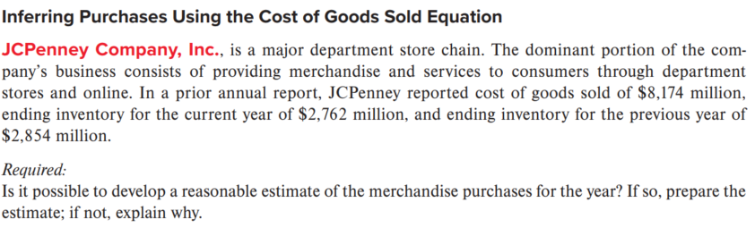
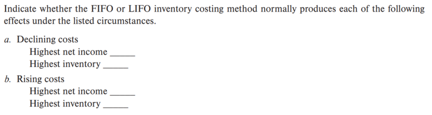
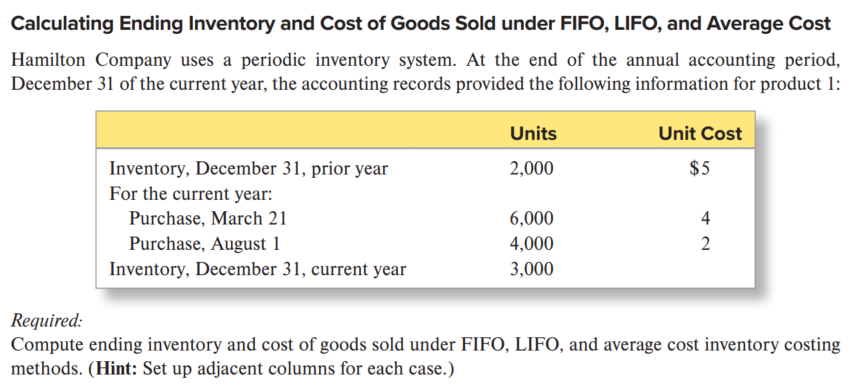
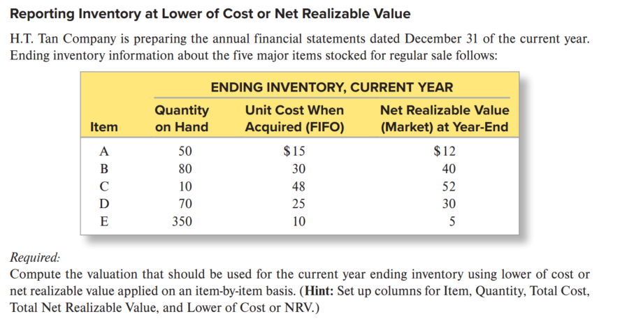
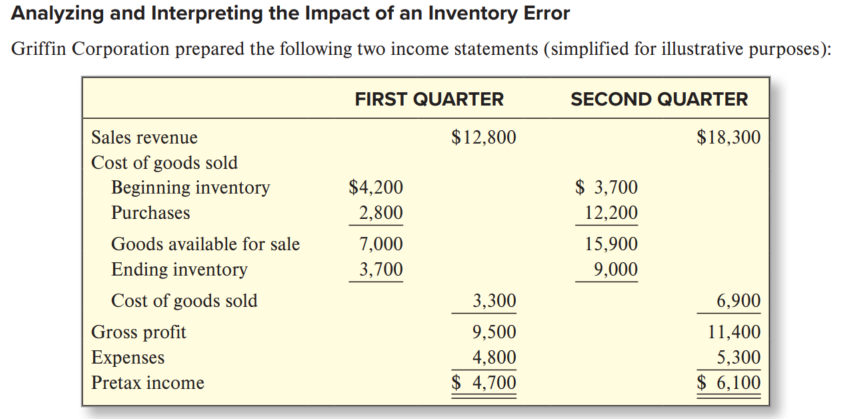
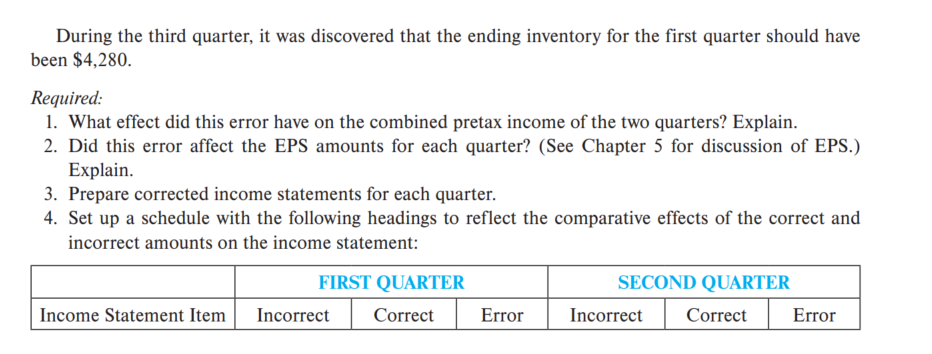
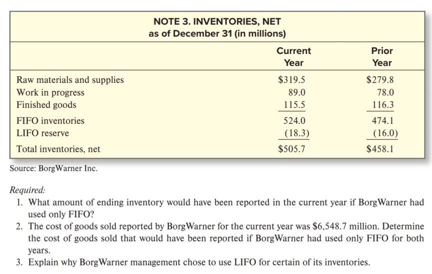

# 作业
## M7-4

是可以基于提供的信息合理估计JCPenney公司当年的商品采购量。使用销售成本方程：

COGS = 期初存货 + 采购量 - 期末存货

- 销售成本(COGS) = \$8,174 million
- 当年期末存货 = \$2,762 million
- 上年期末存货(即当年期初存货) = \$2,854 million

采购量 = \$8,174 million + \$2,762 million - \$2,854 million
       = \$10,936 million - \$2,854 million
       = \$8,082 million

## M7-5

a. 成本下降时（Declining costs）
最高净收入：LIFO
当成本下降时，LIFO假设最近购买的（成本较低的）存货先售出，导致销货成本较低，因此净收入较高。
最高存货：LIFO
当成本下降时，LIFO下的期末存货反映较早购买的（成本较高的）存货，因此存货价值较高。
b. 成本上升时（Rising costs）
最高净收入：FIFO
当成本上升时，FIFO假设较早购买的（成本较低的）存货先售出，导致销货成本较低，因此净收入较高。
最高存货：FIFO
当成本上升时，FIFO下的期末存货反映最近购买的（成本较高的）存货，因此存货价值较高。

## E7-6

1. FIFO（先进先出法）
期末存货：取最新采购的 3,000 单位（8月1日采购）
3,000 × \$2 = \$6,000
销售成本：
期初存货 2,000 × \$5 = \$10,000
3月21日采购 6,000 × \$4 = \$24,000
8月1日采购 1,000 × \$2 = \$2,000
总计 = \$10,000 + \$24,000 + \$2,000 = \$36,000
2. LIFO（后进先出法）
期末存货：取最早采购的 3,000 单位（期初存货 + 3月21日部分）
期初存货 2,000 × \$5 = \$10,000
3月21日采购 1,000 × \$4 = \$4,000
总计 = \$10,000 + \$4,000 = \$14,000
销售成本：
8月1日采购 4,000 × \$2 = \$8,000
3月21日采购 5,000 × \$4 = \$20,000
总计 = \$8,000 + \$20,000 = \$28,000
3. 加权平均成本法
单位平均成本：\$42,000 ÷ 12,000 = \$3.50/单位
期末存货：3,000 × \$3.50 = \$10,500
销售成本：9,000 × \$3.50 = \$31,500

## E7-12

| Item | Quantity | Unit Cost | NRV | Total Cost (Quantity × Unit Cost) | Total NRV (Quantity × NRV) | Lower of Cost or NRV |
| ---- | -------- | --------- | --- | --------------------------------- | -------------------------- | -------------------- |
| A    | 50       | $15       | $12 | $750                              | $600                       | $600                 |
| B    | 80       | $30       | $40 | $2,400                            | $3,200                     | $2,400               |
| C    | 10       | $48       | $52 | $480                              | $520                       | $480                 |
| D    | 70       | $25       | $30 | $1,750                            | $2,100                     | $1,750               |
| E    | 140      | $10       | $5  | $1,400                            | $700                       | $700                 |

期末存货价值 = $5,930  

## E7-14

1. 此错误对两个季度合并税前利润的影响？  
  无影响。错误导致第一季度利润少计$580，第二季度利润多计$580，两季合计抵消，总税前利润不变。

2. 是否影响各季度EPS？  
  是。EPS基于单季净利润计算，第一季度EPS被低估，第二季度EPS被高估，虽全年EPS不变，但季度表现失真。

3. 更正后各季度损益表：
  第一季更正后：  
  - COGS = $2,720  
  - 毛利 = $10,080  
  - 税前利润 = $5,280
  第二季更正后：  
  - 期初存货 = $4,280  
  - COGS = $7,480  
  - 毛利 = $10,820  
  - 税前利润 = $5,520

4. 正确与错误金额比较表：

| Income Statement Item | FIRST QUARTER |         |       | SECOND QUARTER |         |       |
| --------------------- | ------------- | ------- | ----- | -------------- | ------- | ----- |
|                       | Incorrect     | Correct | Error | Incorrect      | Correct | Error |
| Sales revenue         | $12,800       | $12,800 | $0    | $18,300        | $18,300 | $0    |
| Beginning inventory   | $4,200        | $4,200  | $0    | $3,700         | $4,280  | +$580 |
| Ending inventory      | $3,700        | $4,280  | +$580 | $9,000         | $9,000  | $0    |
| Cost of goods sold    | $3,300        | $2,720  | –$580 | $6,900         | $7,480  | +$580 |
| Gross profit          | $9,500        | $10,080 | +$580 | $11,400        | $10,820 | –$580 |
| Pretax income         | $4,700        | $5,280  | +$580 | $6,100         | $5,520  | –$580 |

## E7-19

根据提供的 BorgWarner 公司存货信息，以下是精简解答：

1. $524.0 百万。

2. $6,551.0 百万。

3. 在通货膨胀环境下，LIFO 能降低报告利润，减少应税收入，从而带来税务优势和改善现金流；同时更好地匹配当前成本与收入。