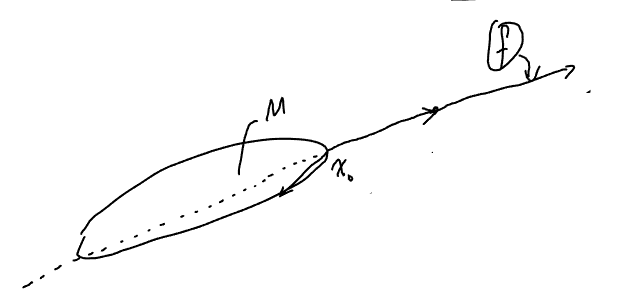

# Hahn-Banach 定理（延拓）
子空间上的有界线性泛函延拓到全空间

## 定义（拟范数）
若 $X$ 是实向量空间，$P: X \to \mathbb{R}$ 称为一个拟范数，如果：

1. $\forall x, y \in X,\quad p(x+y) \leq p(x) + p(y)$ （三角不等式）  
2. $\forall \lambda \geq 0,\quad p(\lambda x) = \lambda p(x)$ （正齐性）

若 $p$ 是一个拟范数且满足 $p(\lambda x) = |\lambda| p(x),\ \forall \lambda \in \mathbb{R}$（称为绝对齐次性），称 $p$ 是一个半范数。  

### 注

1. 由 1 和 $p(0) \leq 2p(0) \Rightarrow p(0) \geq 0$

2. 若 2 成立，则  
$$
p(\pm x) = p(x) \Rightarrow 2p(x) = p(x) + p(-x) \geq p(0) \geq 0.
$$  
即：若 $p$ 是半范数时，$p$ 是非负的。

3. 范数与半范数的区别在于是否区分零点，即：  
  $$
  p(x) = 0 \Leftrightarrow x = 0
  $$
  例子： $\forall f \in C[0,1],\quad p(f) \stackrel{\text{定义}}{=} |f(x_0)|$，其中 $x_0 \in [0,1]$. 则 $p$ 是 $C[0,1]$ 上的半范数。

## 定理（实 Hahn-Banach）
设 $X$ 是实线性空间，$p: X \to \mathbb{R}$ 是一个拟范数，$Y \subseteq X$ 是 $X$ 的子空间。$\phi: Y \to \mathbb{R}$ 是线性映射，满足 $\phi(x) \leq p(x),\ \forall x \in Y$。则存在线性映射 $\Phi: X \to \mathbb{R}$，满足：
1. $\Phi|_Y = \phi$
2. $\forall x \in X,\quad \Phi(x) \leq p(x)$

> 注： 将线性子空间上的线性映射延拓至全空间是容易的。这里的难点在于延拓的同时保持原先“线性映射”的约束（即 $\forall x \in Y,\ \Phi(x) \leq p(x)$）。

### 引理 1
假设 $X, Y, p, \phi$ 满足定理条件。记 $x_0 \in X \setminus Y$，$\widetilde{Y} \stackrel{\text{定义}}{=} Y \oplus \operatorname{span}\{x_0\}$。则存在线性映射 $\widehat{\phi}: \widetilde{Y} \to \mathbb{R}$，满足：

1. $\widehat{\phi}|_Y = \phi$  
2. $\forall x \in \widetilde{Y},\quad \widehat{\phi}(x) \leq p(x)$

#### 证明
由要求，任取 $x \in \widetilde{Y}$，$\exists\, y \in Y$ 且 $\lambda \in \mathbb{R}$，s.t. $x = y + \lambda x_0$

定义 $\widehat{\phi}(x) = \phi(y) + t\lambda$ （若 $\widehat{\phi}$ 是线性、满足 ①②，则 $\widehat{\phi}(x) = \phi(y) + \lambda \widehat{\phi}(x_0)$）

不难验证：$\widehat{\phi}|_Y = \phi$. 为了满足2：

$$
\widehat{\phi}(x) \leq p(x) \iff \phi(y) + \lambda a \leq p(y + \lambda x_0)
\quad \forall y \in Y,\ \forall \lambda \in \mathbb{R}.
$$

不妨假设 $\lambda \neq 0$，

④ $\iff |\lambda| \left( \phi(|\lambda|^{-1} y) + \operatorname{sgn}\lambda \cdot a \right) \leq |\lambda| \, p(|\lambda|^{-1} y + (\operatorname{sgn}\lambda) x_0)$

$\iff \phi(y) \pm a \leq p(y \pm x_0),\quad \forall y \in Y$

$\iff \phi(y) - p(y - x_0) \leq a \leq p(y + x_0) - \phi(y),\quad \forall y \in Y$

任取 $y, \tilde{y} \in Y$：

$$
\phi(y) + \phi(\tilde{y}) = \phi(y + \tilde{y}) \leq p(y + \tilde{y}) \leq p(y + x_0) + p(\tilde{y} - x_0)
$$

$$\Rightarrow\quad \phi(\tilde{y}) - p(\tilde{y} - x_0) \leq p(y + x_0) - \phi(y)$$

$$\Rightarrow\quad \sup_{\tilde{y} \in Y} \left( \phi(\tilde{y}) - p(\tilde{y} - x_0) \right) \leq \inf_{y \in Y} \left( p(y + x_0) - \phi(y) \right)$$

$\Rightarrow$ $a$ 存在

### 定理证明
利用 Zorn 引理 $\Rightarrow$ H–B 定理。记
$$\mathcal{P} = \left\{ (Z, \chi) \ \middle| \ 
\begin{array}{l}
Z \subseteq X \text{（线性子空间）}, \\
\chi: Z \to \mathbb{R} \text{（线性映射），满足} \\
①\ Y \subseteq Z \\
②\ \chi|_Y = \phi \\
③\ \chi(x) \leq p(x),\ \forall x \in Z
\end{array}
\right\}$$

$\mathcal{P}$ 上定义偏序关系，即：
$$(Z, \chi) \preccurlyeq (\widehat{Z}, \widehat{\chi}) \quad \text{如果} \quad Z \subseteq \widehat{Z} \quad \text{且} \quad \widehat{\chi}\big|_Z = \chi.$$
可以验证：
1. 若 $S \subseteq \mathcal{P}$ 是全序子集，则令 $Z_0 \stackrel{\text{定义}}{=} \bigcup_{(Z,\chi)\in S} Z$。$\forall x \in Z_0.\ (\Rightarrow \exists (Z,\chi) \in S,\ \text{s.t.}\ x \in Z)\quad \chi_0(x) \stackrel{\text{定义}}{=} \chi(x)$. 由此，$(Z_0, \chi_0)$ 是 $S$ 的上界。
2. 由 Zorn 引理，$\exists \mathcal{P}$ 的一个极大元 $(\widehat{Z}, \widehat{\chi})$ 满足 $\widehat{Z} = X$ （否则由引理1，可以构造 $(Z', \chi') \in \mathcal{P}$，s.t. $\widehat{Z} \subsetneq Z'$ 且 $\chi'\big|_{\widehat{Z}} = \widehat{\chi}$，这与极大元性质矛盾

### 推论1
若 $X$ 是 $\mathbb{R}$ 上的赋范空间，$Y \subseteq X$ 是子空间，$\phi: Y \to \mathbb{R}$ 是线性映射且 $\phi \in Y^*$，
则 $\exists\, \Phi \in X^*$，s.t. $\Phi|_Y = \phi$ 且 $\|\Phi\| = \|\phi\|$。
证明：
取 $p(x) \stackrel{\text{定义}}{=} \|\phi\| \|x\|$，由 H-B 定理，$\exists\, \Phi: X \to \mathbb{R}$，s.t. 
1. $\Phi|_Y = \phi$。
2. $\Phi(x) \leq \|\phi\| \|x\|,\quad \forall x \in X \implies |\Phi(x)| = \Phi(\operatorname{sgn}\Phi(x)\cdot x) \leq \|\phi\| \|x\|\implies \|\Phi\| = \|\phi\|$。

### 推论2（复 Hahn-Banach）
若 $X$ 是 $\mathbb{C}$ 上的赋范空间，$Y \subseteq X$ 是线性子空间，$\gamma \in L(Y; \mathbb{C})$，则 $\exists\, \Psi \in L(X; \mathbb{C})$，s.t.
1. $\Psi|_Y = \gamma$，
2. $\|\Psi\| = \|\gamma\|$。
#### 证明
记 $\phi(x) \stackrel{\text{定义}}{=} \operatorname{Re} \gamma(x)$，则 $|\phi(x)| \leq \|\gamma\| \|x\|$。

$Y = (Y, +, \cdot, \mathbb{C}) \implies Y = (Y, +, \cdot, \mathbb{R})$。由推论1，$\exists\, \Phi \in L((X, +, \cdot, \mathbb{R}); \mathbb{R})$，s.t. $\forall x \in X,\quad |\Phi(x)| \leq \|\gamma\| \|x\|$。

由 $\phi(x) = \operatorname{Re} \gamma(x) \implies \Phi(ix) = \operatorname{Re} (\gamma(ix)) = -\operatorname{Im} \gamma(x)\implies \gamma(x) = \operatorname{Re} \gamma(x) + i \operatorname{Im} \gamma(x) = \Phi(x) - i \Phi(ix)$

记 $\Psi(x) \stackrel{\text{定义}}{=} \Phi(x) - i \Phi(ix)$，则
1. $\forall x, y \in X,\ a+ib \in \mathbb{C}$ $\Psi((a+ib)x + y) = \Phi(ax + ibx + y) - i \Phi(i(ax+y) - bx)$
$= a\Phi(x) + b\Phi(ix) + \Phi(y) - i \left[ -b\Phi(x) + a\Phi(ix) + \Phi(iy) \right]$
$= (a+ib)\Psi(x) + \Psi(y) \implies \Psi$ 是复线性的。
2. $\Psi|_Y = \gamma$
3. $\Psi(x) = |\Psi(x)| e^{i\theta_x} \implies |\Psi(x)| = \Psi(e^{-i\theta_x} x) = \Phi(e^{-i\theta_x} x) \leq \|\gamma\| \|x\|\implies \|\Psi\| = \|\gamma\|$。

## 几个应用
### 命题3
若 $X$ 是赋范空间，$\forall x \in X \setminus \{0\}$，$\exists f \in X^*$，s.t. $f(x) = \|x\|$ 且 $\|f\| = 1$。

#### 证明

记 $Y = \operatorname{span}\{x\}$。$\phi(ax) \stackrel{\text{定义}}{=} a\|x\|$。$\Rightarrow |\phi(y)| = |\phi(ax)| = |a|\|x\| = \|ax\| = \|y\|$ $\Rightarrow \|\phi\| = 1$。$\implies$（由 H-B 定理）$\exists f \in X^*$，s.t. $f|_Y = \phi$（即 $f(x) = \|x\|$）且 $\|f\| = 1$。

> 由命题3推出如下结论：即 $X^*$（$X$ 上的坐标轴）可以区分 $X$ 中的任意两点。

### 推论4
1. 若 $x, y \in X$ 且 $x \neq y$，则 $\exists f \in X^*$，s.t. $f(x) \neq f(y)$；
2. 若 $x \in X$，满足 $\forall f \in X^*$ 有 $f(x) = 0$，则 $x = 0$。

#### 证明
只需证明1。由命题3，$\exists f \in X^*$，s.t. $f(x-y) = \|x-y\| \neq 0 \implies f(x) \neq f(y)$。

### 命题5
若 $X$ 是赋范空间，$M \subseteq X$ 是线性子空间，$x_0 \in X$ 且 $\operatorname{dist}(x_0, M) = d > 0$。则 $\exists f \in X^*$ 满足
1. $f|_M \equiv 0$
2. $f(x_0) = d$
3. $\|f\| = 1$。

#### 证明
1. 对于 Hilbert 空间上。假设 $\{e_\alpha\}_{\alpha \in \Lambda}$ 是 $M$ 的规范正交基。则 $(x_0)_M \stackrel{\text{定义}}{=} \sum_{\alpha \in \Lambda} \langle x_0, e_\alpha \rangle e_\alpha$ 且 $x_0 - (x_0)_M \perp M$ $\implies d = \|x_0 - (x_0)_M\|$。$\implies f(x) = \langle x, \frac{x_0 - (x_0)_M}{\|x_0 - (x_0)_M\|} \rangle \implies f$ 满足 ①②③。

2. 对于一般的 Banach 空间。记 $Y = M \oplus \operatorname{span}\{x_0\}$。$\forall y \in Y$，$\exists !\ x \in M,\ t \in \mathbb{F}$，s.t. $y = x + tx_0$。则 $f(y) \stackrel{\text{定义}}{=} td \implies$ ①②成立。对 $\forall f \in Y^*$，$\forall y \in M$，$|f(y)| = |t|d = |t| \operatorname{dist}(x_0, M) \leq |t| \|x_0 + \frac{x}{t}\| = \|y\|$（取 $y = x + tx_0$, $t \neq 0$）。$\implies f \in Y^*$ 且 $\|f\| \leq 1$。另证：$d = |f(x_0)| \stackrel{\text{取}}{=} \sup_{h \in M} |f(x_0 - h)| \leq \|f\| \|x_0 - h\| \implies d \leq \|f\| d \implies \|f\| \geq 1 \implies \|f\| = 1$。由 H-B 定理，$\exists f \in X^*$ 满足 ①②③。

### 推论6
1. 假设 $M \subseteq X$，则 $x \in \overline{\operatorname{span}\, M} \iff \forall f \in X^*$ 满足 $f|_M = 0$，有 $f(x) = 0$。
2. 若 $X$ 是实赋范空间，$S \subseteq X$。称 $S^\perp$ 是 $S$ 的零化子空间，如果 $S^\perp = \{ f \in X^* \mid f|_S = 0 \}$。

>注： $x \in \overline{M}$（$M$ 是 $X$ 的线性子空间）$\iff \forall f \in M^\perp$, $f(x) = 0$（$\Rightarrow M$ 是 $X$ 的稠密子集 $\iff M^\perp = \{0\}$）

# Hahn-Banach 定理（凸集分离）
包括凸集与点的分离、凸集与凸集的分离和凸闭集与凸紧集的分离

## 引入
由$\mathbb{R}^n$的凸投影定理（有限性）：

若 $M$ 为凸闭集，$x \notin M$。
$\Rightarrow$ ① $\exists x_0 \in M$，s.t. $\|x - x_0\| = \text{dist}(x, M)$
② $\forall y \in M$, $(x - x_0, y - x_0) \leq 0$
$\forall z \in \mathbb{R}^n$, 记 $f(z) = (z, x - x_0)$
则 $\forall y \in M$,
$f(x) - f(y) = (x - y, x - x_0) = (x - x_0, x - x_0) - (y - x_0, x - x_0)$
$= \|x - x_0\|^2 - (y - x_0, x - x_0) \geq 0$

## 一些定义和引理
### 定义（超平面，仿射超平面）
- 设 $X$ 是实赋范空间，如果 $M$ 是闭子空间且 $\text{codim}(M) = \text{dist}(X/M) = 1$,称 $M$ 是 $X$ 的超平面。
- 如果 $\tilde{M}$ 是超平面 $M$ 的平移,称 $\tilde{M}$ 是仿射超平面。

### 定义（开半空间）
若 $f \in X^*$ 且 $f \neq 0$, $c \in \mathbb{R}$，称 $\{x \in X \mid f(x) > c\}$ 为开半空间。

### 命题7
$M \subseteq X$ 是仿射超平面 $\Leftrightarrow \exists 0 \neq f \in X^*$ 以及 $c \in \mathbb{R}$，s.t. $M = f^{-1}(c) = \{x \in X \mid f(x) = c\}$。

#### 证明
“$\Rightarrow$” 
由定义，$\exists Y \subseteq X$ 超平面以及 $x_0 \in Y$，s.t. $M = Y + x_0$。$\Rightarrow Y = Y \oplus \text{span}\{x_0\}$。（由补子空间性质）
由命题5的结论，$\exists f \in X^*$，s.t. $f(y + t x_0) = t \cdot \text{dist}(x_0, M) \Rightarrow f^{-1}(0) = Y \quad \Rightarrow \quad M = f^{-1}(f(x_0))$

“$\Leftarrow$” 
设 $Y = f^{-1}(0)$，$f(x_0) = c$，则 $M = Y + x_0$。由于 $f \in X^* \Rightarrow Y = \ker f$ 是闭子空间。
$\forall x \in X$，$x = \frac{f(x)}{f(y_0)} y_0 + x - \frac{f(x)}{f(y_0)} y_0 $,于是 $X = \ker f \oplus \text{span}\{y_0\}$，其中 $f(y_0) = 1$，且 $(\ker f) \cap \text{span}\{y_0\} = \{0\}$。

### 引理8
若 $X$ 是实赋范空间，$A \subseteq X$ 是凸集。则
1. $\text{int}(A)$ 以及 $\overline{A}$ 是凸集。  
2. 如果 $\text{int}(A) \neq \emptyset$，则 $A \subseteq \overline{\text{int} A}$。

#### 证明：  
1. 由定义直接验证；  
2. 假设 $x_0 \in \text{int}(A) \Rightarrow \exists \delta > 0$，s.t. $B(x_0; \delta) \subseteq \text{int}(A) \subseteq A$。  

任取 $x \in A$，记 $U_x = \left\{ tx + (1-t)y \mid y \in B(x_0; \delta), t \in ]0,1] \right\}$。$\Rightarrow U_x \subseteq \text{int}(A)$  

$\Rightarrow x \in \overline{U_x} \subseteq \overline{\text{int}(A)}$

（图示：点 $x$、点 $x_0$、区域 $U_x$ 及其包含关系示意）

### 引理9
若 $X$ 是实赋范空间，$A \subseteq X$ 是凸集且 $\text{int}(A) \neq \emptyset$。若存在非零 $f \in X^*$ 以及 $c \in \mathbb{R}$，s.t. $\forall x \in \text{int}(A)$，$f(x) \geq c$。则 $\forall x \in A$，$f(x) \geq c$，且 $\forall x \in \text{int}(A)$，$f(x) > c$。 (即严格区分内点与边界)

#### 证明
由引理8，$\overline{\text{int}(A)} \supseteq A \Rightarrow \forall x \in A$，$f(x) \geq c$。假设 $x_0 \in \text{int}(A)$，$x_0 \in X$ 满足 $f(x_0) = 1 \Rightarrow \exists t > 0$，s.t. $x \pm t x_0 \in A \Rightarrow f(x) = f(x - t x_0) + f(t x_0) \geq c + t f(x_0) > c$

## Minkowski 泛函
在线性空间上引入“距离”

### 定义

若 $K$ 是 $(X, +, \cdot, \mathbb{F})$（$\mathbb{F} = \mathbb{R}$ 或 $\mathbb{C}$）中的凸集，则由 $K$ 诱导的 Minkowski 泛函 $P_K: X \to [0, +\infty]$ 定义为：
$$
P_K(x) \overset{\text{def}}{=} \inf \left\{ r \in \mathbb{R} \mid r > 0,\ x \in rK \right\}, \quad \forall x \in X.
$$
其中，约定 $\inf \emptyset = +\infty$。

> $P_K(x)$ 的几何意义：即零点沿着 $x$ 方向“经伸缩变换”至集合边界时的相似系数。

### 几个例子
#### 1
取 $U = \{ \|x\| \leq 1 \}$，则 $P_U(x) = \|x\|$。  
（若 $\hat{U} = \{ \|x\| < 1 \}$，则 $P_{\hat{U}}(x) = \|x\|$）

#### 2
设 $X = (X, +, \cdot, \mathbb{R})$，$f$ 是 $X$ 上的线性泛函，$a > 0$。令 $K \overset{\text{def}}{=} \{ x \in X \mid |f(x)| \leq a \}$，则：
$$
P_K(x) = \frac{1}{a} |f(x)| \quad \text{且} \quad P_K \text{是半范数}.
$$

### 定义: 吸收集
为了保证 $P_K$ 点点有限，引入“吸收集”，即：
若 $X = (X, +, \cdot, \mathbb{F})$，$K \subseteq X$，称 $K$ 在 $X$ 中是吸收的，如果 $\forall x \in X$，$\exists \lambda > 0$，s.t.：
$$
x \in rK \quad \forall r \in \mathbb{F} \text{ 且 } |r| \geq \lambda \quad \Rightarrow \quad 0 \in K \text{ 且 } P_K(0) = 0.
$$

### 定义: 代数内点
若 $X = (X, +, \cdot, \mathbb{R})$，$x_0 \in A$ 称为 $A$ 的代数内点，如果 $\forall x \in X$，$\exists t_x > 0$，使得：
$$
x_0 + [0, t_x]x \subseteq A,
$$
或等价地：
$$
\left\{ x_0 + rx \mid r \in [0, t_x] \right\} \subseteq A.
$$

> 几何意义：从点 $x_0$ 出发，沿任意方向 $x$，都可以在 $A$ 内走一小段距离。

### 命题4
$X = (X, +, \cdot, \mathbb{R})$，则 $K$ 是吸收集 $\Leftrightarrow$ $0$ 是 $K$ 的代数内点。

> 由定义可知，若 $K$ 是吸收集，则 $\forall x \in X$，有 $P_K(x) < +\infty$。
> 可以证明：若 $K$ 是凸集，则 $\forall x \in X$，$P_K(x) < +\infty \Leftrightarrow K$ 是吸收集。

### 定义: 平衡集
为了进一步保证 $P_K(x)$ 是半范数，引入“平衡”的概念，即：
若 $X = (X, +, \cdot, \mathbb{R})$，$K \subseteq X$，称 $K$ 是 $X$ 中的平衡集，如果 $\forall |a| \leq 1$，$\forall s \in K$，有 $as \in K$。  
即：$\forall |a| \leq 1$，$aK \subseteq K$。

> 若 $K$ 是凸集，则 $K$ 是平衡集 $\Leftrightarrow \forall |a| = 1$，$aK \subseteq K$。

### 定理: 集合分类
定理：若 $K$ 是 $X = (X, +, \cdot, \mathbb{R})$ 中的集合，则：

1. 若 $K$ 是凸吸收集，则 $P_K$ 满足次可加性（或称次可加性），且 $P_K$ 是拟范数。

2. 若 $K$ 是平衡吸收集，则 $P_K$ 满足绝对齐次性。(即：$P_K(\lambda x) = |\lambda| P_K(x)$，$\forall \lambda \in \mathbb{R}$)。

3. 若 $K$ 是平衡凸吸收集，则 $P_K$ 是半范数, 且：$P_K(x) = \frac{1}{\sup\{ r > 0 \mid rx \in K \}}$

> 吸收：保证 $P_K(x) < +\infty \Rightarrow$ 保证次可加性有效。
> 凸：保证三角不等式（见图3）。
> 平衡：保证绝对齐次性。

#### 证明

1. $K$ 是凸吸收集，下证“次可加性”以及“正齐次性”。

- 次可加性，即：$P_K(x+y) \leq P_K(x) + P_K(y)$。

  由 $P_K(x)$ 的定义，$\forall \varepsilon > 0$，$\exists r_x > 0$，s.t. $r_x < P_K(x) + \varepsilon$ 且 $\frac{x}{r_x} \in K$；同理 $\frac{y}{r_y} \in K$。

  $\Rightarrow \frac{r_x}{r_x + r_y} \cdot \frac{x}{r_x} + \frac{r_y}{r_x + r_y} \cdot \frac{y}{r_y} \in K$

  即：$\frac{x+y}{r_x + r_y} \in K \Rightarrow P_K(x+y) \leq r_x + r_y \leq P_K(x) + P_K(y) + 2\varepsilon \Rightarrow$ 结论成立。

- 正齐次性，即：$P_K(\lambda x) = \lambda P_K(x)$，$\forall \lambda > 0$。

  由 $P_K(x)$ 的定义，$\forall \varepsilon > 0$，$\exists r_x > 0$，s.t. $r_x < P_K(x) + \varepsilon$ 且 $\frac{x}{r_x} \in K$。

  $\Rightarrow \frac{\lambda x}{\lambda r_x} \in K \Rightarrow P_K(\lambda x) \leq \lambda r_x \leq \lambda (P_K(x) + \varepsilon) \Rightarrow P_K(\lambda x) \leq \lambda P_K(x)$。

  又 $\frac{1}{\lambda} \cdot (\lambda x) = x \in K \Rightarrow P_K(x) \leq \frac{1}{\lambda} P_K(\lambda x) \Rightarrow P_K(\lambda x) \geq \lambda P_K(x)$。

  故 $P_K(\lambda x) = \lambda P_K(x)$，$\Rightarrow P_K$ 是拟范数。

2. $K$ 是平衡吸收集，则 $P_K(\lambda x) = |\lambda| P_K(x)$。由上一问，当 $\lambda > 0$ 时，$P_K(\lambda x) = \lambda P_K(x)$。

    只需证明：$P_K(-x) = P_K(x)$。

    由 $P_K(x)$ 的定义，$\forall \varepsilon > 0$，$\exists r_x > 0$，s.t. $r_x < P_K(x) + \varepsilon$ 且 $\frac{x}{r_x} \in K$。

    $\Rightarrow \frac{-x}{r_x} \in K$ （因 $K$ 平衡）$\Rightarrow P_K(-x) \leq r_x \leq P_K(x) + \varepsilon \Rightarrow P_K(-x) \leq P_K(x)$。

    又 $P_K(x) = P_K(-(-x)) \leq P_K(-x)$，故 $P_K(x) = P_K(-x)$。

    因此，$P_K(\lambda x) = |\lambda| P_K(x)$，即满足绝对齐次性。

## 定理 (Hahn-Banach 几何形式)
设 $X$ 是实赋范空间，$A, B \subseteq X$ 是非空凸集。
1. 若 $0 \in A$ 且 $x_0 \notin \bar{A}$。则存在非零 $f \in X^*$ 以及 $c \in \mathbb{R}$，使得：
   $$
   f(x_0) \leq c \leq f(a), \quad \forall a \in A.\\
   c < f(\tilde{a}), \quad \forall \tilde{a} \in \mathrm{int}(A).
   $$
2. 若 $A \cap B \neq \phi$ 且 $\mathrm{int}(A) \neq \phi, \, B \neq \phi$，则存在非零 $f \in X^*$ 以及 $c \in \mathbb{R}$，使得：
   $$
   \sup_{a \in A} f(a) \leq c \leq \inf_{b \in B} f(b).\\
   f(\tilde{a}) < c, \quad \forall \tilde{a} \in \mathrm{int}(A).\\
   $$
3. 若 $A$ 是闭集，$B$ 是紧集且 $A \cap B = \phi$，则存在连续的线性泛函 $f \in X^*$ 使得：
   $$
   \sup_{a \in A} f(a) < \inf_{b \in B} f(B).
   $$