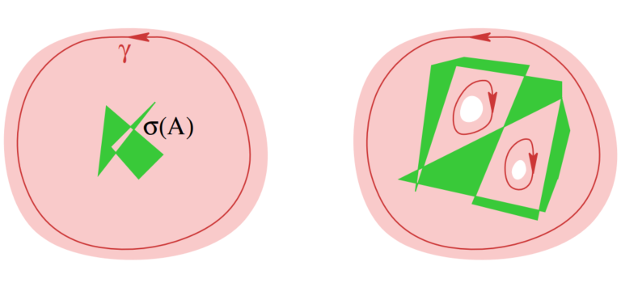

# 全纯泛函演算

设 $X$ 是一个非零复Banach空间，$A \in \mathcal{L}^c(X)$ 是一个有界复线性算子。那么根据谱理论的基本引理和定理，$A$ 的谱是一个非空紧致的复平面子集。全纯泛函演算将一个有界线性算子 $f(A) \in \mathcal{L}^c(X)$ 赋予每一个在包含 $\sigma(A)$ 的开集 $U \subset \mathbb{C}$ 上的全纯函数 $f: U \to \mathbb{C}$。算子 $f(A)$ 定义为沿着 $U \setminus \sigma(A)$ 中环绕谱的闭链对预解算子进行的 Dunford 积分。

## 定义 (Dunford 积分)

设 $X$ 是一个非零复Banach空间，$A \in \mathcal{L}^c(X)$。令 $U \subset \mathbb{C}$ 为一个开集，满足
$$
\sigma(A) \subset U
$$
并令 $\gamma = (\gamma_1, \dots, \gamma_m)$ 为一族光滑环路 $\gamma_i: \mathbb{R}/\mathbb{Z} \to U \setminus \sigma(A)$，其绕数为
$$
w(\gamma, \lambda) := \frac{1}{2\pi \mathrm{i}} \sum_{i=1}^m \int_{\gamma_i} \frac{dz}{z - \lambda} = \begin{cases}
1, & \text{当 } \lambda \in \sigma(A), \\
0, & \text{当 } \lambda \in \mathbb{C} \setminus U.
\end{cases}
$$
（参见上图）该集合 $\gamma$ 被称为 $U \setminus \sigma(A)$ 中的一个**闭链**，而闭链 $\gamma$ 的像集定义为 $\operatorname{im}(\gamma) := \bigcup_{i=1}^m \gamma_i(\mathbb{R}/\mathbb{Z})$。关于 $\gamma$ 的存在性，可参考相关文献。算子 $f(A) \in \mathcal{L}^c(X)$ 定义为
$$
f(A) := \frac{1}{2\pi \mathrm{i}} \int_\gamma f(z)(z\mathbb{I} - A)^{-1} dz = \frac{1}{2\pi \mathrm{i}} \sum_{i=1}^m \int_{\gamma_i} f(z)(z\mathbb{I} - A)^{-1} dz.
$$
此积分被称为 **Dunford 积分**。

下一个定理建立了算子 $f(A)$ 的基本性质并研究了它们的谱。

## 定理 (全纯泛函演算)

设 $X$ 是一个非零复Banach空间，$A \in \mathcal{L}^c(X)$。则以下结论成立。

1. 算子 $f(A)$ 的定义与满足绕数条件的闭链 $\gamma$ 在 $U \setminus \sigma(A)$ 中的选择无关。

2. 设 $U \subset \mathbb{C}$ 为一个开集，满足 $\sigma(A) \subset U$，且令 $f, g: U \to \mathbb{C}$ 为全纯函数。则
   $$
   (f + g)(A) = f(A) + g(A), \quad (fg)(A) = f(A)g(A).
   $$

3. 若 $p(z) = \sum_{k=0}^n a_k z^k$ 是一个多项式，则 $p(A) = \sum_{k=0}^n a_k A^k$。

4. 设 $U \subset \mathbb{C}$ 为一个开集，满足 $\sigma(A) \subset U$，且令 $f: U \to \mathbb{C}$ 为全纯函数。则
   $$
   \sigma(f(A)) = f(\sigma(A)).
   $$
   此断言被称为**谱映射定理**。

5. 设 $U, V \subset \mathbb{C}$ 为开集，满足 $\sigma(A) \subset U$，且令 $f: U \to V$ 和 $g: V \to \mathbb{C}$ 为全纯函数。则
   $$
   g(f(A)) = (g \circ f)(A).
   $$

6. 设 $\Sigma_0, \Sigma_1 \subset \sigma(A)$ 为互不相交的紧致集，满足 $\Sigma_0 \cup \Sigma_1 = \sigma(A)$，并令 $U_0, U_1 \subset \mathbb{C}$ 为互不相交的开集，满足 $\Sigma_i \subset U_i$ ($i=0,1$)。定义函数 $f: U := U_0 \cup U_1 \to \mathbb{C}$，使得 $f|_{U_0} := 0$ 且 $f|_{U_1} := 1$，并定义 $P := f(A) \in \mathcal{L}^c(X)$。则 $P$ 是一个投影且与 $A$ 可交换，即 $P^2 = P$ 且 $PA = AP$。因此，$X_0 := \ker(P)$ 和 $X_1 := \operatorname{im}(P)$ 是 $X$ 的闭 $A$-不变子空间，满足 $X = X_0 \oplus X_1$。算子 $A_i := A|_{X_i}: X_i \to X_i$ 的谱由 $\sigma(A_i) = \Sigma_i$ 给出，其中 $i=0,1$。

### 证明

我们证明第一部分。设 $\beta$ 和 $\gamma$ 是 $U \setminus \sigma(A)$ 中满足绕数条件的两族环路。则它们的差 $\gamma - \beta$，理解为 $U \setminus \sigma(A)$ 中的一个闭链，是**同伦于零**的，因为其在 $U \setminus \sigma(A)$ 补集中的每一点上的绕数均为零。因此，柯西积分公式断言，每个全纯函数在 $U \setminus \sigma(A)$ 上沿 $\gamma - \beta$ 的积分为零。这意味着对于每个全纯函数 $f: U \to \mathbb{C}$ 和所有 $x \in X$ 以及所有 $x^* \in X^*$，
$$
\int_\beta f(z)\langle x^*, (z\mathbb{I} - A)^{-1}x \rangle dz = \int_\gamma f(z)\langle x^*, (z\mathbb{I} - A)^{-1}x \rangle dz.
$$
因此，根据 Hahn-Banach 定理，算子值函数 $U \setminus \sigma(A) \to \mathcal{L}^c(X): z \mapsto f(z)(z\mathbb{I} - A)^{-1}$ 沿 $\beta$ 和 $\gamma$ 的积分对于每个全纯函数 $f: U \to \mathbb{C}$ 都一致。这证明了第一部分。

我们证明第二部分。关于和的断言直接从定义得出。为了证明关于乘积的断言，选择两个闭链 $\beta$ 和 $\gamma$ 在 $U \setminus \sigma(A)$ 中，它们都满足绕数条件，具有不相交的像集，使得 $\operatorname{im}(\beta) \cap \operatorname{im}(\gamma) = \emptyset$，并且 $\beta$ 的像被 $\gamma$ 所环绕，即
$$
w(\gamma, w) = 1 \quad \text{对于所有 } w \in \operatorname{im}(\beta),\\ w(\beta, z) = 0 \quad \text{对于所有 } z \in \operatorname{im}(\gamma).
$$
（参见图）然后，根据预解恒等式，我们有

$$
\begin{aligned}
f(A)g(A) &= \frac{1}{2\pi \mathrm{i}} \int_\beta f(w) R_w(A) dw \frac{1}{2\pi \mathrm{i}} \int_\gamma g(z) R_z(A) dz \\
&= \frac{1}{2\pi \mathrm{i}} \frac{1}{2\pi \mathrm{i}} \int_\beta \int_\gamma f(w)g(z) \frac{R_w(A) - R_z(A)}{z - w} dz dw \\
&= \frac{1}{2\pi \mathrm{i}} \int_\beta f(w) \left( \frac{1}{2\pi \mathrm{i}} \int_\gamma \frac{g(z) dz}{z - w} \right) R_w(A) dw + \frac{1}{2\pi \mathrm{i}} \int_\gamma g(z) \left( \frac{1}{2\pi \mathrm{i}} \int_\beta \frac{f(w) dw}{w - z} \right) R_z(A) dz \\
&= \frac{1}{2\pi \mathrm{i}} \int_\beta f(w)g(w) R_w(A) dw \\
&= (fg)(A).
\end{aligned}
$$

此处倒数第二步使用了绕数条件。这证明了第二部分。

我们证明第三部分。鉴于第二部分，只需证明与全纯函数 $f(z)=1$ 和 $f(z)=z$ 相关的方程
$$
1(A) = \mathbb{I}_X, \quad \mathrm{id}(A) = A,
$$
即可。在这些情况下，我们可以选择 $U = \mathbb{C}$ 并令 $\gamma_r(t) := re^{2\pi \mathrm{i}t}$，其中 $r > \|A\|$。则
$$
f(A) = \frac{1}{2\pi \mathrm{i}} \int_{\gamma_r} f(z)(z\mathbb{I} - A)^{-1} dz = \int_0^1 f(re^{2\pi \mathrm{i}t})(\mathbb{I} - r^{-1}e^{-2\pi \mathrm{i}t}A)^{-1} dt.
$$

对于 $f \equiv 1$，根据 Neumann 级数定理，当 $r$ 趋于无穷大时，被积函数一致收敛到 $\mathbb{I}$，因此 $1(A) = \mathbb{I}$。在 $f(z) = z$ 的情况下，我们得到
$$
\begin{aligned}
\mathrm{id}(A) &= \frac{1}{2\pi \mathrm{i}} \int_{\gamma_r} z(z\mathbb{I} - A)^{-1} dz \\
&= \frac{1}{2\pi \mathrm{i}} \int_{\gamma_r} A(z\mathbb{I} - A)^{-1} dz \\
&= A \circ 1(A) \\
&= A.
\end{aligned}
$$
这里第二项和第三项的差值消失，因为它是在 $U$ 中一个同伦于零的闭链上对常值算子值函数 $z \mapsto \mathbb{I}$ 的积分，根据绕数条件。这证明了第三部分。

我们证明第四部分。固定一个谱值 $\lambda \in \sigma(A)$。则存在一个全纯函数 $g: U \to \mathbb{C}$，使得
$$
f(z) - f(\lambda) = (z - \lambda)g(z) \quad \text{对于所有 } z \in U.
$$
根据第二部分，这意味着
$$
f(\lambda)\mathbb{I} - f(A) = (\lambda\mathbb{I} - A)g(A) = g(A)(\lambda\mathbb{I} - A).
$$
因此，$f(\lambda)\mathbb{I} - f(A)$ 不可能是双射，所以
$$
f(\lambda) \in \sigma(f(A)).
$$
这表明
$$
f(\sigma(A)) \subset \sigma(f(A)).
$$
为了证明反向包含，固定一个元素 $\lambda \in \mathbb{C} \setminus f(\sigma(A))$。则
$$
V := U \setminus f^{-1}(\lambda)
$$
是 $\sigma(A)$ 的一个开邻域。定义 $g_\lambda: V \to \mathbb{C}$ 为
$$
g_\lambda(z) := \frac{1}{\lambda - f(z)} \quad \text{对于 } z \in V = U \setminus f^{-1}(\lambda).
$$
则 $g_\lambda$ 是全纯的，并且根据第二和第三部分，有
$$
g_\lambda(A)(\lambda\mathbb{I} - f(A)) = (\lambda\mathbb{I} - f(A))g_\lambda(A) = 1(A) = \mathbb{I}.
$$
因此，$\lambda\mathbb{I} - f(A)$ 是可逆的，所以
$$
\lambda \in \mathbb{C} \setminus \sigma(f(A)).
$$
这表明
$$
\sigma(f(A)) \subset f(\sigma(A))
$$
并证明了第四部分。

为了证明第五部分，首先注意到算子 $g(f(A))$ 是良定义的，因为根据第四部分，$\sigma(f(A)) = f(\sigma(A)) \subset V$。选择一个闭链 $\beta$ 在 $U \setminus \sigma(A)$ 中，使得当 $\lambda \in \sigma(A)$ 时 $w(\beta, \lambda) = 1$，而当 $\lambda \in \mathbb{C} \setminus U$ 时 $w(\beta, \lambda) = 0$。则
$$
K := \operatorname{im}(\beta) \cup \{ w \in U \setminus \operatorname{im}(\beta) \mid w(\beta, w) \neq 0 \}
$$
是 $\sigma(A)$ 的一个紧邻域。然后，对于每个 $z \in \mathbb{C} \setminus f(K)$，函数 $w \mapsto (z - f(w))^{-1}$ 和 $w \mapsto z - f(w)$ 在 $K$ 的一个开邻域内是全纯的，且它们的乘积是常值函数 1。因此，根据第二、第三和第四部分，有
$$
(z\mathbb{I} - f(A))^{-1} = \frac{1}{2\pi \mathrm{i}} \int_\beta \frac{(w\mathbb{I} - A)^{-1}}{z - f(w)} dw \quad \text{对于 } z \in \mathbb{C} \setminus f(K).
$$
选择一个闭链 $\gamma$ 在 $V \setminus f(K)$ 中，使得
$$
w(\gamma, \mu) = \begin{cases}
1, & \text{当 } \mu \in f(K), \\
0, & \text{当 } \mu \in \mathbb{C} \setminus V.
\end{cases}
$$
则
$$
\begin{aligned}
g(f(A)) &= \frac{1}{2\pi \mathrm{i}} \int_\gamma g(z)(z\mathbb{I} - f(A))^{-1} dz \\
&= \frac{1}{2\pi \mathrm{i}} \int_\gamma g(z) \left( \frac{1}{2\pi \mathrm{i}} \int_\beta \frac{(w\mathbb{I} - A)^{-1}}{z - f(w)} dw \right) dz \\
&= \frac{1}{2\pi \mathrm{i}} \int_\beta \left( \frac{1}{2\pi \mathrm{i}} \int_\gamma \frac{g(z)}{z - f(w)} dz \right) (w\mathbb{I} - A)^{-1} dw \\
&= \frac{1}{2\pi \mathrm{i}} \int_\beta g(f(w))(w\mathbb{I} - A)^{-1} dw \\
&= (g \circ f)(A).
\end{aligned}
$$
此处第二步使用了上述公式，第四步使用了绕数条件和柯西积分公式。这证明了第五部分。

我们证明第六部分。由于 $f^2 = f$，根据第二部分可知 $P^2 = P$。此外，$P$ 根据定义与 $A$ 可交换。定义 $g: U \to \mathbb{C}$ 为 $g(z) = z$（当 $z \in U$），并令 $c \in \mathbb{C}$。则根据第二和第三部分，我们有
$$
c\mathbb{I}_{X_0} \oplus A_1 = c(\mathbb{I}_X - P) + AP = (c(1-f) + gf)(A)
$$
因此，根据第四部分，$\sigma(c\mathbb{I}_{X_0} \oplus A_1) = \{c\} \cup \Sigma_1$。若 $\lambda \in \mathbb{C} \setminus \Sigma_1$，则算子 $(\lambda - c)\mathbb{I}_{X_0} \oplus (\lambda\mathbb{I}_{X_1} - A_1)$ 对于 $c \neq \lambda$ 是双射，因此算子 $\lambda\mathbb{I}_{X_1} - A_1$ 是双射。反之，假设 $\lambda \in \Sigma_1$。则算子 $(\lambda - c)\mathbb{I}_{X_0} \oplus (\lambda\mathbb{I}_{X_1} - A_1)$ 不是双射，对于 $c \neq \lambda$，这意味着算子 $\lambda\mathbb{I}_{X_1} - A_1$ 不是双射。因此 $\sigma(A_1) = \Sigma_1$。通过交换 $\Sigma_0$ 和 $\Sigma_1$，可得方程 $\sigma(A_0) = \Sigma_0$。这证明了全纯泛函演算定理。

# 紧算子的谱

紧算子的谱理论比一般有界线性算子的谱理论要简单得多。特别是，每个非零谱值都是一个特征值，广义特征空间都是有限维的，并且零是谱唯一的可能聚点（即每个非零谱值都是谱的一个孤立点）。所有这些观察结果都是第4章中结果的相当直接的推论。

设 $X$ 是一个复Banach空间，令 $A \in \mathcal{L}^c(X)$ 为一个有界复线性算子。则对于所有 $\lambda \in \mathbb{C}$ 和所有 $k \in \mathbb{N}$，有 $\ker(\lambda\mathbb{I} - A)^k \subset \ker(\lambda\mathbb{I} - A)^{k+1}$。此外，如果对于某个整数 $m \geq 1$，有 $\ker(\lambda\mathbb{I} - A)^m = \ker(\lambda\mathbb{I} - A)^{m+1}$，则对于所有 $k \in \mathbb{N}$，有 $\ker(\lambda\mathbb{I} - A)^m = \ker(\lambda\mathbb{I} - A)^{m+k}$。这些子空间的并集被称为与特征值 $\lambda \in \mathrm{P}\sigma(A)$ 相关的 $A$ 的**广义特征空间**，并记为
$$
E_\lambda := E_\lambda(A) := \bigcup_{m=1}^\infty \ker(\lambda\mathbb{I} - A)^m.
$$

## 定理 (紧算子的谱)

设 $X$ 是一个非零复Banach空间，令 $A \in \mathcal{L}^c(X)$ 为一个紧算子。则以下结论成立。

1. 如果 $\lambda \in \sigma(A)$ 且 $\lambda \neq 0$，则 $\lambda$ 是 $A$ 的一个特征值，$\dim E_\lambda(A) < \infty$，并且存在一个整数 $m \in \mathbb{N}$，使得
   $$
   E_\lambda(A) = \ker(\lambda\mathbb{I} - A)^m, \quad X = \ker(\lambda\mathbb{I} - A)^m \oplus \operatorname{im}(\lambda\mathbb{I} - A)^m.
   $$

2. $A$ 的非零特征值是孤立的，即对于每个 $\lambda \in \sigma(A) \setminus \{0\}$，存在一个常数 $\varepsilon > 0$，使得每个 $\mu \in \mathbb{C}$ 满足
   $$
   0 < |\lambda - \mu| < \varepsilon \quad \Longrightarrow \quad \mu \in \rho(A).
   $$

### 证明

我们证明第一部分。固定一个非零复数 $\lambda$。则根据 Fredholm 算子指标定理，$\lambda\mathbb{I} - A$ 是一个指标为零的 Fredholm 算子。因此，
$$
\dim \ker(\lambda\mathbb{I} - A) = \dim \operatorname{coker}(\lambda\mathbb{I} - A)
$$
所以 $\lambda\mathbb{I} - A$ 要么是双射（此时 $\lambda \notin \sigma(A)$），要么不是单射（此时 $\lambda \in \mathrm{P}\sigma(A)$）。

现在固定一个元素
$$
\lambda \in \mathrm{P}\sigma(A) \setminus \{0\}
$$
并定义：
$$
K := \lambda^{-1}A, \quad E_n := \ker(\mathbb{I} - K)^n = \ker(\lambda\mathbb{I} - A)^n \quad \text{对于 } n \in \mathbb{N}.
$$
由于 $K$ 是一个紧算子，根据紧算子的 Fredholm 性质可知，$(\mathbb{I} - K)^n$ 是一个 Fredholm 算子，因此对所有 $n \in \mathbb{N}$ 具有有限维核。于是 $\dim(E_n) < \infty$ 对所有 $n \in \mathbb{N}$ 成立。

接下来我们证明存在一个整数 $m \in \mathbb{N}$，使得 $E_m = E_{m+1}$。假设相反，情况并非如此。则对于所有 $n \in \mathbb{N}$，有 $E_{n-1} \subsetneq E_n$。因此，根据 Riesz 引理，存在一个序列 $(x_n)_{n\in\mathbb{N}}$ 在 $X$ 中，使得对于所有 $n \in \mathbb{N}$，
$$
x_n \in E_n, \quad \|x_n\| = 1, \quad \inf_{x\in E_{n-1}} \|x_n - x\| \geq \frac{1}{2}.
$$
固定两个整数 $n > m > 0$。则 $Kx_n \in E_{n-1}$ 且 $x_n - Kx_n \in E_{n-1}$，所以
$$
\|Kx_n - Kx_m\| = \|x_n - (Kx_m + x_n - Kx_n)\| \geq \frac{1}{2}.
$$
因此，序列 $(Kx_n)_{n\in\mathbb{N}}$ 没有收敛子列，这与算子 $K$ 是紧算子的事实相矛盾。

因此，我们已证明存在一个整数 $m \in \mathbb{N}$，使得
$$
\ker(\lambda\mathbb{I} - A)^m = \ker(\lambda\mathbb{I} - A)^{m+k} \quad \text{对于所有 } k \in \mathbb{N}.
$$

定义
$$
X_0 := \ker(\lambda\mathbb{I} - A)^m, \quad X_1 := \operatorname{im}(\lambda\mathbb{I} - A)^m.
$$
由于 $(\lambda\mathbb{I} - A)^m$ 是一个 Fredholm 算子，这些子空间都是闭的，且 $X_0$ 是有限维的。此外，这些子空间在 $A$ 下都是不变的。我们证明
$$
X = X_0 \oplus X_1.
$$
如果 $x \in X_0 \cap X_1$，则 $(\lambda\mathbb{I} - A)^m x = 0$ 且存在一个元素 $\xi \in X$ 使得 $x = (\lambda\mathbb{I} - A)^m \xi$。因此 $\xi \in \ker(\lambda\mathbb{I} - A)^{2m} = \ker(\lambda\mathbb{I} - A)^m$ 且所以 $x = (\lambda\mathbb{I} - A)^m \xi = 0$。在 $X^* = \mathcal{L}^c(X,\mathbb{C})$ 中，$X_0 \oplus X_1$ 的零化子是
$$
\begin{aligned}
(X_0 \oplus X_1)^\perp &= (\ker(\lambda\mathbb{I} - A)^m)^\perp \cap (\operatorname{im}(\lambda\mathbb{I} - A)^m)^\perp \\
&= \operatorname{im}(\lambda\mathbb{I} - A^*)^m \cap \ker(\lambda\mathbb{I} - A^*)^m \\
&= \{0\}.
\end{aligned}
$$
此处第二个等式源于对偶定理。最后一个等式源于线性算子 $(\lambda\mathbb{I} - A)^k$ 和 $(\lambda\mathbb{I} - A^*)^k$ 的核具有相同的维度，对于所有 $k \in \mathbb{N}$，因此 $\ker(\lambda\mathbb{I} - A^*)^{2m} = \ker(\lambda\mathbb{I} - A^*)^m$。现在由 Hahn-Banach 定理可知，$X_0 \oplus X_1$ 在 $X$ 中稠密，因此等于 $X$。这证明了直和分解和第一部分。

现在算子 $\lambda\mathbb{I} - A: X_1 \to X_1$ 是单射。因此，逆算子定理断言存在一个常数 $\varepsilon > 0$，使得 $\varepsilon \|x_1\| \leq \|\lambda x_1 - Ax_1\|$ 对于所有 $x_1 \in X_1$ 成立。因此，根据 Neumann 级数收敛性，算子 $\mu\mathbb{I} - A: X_1 \to X_1$ 对于所有满足 $|\mu - \lambda| < \varepsilon$ 的 $\mu \in \mathbb{C}$ 是可逆的。此外，如果 $\mu \neq \lambda$，则算子 $\mu\mathbb{I} - A: X_0 \to X_0$ 是单射，因为 $\lambda$ 是 $A|_{X_0}$ 的唯一特征值。因此，$\mu\mathbb{I} - A$ 对于所有满足 $0 < |\mu - \lambda| < \varepsilon$ 的 $\mu \in \mathbb{C}$ 是双射。这证明了第二部分和定理。

## 例子

设 $X$ 是 Argyros-Haydon 空间的复化。则每个有界线性算子 $A: X \to X$ 具有形式
$$
A = \lambda\mathbb{I} + K,
$$
其中 $\lambda \in \mathbb{C}$ 且 $K: X \to X$ 是一个紧算子。根据紧算子的谱定理，$K$ 的谱要么是一个有限集，要么是一个收敛到零的序列。因此，$X$ 上每个有界线性算子的谱要么是一个有限集，要么是一个收敛序列。这与无限维Hilbert空间形成鲜明对比，在无限维Hilbert空间中，复平面的每个非空紧子集都是某个有界线性算子的谱。

## 注释 (谱投影)

设 $X$ 是一个复Banach空间，令 $A \in \mathcal{L}^c(X)$ 为一个紧算子，令 $\lambda \in \sigma(A)$ 为 $A$ 的一个非零特征值，并选择 $m \in \mathbb{N}$ 使得
$$
E_\lambda := \ker(\lambda\mathbb{I} - A)^m = \ker(\lambda\mathbb{I} - A)^{m+1}.
$$
根据紧算子的谱定理，存在这样的整数 $m$，$E_\lambda$ 是 $X$ 的一个有限维线性子空间，算子 $(\lambda\mathbb{I} - A)^m$ 具有闭像，且
$$
X = \ker(\lambda\mathbb{I} - A)^m \oplus \operatorname{im}(\lambda\mathbb{I} - A)^m.
$$
因此，公式
$$
P_\lambda(x_0 + x_1) := x_0
$$
对于 $x_0 \in \ker(\lambda\mathbb{I} - A)^m$ 且 $x_1 \in \operatorname{im}(\lambda\mathbb{I} - A)^m$ 定义了一个有界线性算子 $P_\lambda: X \to X$，它是 $A$-不变的投影到 $E_\lambda$ 上，即
$$
P_\lambda^2 = P_\lambda, \quad P_\lambda A = AP_\lambda, \quad \operatorname{im}(P_\lambda) = E_\lambda.
$$
算子 $P_\lambda$ 由上述性质唯一确定，被称为与 $\lambda$ 相关的**谱投影**。它也可以写成如下形式：
$$
P_\lambda = \frac{1}{2\pi \mathrm{i}} \int_\gamma (z\mathbb{I} - A)^{-1} dz.
$$
这里 $r > 0$ 被选为使得
$$
\overline{B_r(\lambda)} \cap \sigma(A) = \{\lambda\}
$$
（参见紧算子的谱定理的第二部分），且环路 $\gamma: [0,1] \to \rho(A)$ 定义为
$$
\gamma(t) := \lambda + r e^{2\pi \mathrm{i}t} \quad \text{对于 } 0 \leq t \leq 1.
$$
此公式是全纯泛函演算的一个特例。