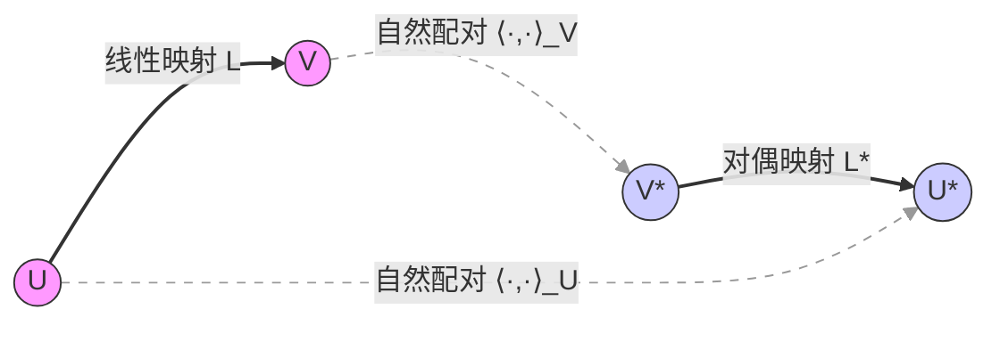

## 基变换、对偶空间与张量视角下的行空间、列空间、核空间及转置核空间的关系

### 1. 关系图示

- 原空间与对偶空间：  
  - 原空间 $ U, V $（粉色）和对偶空间 $ U^*, V^* $（蓝色）通过自然配对 $ \langle \cdot, \cdot \rangle $ 关联。  
  - 自然配对是线性泛函的作用，例如 $ \langle \phi, u \rangle = \phi(u) $（$ \phi \in U^* $, $ u \in U $）。

- 线性映射与对偶映射：  
  - 线性映射 $ L: U \to V $ 诱导对偶映射 $ L^*: V^* \to U^* $，满足 $ L^*(\psi) = \psi \circ L $（$ \psi \in V^* $）。  
  - 几何意义：转置 $ L^* $ 将 $ V^* $ 中的泛函“拉回”到 $ U^* $，方向与原映射 $ L $ 相反。

#### 2. 行空间、列空间、核空间与转置核空间的关系
- 行空间与列空间：  
  - 矩阵 $ A $ 的行空间 $ \text{Row}(A) \subseteq U^* $，列空间 $ \text{Col}(A) \subseteq V $。  
  - 转置 $ A^T $ 的列空间对应 $ A $ 的行空间，行空间对应 $ A $ 的列空间（见图中 $ L $ 与 $ L^* $ 的对应关系）。

- 核空间与左零空间：  
  - 核空间 $ \ker(A) \subseteq U $ 是行空间的正交补，左零空间 $ \ker(A^T) \subseteq V^* $ 是列空间的正交补。  
  - 图中表现为：若 $ L(u) = 0 $，则 $ u \in \ker(L) $；若 $ L^*(\psi) = 0 $，则 $ \psi \in \ker(L^*) $。

### 应用示例分析

#### 1. 矩阵转置的几何意义
矩阵转置 $ A^T $ 的几何意义直接对应图中 $ L^* $ 的映射方向：  
- 交换行与列：原映射 $ A $ 的列空间（$ V $ 的子空间）通过 $ A^T $ 转换为行空间（$ U^* $ 的子空间）。  
- 保持正交关系：核空间 $ \ker(A) $ 和左零空间 $ \ker(A^T) $ 的正交补性质由自然配对 $ \langle \cdot, \cdot \rangle $ 保证。

#### 2. 实对称矩阵的正交分解
实对称矩阵 $ A = A^T $ 的自伴性（$ L = L^* $）在图中体现为：  
- 映射方向一致：$ A $ 既是 $ U \to V $ 的映射，也是 $ V^* \to U^* $ 的映射（当 $ U = V $ 时，$ A $ 在自身与对偶空间之间保持对称性）。  
- 正交特征基：自伴性迫使特征向量正交，最终在自然配对下形成正交分解 $ A = Q \Lambda Q^T $。

### 总结
1. 转置的本质是对偶映射，方向与原映射相反；  
2. 实对称矩阵的自伴性使其在自然配对下退化为对角化形式。  
图表语言与张量分析结合，揭示了线性代数中抽象关系的几何直观。