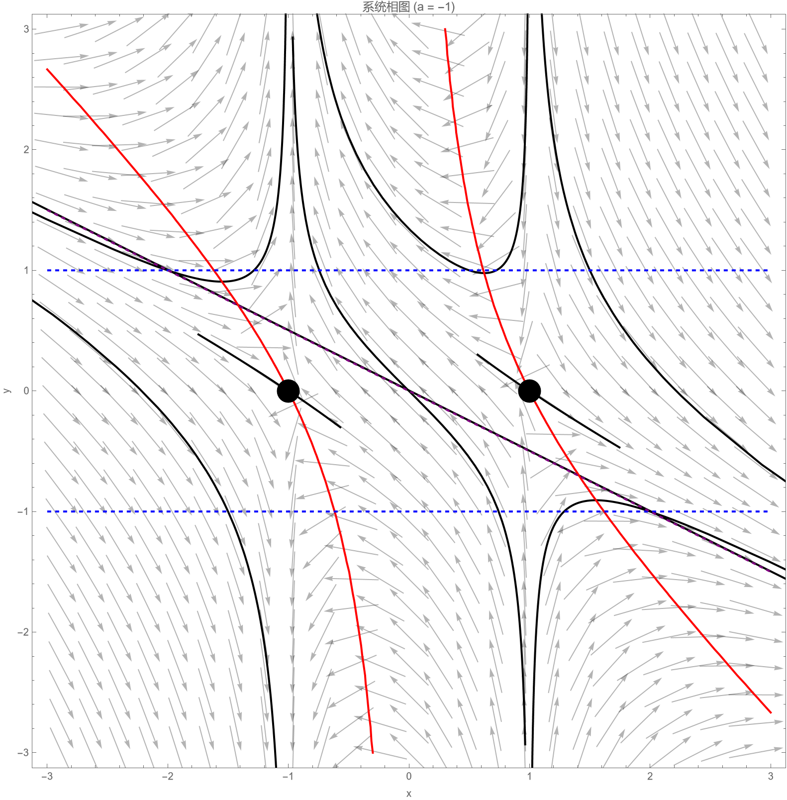

# Ex 1
本题的目的是说明平衡点渐近稳定的定义中，首先要求平衡点稳定这个条件不是多余的。
1. 求系统 $\dot{\theta}=\sin\frac{\theta}{2}$ 的相流。
2. 考虑极坐标系下的系统 $\dot{r}=r(1-r);\quad\dot{\theta}=\sin\frac{\theta}{2}.$ 求系统的相流。
3. 将该系统转化为直角坐标系下的自治系统，并求其平衡点以及相流。
4. 证明该平衡点p不稳定，但是存在p的一个小邻域U使得对任意的 $z\in U$ 有 $\lim_{t\rightarrow\infty}\phi_{t}(z)=p.$

## 解答
### 1
分离变量：
$$\frac{d\theta}{dt} = \sin\frac{\theta}{2} \implies \frac{d\theta}{\sin(\theta/2)} = dt$$
积分两边：
$$\int \csc\left(\frac{\theta}{2}\right) d\theta = \int dt$$
令 $u = \frac{\theta}{2}$，则 $d\theta = 2 du$，所以：
$$\int \csc u \cdot 2 du = \int dt \implies 2 \int \csc u \, du = t + C$$
$$2 \ln \left| \tan\frac{u}{2} \right| = t + C \implies \ln \left| \tan\frac{\theta}{4} \right| = \frac{t}{2} + C_1$$
$$\left| \tan\frac{\theta}{4} \right| = e^{t/2} e^{C_1} \implies \tan\frac{\theta}{4} = A e^{t/2}$$
其中 $A$ 为常数。由初始条件 $\theta(0) = \theta_0$，得 $A = \tan\frac{\theta_0}{4}$。因此相流为：
$$\phi_t(\theta_0) = 4 \arctan\left( e^{t/2} \tan\frac{\theta_0}{4} \right)$$

### 2
系统由两个独立的方程组成：

$\dot{r} = r(1-r)$ 是逻辑方程，解为：
$$r(t) = \frac{1}{1 + \left( \frac{1}{r_0} - 1 \right) e^{-t}}$$
其中 $r_0 = r(0)$。当 $t \to \infty$ 时，若 $r_0 > 0$，则 $r(t) \to 1$；若 $r_0 = 0$，则 $r(t) = 0$。
$\dot{\theta} = \sin\frac{\theta}{2}$ 的相流如第1部分所示：
$$\theta(t) = 4 \arctan\left( e^{t/2} \tan\frac{\theta_0}{4} \right)$$
其中 $\theta_0 = \theta(0)$。

因此，极坐标系下的相流为：
$$\phi_t(r_0, \theta_0) = \left( \frac{1}{1 + \left( \frac{1}{r_0} - 1 \right) e^{-t}},\ 4 \arctan\left( e^{t/2} \tan\frac{\theta_0}{4} \right) \right)$$
平衡点为：

$r = 0$
$r = 1$ 且 $\theta = 2k\pi$ ，但考虑 $\theta$ 模 $2\pi$，主要平衡点为 $(1,0)$。

### 3
直角坐标与极坐标的关系： $x = r \cos \theta$, $y = r \sin \theta$。则：
$$\dot{x} = \frac{dx}{dt} = \frac{\partial x}{\partial r} \dot{r} + \frac{\partial x}{\partial \theta} \dot{\theta} = \cos \theta \cdot r(1-r) + (-r \sin \theta) \cdot \sin\frac{\theta}{2} = r(1-r) \cos \theta - r \sin \theta \sin\frac{\theta}{2}$$
$$\dot{y} = \frac{dy}{dt} = \frac{\partial y}{\partial r} \dot{r} + \frac{\partial y}{\partial \theta} \dot{\theta} = \sin \theta \cdot r(1-r) + r \cos \theta \cdot \sin\frac{\theta}{2} = r(1-r) \sin \theta + r \cos \theta \sin\frac{\theta}{2}$$
因此，直角坐标系下的自治系统为：
$$\begin{aligned}
\dot{x} &= r(1-r) \cos \theta - r \sin \theta \sin\frac{\theta}{2} \\
\dot{y} &= r(1-r) \sin \theta + r \cos \theta \sin\frac{\theta}{2}
\end{aligned}$$
其中 $r = \sqrt{x^2 + y^2}$, $\cos \theta = \frac{x}{r}$, $\sin \theta = \frac{y}{r}$，但 $\sin\frac{\theta}{2}$ 需通过三角恒等式表达，例如 $\sin\frac{\theta}{2} = \sqrt{\frac{1 - \cos \theta}{2}}$（需考虑象限），系统在原点可能不光滑。
平衡点满足 $\dot{r} = 0$ 和 $\dot{\theta} = 0$：

$\dot{r} = 0$ 当 $r = 0$ 或 $r = 1$。
$\dot{\theta} = 0$ 当 $\sin\frac{\theta}{2} = 0$，即 $\theta = 2k\pi$。

因此平衡点为：

$r = 0$：原点 $(0,0)$。
$r = 1$ 且 $\theta = 2k\pi$：点 $(1,0)$（考虑模 $2\pi$）。

相流在直角坐标系中为：
$$\Phi_t(x, y) = \left( r(t) \cos \theta(t),\ r(t) \sin \theta(t) \right)$$
其中 $r(t) = \frac{1}{1 + \left( \frac{1}{r_0} - 1 \right) e^{-t}}$，$\theta(t) = 4 \arctan\left( e^{t/2} \tan\frac{\theta_0}{4} \right)$，且 $r_0 = \sqrt{x^2 + y^2}$，$\theta_0 = \arg(x + y i)$。

### 4
取平衡点 $p = (1,0)$。首先证明 $p$ 不稳定。
对于稳定性，需证明存在 $\epsilon > 0$，使得对任意 $\delta > 0$，存在 $z$ 满足 $|z - p| < \delta$，但对某个 $t$，有 $|\phi_t(z) - p| \geq \epsilon$。取 $\epsilon = 1$。对任意 $\delta > 0$，取 $z$ 满足 $r_0 = 1$，$\theta_0 = \delta$（即点 $(1, \delta)$ 在极坐标中）。则 $|z - p| \approx \delta < \delta$。但从系统：

- $\dot{r} = 0$，故 $r(t) = 1$。
- $\dot{\theta} = \sin\frac{\theta}{2} > 0$（对 small $\delta > 0$），故 $\theta(t)$ 增加。

当 $\theta(t) = \pi$ 时，点位于 $(-1, 0)$，与 $p$ 的距离为 $2 \geq 1$。因此，存在 $t$ 使得 $|\phi_t(z) - p| \geq 1$。故 $p$ 不稳定。
现在证明存在小邻域 $U$ 使得对任意 $z \in U$，有 $\lim_{t \to \infty} \phi_t(z) = p$。取 $U$ 为不包含原点的开集，例如 $U = \{ (x,y) \mid \sqrt{(x-1)^2 + y^2} < \frac{1}{2} \}$（即以 $p$ 为中心、半径 $1/2$ 的开球）。对任意 $z \in U$，有 $r_0 > 0$，且从系统：

- 当 $t \to \infty$ 时，$r(t) \to 1$。
- 当 $t \to \infty$ 时，$\theta(t) \to 0 \mod 2\pi$（因为 $\tan\frac{\theta}{4} \propto e^{t/2} \to \infty$，故 $\theta(t) \to 2\pi \equiv 0$）。

因此 $\phi_t(z) \to (1,0) = p$。故 $\lim_{t \to \infty} \phi_t(z) = p$ 对所有 $z \in U$ 成立。

# Ex 2
设$a\in\mathbb{R},z\in\mathbb{R}^2$ 。考虑初值问题

$$\begin{cases}\dot{x}&=x^2-1,\\\dot{y}&=-xy+a(x^2-1)\end{cases};\quad(x(0),y(0))=z.$$

1. 求解初值问题。
2. 设$a<0$ ，画出系统的相图(即画出典型的相曲线)。

## 解答
### 1
设初始值为 $z = (x_0, y_0)$。

- 若 $x_0 = 1$，则  
  $$
  x(t) = 1, \quad y(t) = y_0 e^{-t}.
  $$

- 若 $x_0 = -1$，则  
  $$
  x(t) = -1, \quad y(t) = y_0 e^{t}.
  $$

- 若 $x_0 \neq \pm 1$，令 $C = \dfrac{x_0 - 1}{x_0 + 1}$，则  
  $$
  x(t) = \dfrac{1 + C e^{2t}}{1 - C e^{2t}},
  $$  
  解定义在最大存在区间上。进一步，  
  $$
  y(t) = \dfrac{1}{\sqrt{|x(t)^2 - 1|}} \left( \sqrt{|x_0^2 - 1|} \, y_0 + a \int_{x_0}^{x(t)} \sqrt{|s^2 - 1|} \, ds \right),
  $$  

### 2

# Ex 3
考虑系统

$$\begin{cases}\dot{x}&=(\epsilon x+2y)(z+1)\\\dot{y}&=(-x+\epsilon y)(z+1)\\\dot{z}&=-z^3\end{cases}$$

1. 证明：当$\epsilon=0$ 时，平衡点不是渐近稳定的。

2. 证明：当$\epsilon<0$ 时，对任意的$p=(x,y,z)$ 满足$z>-1$ 均有
  $$\lim_{t\rightarrow\infty}\phi_{t}(z)=(0,0,0).$$

## 解答
### 1
当 $\epsilon = 0$ 时，系统简化为
$$\begin{aligned}
\dot{x} &= 2y(z+1), \\
\dot{y} &= -x(z+1), \\
\dot{z} &= -z^3.
\end{aligned}$$
平衡点为 $(0,0,0)$。考虑函数 $V = x^2 + 2y^2$，其时间导数为
$$\dot{V} = 2x\dot{x} + 4y\dot{y} = 2x \cdot 2y(z+1) + 4y \cdot (-x)(z+1) = 4xy(z+1) - 4xy(z+1) = 0.$$
因此，$V$ 为守恒量。对于任意满足 $x^2 + 2y^2 > 0$ 的初始条件，$V$ 保持为正常数，故轨迹不趋于原点。这表明原点不是渐近稳定的。

### 2
首先，$z$ 方程 $\dot{z} = -z^3$ 是独立的。考虑李雅普诺夫函数 $V_z = \frac{1}{2}z^2$，则 $\dot{V}_z = z\dot{z} = -z^4 \le 0$，且等号仅当 $z=0$ 时成立。故 $z(t) \to 0$ 当 $t \to \infty$，且由初始条件 $z(0) > -1$ 可知 $z(t) > -1$ 对所有 $t \ge 0$ 成立（若 $z(0) \in (-1,0)$，则 $\dot{z} > 0$，$z(t)$ 递增趋于 0；若 $z(0) > 0$，则 $\dot{z} < 0$，$z(t)$ 递减趋于 0）。
对于 $x$ 和 $y$，考虑函数 $W = x^2 + 2y^2$，其时间导数为
$$\dot{W} = 2x\dot{x} + 4y\dot{y} = 2x(\epsilon x+2y)(z+1) + 4y(-x+\epsilon y)(z+1) = 2\epsilon (z+1)(x^2+2y^2) = 2\epsilon (z+1) W.$$
由于 $\epsilon < 0$ 且 $z(t)+1 > 0$，有 $\dot{W} < 0$ 当 $W > 0$。解此微分方程得
$$W(t) = W(0) \exp\left( 2\epsilon \int_0^t (z(s)+1) \, ds \right).$$
因为 $z(t)+1$ 有正下界（若 $z(0) < 0$，则 $z(t)+1 \ge z(0)+1 > 0$；若 $z(0) \ge 0$，则 $z(t)+1 \ge 1$），故 $\int_0^t (z(s)+1) \, ds \to +\infty$ 当 $t \to \infty$。又 $\epsilon < 0$，所以指数项趋于 $-\infty$，从而 $W(t) \to 0$，即 $x(t), y(t) \to 0$。
综上，结合 $z(t) \to 0$，即得 $\phi_t(p) \to (0,0,0)$。