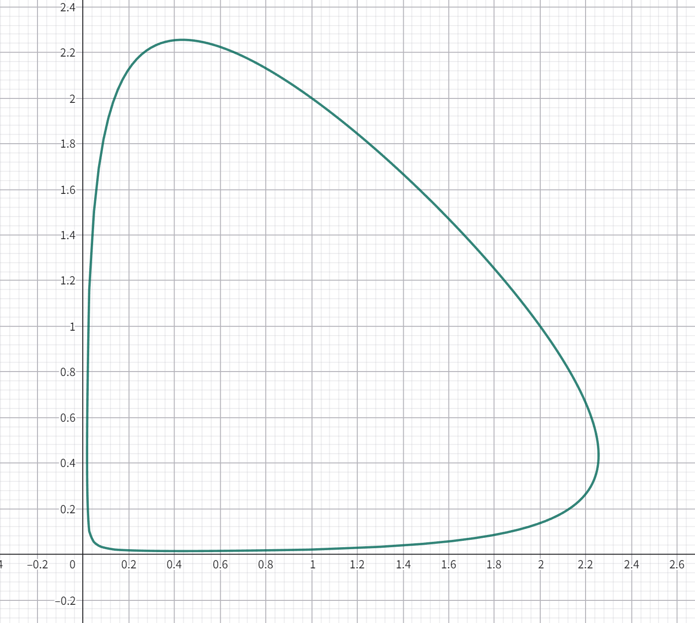

# Ex 1
构造一族向量场 $F_\lambda(X) = F(\lambda, X)$ 使得 $F: [0,1] \times \mathbb{R}^2 \to \mathbb{R}^2$ 为 $C^2$ 光滑，使得 $\dot{X} = F_0(X)$ 为梯度系统，$\dot{X} = F_1(X)$ 为 Hamilton 系统。

## 解答
先构造两个向量场 $G(X), H(X): \mathbb{R}^2 \to \mathbb{R}^2$，使得 $G$ 为梯度场，$H$ 为 Hamilton 场。 不妨取势能函数和Hamilton函数均为
$$V(x,y) = H(x,y) = \frac{1}{2}(x^2 + y^2).$$
则
$$G(X) = -\nabla V(x,y) = \begin{pmatrix} -x \\ -y \end{pmatrix}, \quad H(X) = J  \nabla H(x,y) = \begin{pmatrix} y \\ -x \end{pmatrix},$$
于是构造两个向量场的线性组合
$$F_\lambda(X) = (1 - \lambda) G(X) + \lambda H(X) = \begin{pmatrix} - (1 - \lambda) x + \lambda y \\ - (1 - \lambda) y - \lambda x \end{pmatrix}.$$
显然 $F: [0,1] \times \mathbb{R}^2 \to \mathbb{R}^2$ 为 $C^\infty$ 光滑，且满足题意。

# Ex 2
考虑初值问题
$$
\begin{cases}
\dot{x} = x(1 - y); & x(0) = 1; \\
\dot{y} = y(x - 1); & y(0) = 2
\end{cases}
\quad (1)
$$

定义 $F: (0,\infty)^2 \to \mathbb{R}$ 为
$$
F(x,y) := x - \log x + y - \log y.
$$

定义水平集
$$
\Gamma := \{(x,y) \in (0,\infty)^2 : F(x,y) = F(1,2) = 3 - \log 2\}.
$$

设 $a \in (0,1)$ 使得 $F(a,1) = 3 - \log 2$。

1) 证明 $F$ 为凸函数，并画出 $F$ 的典型水平集简图。

2) 设 $\phi: I \to \mathbb{R}^2$ 是初值问题的极大解。定义 $\eta(t) := F(\phi(t))$。证明 $\eta'(t) \equiv 0$，由此证明 $\phi(I) \subset \Gamma$，以及 $I = \mathbb{R}$。

3) 任取 $b \in (a,1)$。证明存在 $c^* > 1$, $c_* \in (0,1)$ 使得 $(b, c_*), (b, c^*) \in \Gamma$。

4) 通过计算 $x$ 分量，证明存在 $T_1 > 0$ 使得 $\phi(T_1) = (b, c^*)$。

5) 通过计算 $y$ 分量，证明存在 $T_2 > T_1$ 使得 $\phi(T_2) = (b, c_*)$。

6) 证明存在 $T_* > 0$ 使得 $\phi(T_*) = (1,2)$，从而证明 $\phi$ 是一个周期解。

## 解答
### 1
首先计算 Hess 矩阵
$$H_F = \begin{pmatrix} \frac{\partial^2 F}{\partial x^2} & \frac{\partial^2 F}{\partial x \partial y} \\ \frac{\partial^2 F}{\partial y \partial x} & \frac{\partial^2 F}{\partial y^2} \end{pmatrix} = \begin{pmatrix} \frac{1}{x^2} & 0 \\ 0 & \frac{1}{y^2} \end{pmatrix}.$$
由于 $x,y > 0$，所以 Hess 矩阵正定，因此 $F$ 为凸函数。
水平集简图如下所示：

### 2
使用链式法则：
$$\eta'(t) = \nabla F(\phi(t)) \cdot \phi'(t) = \left(1 - \frac{1}{x(t)}, 1 - \frac{1}{y(t)}\right) \cdot \begin{pmatrix} x(1 - y) \\ y(x - 1) \end{pmatrix} = (x - 1)(1 - y) + (y - 1)(x - 1) = 0.$$
因此 $\eta(t) \equiv \eta(0) = F(1,2)$，所以 $\phi(I) \subset \Gamma$。
由于 $\Gamma$ 有界且不包含边界点 $(0,y)$ 或 $(x,0)$，所以解 $\phi$ 不会在有限时间内逃离 $(0,\infty)^2$，因此 $I = \mathbb{R}$。

### 3
首先计算 $F(a,1)$ 处关于 $y$ 的偏导数：
$$\frac{\partial F}{\partial y}(a,1) = 1 - 1 = 0.$$
计算二阶偏导数：
$$\frac{\partial^2 F}{\partial y^2}(a,1) = \frac{1}{1^2} = 1 > 0.$$
因此在点 $(a,1)$ 处，$F$ 关于 $y$ 有一个局部极小值。由于 $F(a,1) = 3 - \log 2$，所以存在 $c^* > 1$ 和 $c_* \in (0,1)$ 使得 $(b, c^*), (b, c_*) \in \Gamma$。

### 4
计算 $x$ 分量的微分方程：
$$\frac{dx}{dt} = x(1 - y).$$
由于在 $\Gamma$ 上，$y$ 是 $x$ 的函数，记为 $y = g(x)$。则
$$\frac{dx}{dt} = x(1 - g(x)).$$
在区间 $(a,1)$ 上，$1 - g(x) > 0$，因此 $x(t)$ 单调递减。由初始条件 $x(0) = 1$，存在 $T_1 > 0$ 使得 $x(T_1) = b$，对应的 $y(T_1) = c^*$。
### 5
计算 $y$ 分量的微分方程：
$$\frac{dy}{dt} = y(x - 1).$$
在区间 $(a,1)$ 上，$x - 1 < 0$，因此 $y(t)$ 单调递减。由初始条件 $y(0) = 2$，存在 $T_2 > T_1$ 使得 $y(T_2) = c_*$，对应的 $x(T_2) = b$。
### 6
由于解 $\phi(t)$ 在 $\Gamma$ 上运动，并且 $x(t)$ 和 $y(t)$ 都是周期函数，因此存在 $T_* > 0$ 使得 $\phi(T_*) = (1,2)$。因此 $\phi$ 是一个周期解

# Ex 3
证明 Arzela-Ascoli 定理：设 $\{f_n : n \in \mathbb{N}\} \subset C[a,b]$ 满足：

1) 存在 $M > 0$ 使得对任意的 $n \in \mathbb{N}$ 有 $\|f_n\|_\infty \le M$；

2) 任给 $\varepsilon > 0$，存在 $\delta > 0$ 使得对任意的 $n$，当 $|t - s| \le \delta$ 时有
$$
|f_n(t) - f_n(s)| \le \varepsilon.
$$

则存在子列 $n_k \to \infty$ 以及 $f \in C[a,b]$ 使得 $f_{n_k} \rightrightarrows f$。

## 解答
设 $\{f_n\} \subset C[a,b]$ 满足一致有界和等度连续条件。取 $[a,b]$ 的一个可数稠密子集 $D = \{x_1, x_2, \dotsc\}$（例如全体有理点）。由于 $\{f_n(x_1)\}$ 是有界数列，存在收敛子列，记为 $\{f_{1,k}\}$。对 $\{f_{1,k}\}$ 考虑点 $x_2$，其值也有界，故有子列 $\{f_{2,k}\} \subset \{f_{1,k}\}$ 使得 $\{f_{2,k}(x_2)\}$ 收敛。如此继续，得到嵌套的子列族：
$$\{f_{1,k}\} \supset \{f_{2,k}\} \supset \dotsb$$
满足对任意 $m$，序列 $\{f_{m,k}\}$ 在点 $x_1,\dotsc,x_m$ 处均收敛。
作对角线子列：令 $g_k = f_{k,k}$。则对任意 $x_j \in D$，当 $k \ge j$ 时 $g_k(x_j)$ 属于 $\{f_{j,k}(x_j)\}$ 的子列，故 $\{g_k(x_j)\}$ 收敛。因此 $\{g_k\}$ 在 $D$ 上逐点收敛。
下证 $\{g_k\}$ 在 $[a,b]$ 上一致收敛。给定 $\varepsilon > 0$，由等度连续性，存在 $\delta > 0$ 使得对任意 $n$ 及 $t,s \in [a,b]$ 满足 $|t-s| \le \delta$ 时，有 $|g_n(t) - g_n(s)| \le \varepsilon/3$。取有限点集 $\{y_1,\dotsc,y_p\} \subset D$ 构成 $[a,b]$ 的一个 $\delta$-网（即对任意 $t \in [a,b]$，存在 $y_i$ 使得 $|t - y_i| \le \delta$）。由于 $\{g_k\}$ 在每个 $y_i$ 处收敛，故存在 $N$ 使得对任意 $k,l \ge N$ 和所有 $i=1,\dotsc,p$，有 $|g_k(y_i) - g_l(y_i)| \le \varepsilon/3$。
对任意 $t \in [a,b]$，取 $y_i$ 满足 $|t - y_i| \le \delta$，则当 $k,l \ge N$ 时，
$$\begin{aligned}
|g_k(t) - g_l(t)|
&\le |g_k(t) - g_k(y_i)| + |g_k(y_i) - g_l(y_i)| + |g_l(y_i) - g_l(t)| \\
&\le \frac{\varepsilon}{3} + \frac{\varepsilon}{3} + \frac{\varepsilon}{3} = \varepsilon.
\end{aligned}$$
因此 $\{g_k\}$ 是一致 Cauchy 列。由 $C[a,b]$ 的完备性，存在 $f \in C[a,b]$ 使得 $g_k \rightrightarrows f$。