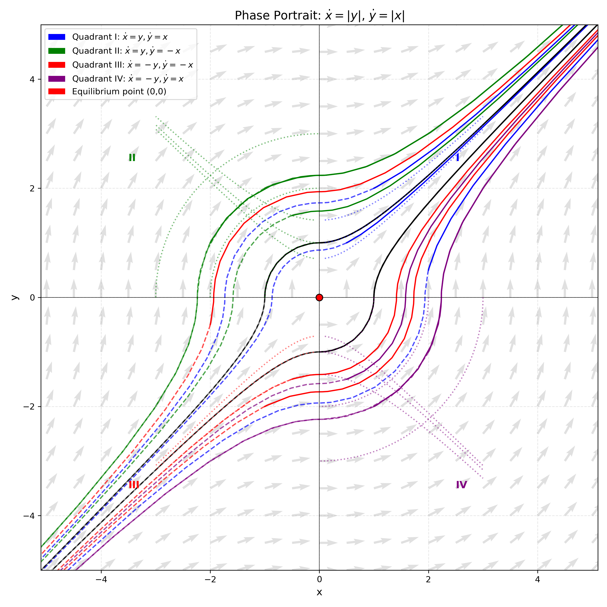

# 习题1
习题1设$\phi:[0,T]\rightarrow \mathbb{R}$连续。设$a,c\in\mathbb{R},b>0$，设对任意的$t\in[0,T]$ 有
$$
\phi(t)\leq a+\int_{0}^{t}(b\phi(s)+c)d s.
$$
证明对任意的$t\in[0,T]$ 有
$$
\phi(t)\leq a e^{b t}+\frac{c}{b}(e^{b t}-1).
$$

## 解答
记 $u(t)=\phi(t)$，由条件知
$$
u(t)\leq a+\int_0^t (b u(s)+c) ds.
$$
令 $v(t)=a+\int_0^t (b u(s)+c) ds$，则 $v(0)=a$，且 $u(t)\leq v(t)$。对 $v(t)$ 求导得
$$
v'(t)=b u(t)+c\leq b v(t)+c,
$$
即
$$
v'(t)-b v(t)\leq c.
$$
两边乘以积分因子 $e^{-bt}$：
$$
\frac{d}{dt}\left(e^{-bt}v(t)\right)=e^{-bt}(v'(t)-b v(t))\leq c e^{-bt}.
$$
从 $0$ 到 $t$ 积分：
$$
e^{-bt}v(t)-v(0)\leq \int_0^t c e^{-bs}ds=\frac{c}{b}(1-e^{-bt}).
$$
代入 $v(0)=a$，整理得
$$
e^{-bt}v(t)\leq a+\frac{c}{b}(1-e^{-bt}),
$$
即
$$
v(t)\leq a e^{bt}+\frac{c}{b}(e^{bt}-1).
$$
由 $u(t)\leq v(t)$ 即得
$$
\phi(t)\leq a e^{b t}+\frac{c}{b}(e^{b t}-1).
$$

# 习题2
考虑自治系统
$$
\dot{x}=|y|,\quad \dot{y}=|x|.
$$
1) 任取 $z=(x,y)\in\mathbb{R}^{2}$，证明初值问题 $\mathcal{I}(0,z)$ 的解局部存在且唯一。
2) $\mathcal{I}(0,z)$ 的极大解为 $(\phi(t,z),I_{z})$，确定解的极大定义区间 $I_{z}$。
3) 确定 $\phi(t,z)$ 的定义域，并证明在其上连续。是 $C^{1}$ 光滑函数吗？说明理由。
4) 证明该自治系统的相流存在。
5) 画出系统的典型极大相曲线。

## 解答
**1)** 系统右端函数 $f(x,y)=(|y|,|x|)$ 连续，且对任意 $z_1=(x_1,y_1),z_2=(x_2,y_2)$ 有
$$
|f_1(z_1)-f_1(z_2)|=||y_1|-|y_2||\le |y_1-y_2|,\quad 
|f_2(z_1)-f_2(z_2)|=||x_1|-|x_2||\le |x_1-x_2|,
$$
故
$$
\|f(z_1)-f(z_2)\|\le \sqrt{|y_1-y_2|^2+|x_1-x_2|^2}= \|z_1-z_2\|,
$$
其中 $\|\cdot\|$ 为欧几里得范数。因此 $f$ 整体 Lipschitz 连续，由 Picard-Lindelöf 定理，初值问题存在唯一局部解。

**2)** 由于 $f$ 整体 Lipschitz 连续，解可唯一延拓到整个实轴，故极大定义区间 $I_z=\mathbb{R}$。

**3)** 解 $\phi(t,z)$ 的定义域为 $\mathbb{R}\times\mathbb{R}^2$。因 $f$ 连续且整体 Lipschitz，解关于时间和初值连续依赖，故 $\phi$ 在其定义域上连续。但 $\phi$ 关于 $z$ 不是 $C^1$ 的。$f$ 在坐标轴上不可微，导致解关于初值的光滑性不能保证；考虑穿过坐标轴的解，当初值变化使解穿越坐标轴时，导数可能出现间断。

**4)** 对每个 $t\in\mathbb{R}$，定义映射 $\Phi_t:\mathbb{R}^2\to\mathbb{R}^2$ 为 $\Phi_t(z)=\phi(t,z)$。由解的唯一性和存在性，有 $\Phi_0=\mathrm{id}$ 且 $\Phi_{t+s}=\Phi_t\circ\Phi_s$，故相流存在。

**5)** 系统有首次积分 $y|y|-x|x| = c$。根据不同象限，相曲线形状如下：
- 第一象限（$x\ge0,y\ge0$）：$y^2-x^2=c$，为双曲线（或直线 $y=x$ 当 $c=0$）。
- 第二象限（$x<0,y\ge0$）：$x^2+y^2=c$（$c>0$），为圆弧。
- 第三象限（$x<0,y<0$）：$x^2-y^2=c$，为双曲线。
- 第四象限（$x\ge0,y<0$）：$x^2+y^2=-c$（$c<0$），为圆弧。
由于 $\dot{x}\ge0,\dot{y}\ge0$，轨线沿曲线向右上方运动。

# 习题3
考虑含参数的自治系统
$$
\dot{x}=x^{2}+\lambda.
$$
记初值问题 $\mathcal{I}(0,z,\lambda)$ 的解为 $\phi(t,z,\lambda)$。求 $\phi$ 的定义域。

## 解答
系统为一维，解 $\phi(t,z,\lambda)$ 满足隐式方程
$$
\int_{z}^{\phi(t,z,\lambda)} \frac{du}{u^2+\lambda} = t.
$$
定义域 $D\subseteq\mathbb{R}^3$ 为所有使上式确定唯一有限实数的 $(t,z,\lambda)$。分类讨论如下：

1. **$\lambda>0$**  
   $$
   \phi(t,z,\lambda)=\sqrt{\lambda}\tan\left(\sqrt{\lambda}\,t+\arctan\frac{z}{\sqrt{\lambda}}\right),
   $$
   定义域为
   $$
   D_+=\left\{(t,z,\lambda):\lambda>0,\; t\in\left(-\frac{\pi}{2\sqrt{\lambda}}-\frac{1}{\sqrt{\lambda}}\arctan\frac{z}{\sqrt{\lambda}},\; \frac{\pi}{2\sqrt{\lambda}}-\frac{1}{\sqrt{\lambda}}\arctan\frac{z}{\sqrt{\lambda}}\right)\right\}.
   $$

2. **$\lambda=0$**  
   - 若 $z=0$，则 $\phi(t,0,0)=0$，定义域为 $\{(t,0,0):t\in\mathbb{R}\}$。
   - 若 $z>0$，则 $\phi(t,z,0)=\dfrac{z}{1-tz}$，定义域为 $\{(t,z,0):z>0,\; t<1/z\}$。
   - 若 $z<0$，则 $\phi(t,z,0)=\dfrac{z}{1-tz}$，定义域为 $\{(t,z,0):z<0,\; t>1/z\}$。

3. **$\lambda<0$**，记 $\mu=-\lambda>0$  
   - 若 $z>\sqrt{\mu}$，解存在于 $t<T(z,\lambda)$，其中 $T(z,\lambda)=\dfrac{1}{2\sqrt{\mu}}\ln\dfrac{z+\sqrt{\mu}}{z-\sqrt{\mu}}$，定义域为 $t<T(z,\lambda)$。
   - 若 $z=\sqrt{\mu}$，平衡解 $\phi\equiv\sqrt{\mu}$，定义域为 $t\in\mathbb{R}$。
   - 若 $-\sqrt{\mu}<z<\sqrt{\mu}$，解存在于 $t<T(z,\lambda)$，其中 $T(z,\lambda)=\dfrac{1}{2\sqrt{\mu}}\ln\dfrac{\sqrt{\mu}+z}{\sqrt{\mu}-z}$，定义域为 $t<T(z,\lambda)$。
   - 若 $z=-\sqrt{\mu}$，平衡解 $\phi\equiv-\sqrt{\mu}$，定义域为 $t\in\mathbb{R}$。
   - 若 $z<-\sqrt{\mu}$，解存在于 $t>T(z,\lambda)$，其中 $T(z,\lambda)=\dfrac{1}{2\sqrt{\mu}}\ln\dfrac{z+\sqrt{\mu}}{z-\sqrt{\mu}}$，定义域为 $t>T(z,\lambda)$。

综上，$\phi$ 的定义域 $D$ 为上述各部分的并集。

# 习题4
设 $n\in\mathbb{N}$，考虑自治系统
$$
\mathcal{A}(n): \dot{x}=x^{n}\sin x.
$$
1) 证明系统 $\mathcal{A}(n)$ 存在相流。
2) $\{\mathcal{A}(n):n\geq1\}$ 有几个拓扑共轭等价类？说明理由。
3) 证明系统 $\dot{x}=e^{x}\sin x$ 存在相流。
4) 是否存在 $n$ 使得 $\mathcal{A}(n)$ 与系统 $\dot{x}=e^{x}\sin x$ 拓扑共轭？说明理由。

## 解答
**1)** 右端函数 $f(x)=x^n\sin x$ 光滑，局部 Lipschitz，故初值问题局部存在唯一解。平衡点为 $x=k\pi\,(k\in\mathbb{Z})$。当 $k\neq0$ 时，$f'(k\pi)=(k\pi)^n\cos(k\pi)\neq0$，平衡点为双曲的；当 $k=0$ 时，$f'(0)=0$，但 $f$ 仍光滑。在相邻平衡点之间，$f(x)$ 不变号，解单调。由于存在无穷多平衡点，解或被吸引至稳定平衡点，或在有限时间达到 $0$（当 $n\ge1$ 且解从适当一侧趋于 $0$ 时），之后可延拓为平衡解。解不会在有限时间爆破至无穷，故所有解的最大存在区间为 $\mathbb{R}$，相流存在。

**2)** 平衡点类型：对 $k\neq0$，$k$ 为偶数时 $f'(k\pi)>0$，不稳定；$k$ 为奇数时 $f'(k\pi)<0$，稳定。对 $k=0$，当 $n$ 为奇数时，$f(x)$ 在 $0$ 两侧均为正，$0$ 不稳定；当 $n$ 为偶数时，$f(x)$ 在 $0$ 右侧为正、左侧为负，$0$ 半稳定。因此相图依赖 $n$ 的奇偶性：奇数 $n$ 时所有偶数 $k$（含 $0$）不稳定，奇数 $k$ 稳定；偶数 $n$ 时 $0$ 半稳定，其他偶数 $k$ 不稳定，奇数 $k$ 稳定。两类相图不能通过同胚互变，故有两个拓扑共轭等价类：奇数 $n$ 类和偶数 $n$ 类。

**3)** 系统 $\dot{x}=e^x\sin x$ 的右端光滑，平衡点 $x=k\pi$。由于 $f'(k\pi)=e^{k\pi}\cos(k\pi)$，$k$ 为偶数时 $f'>0$，不稳定；$k$ 为奇数时 $f'<0$，稳定。所有平衡点双曲，解在平衡点之间单调且不爆破，故解可延拓到 $\mathbb{R}$，相流存在。

**4)** 存在，当 $n$ 为奇数时，两个系统的平衡点类型一致。偶数 $k$（含 $0$）不稳定，奇数 $k$ 稳定。可构造同胚 $h:\mathbb{R}\to\mathbb{R}$ 使 $h(k\pi)=k\pi$，并在每个区间 $(k\pi,(k+1)\pi)$ 上单调，从而将 $\mathcal{A}(n)$ 的轨线映射到 $\dot{x}=e^x\sin x$ 的轨线。当 $n$ 为偶数时，$\mathcal{A}(n)$ 在 $x=0$ 半稳定，而 $\dot{x}=e^x\sin x$ 在 $x=0$ 不稳定，局部结构不同，故不拓扑共轭。