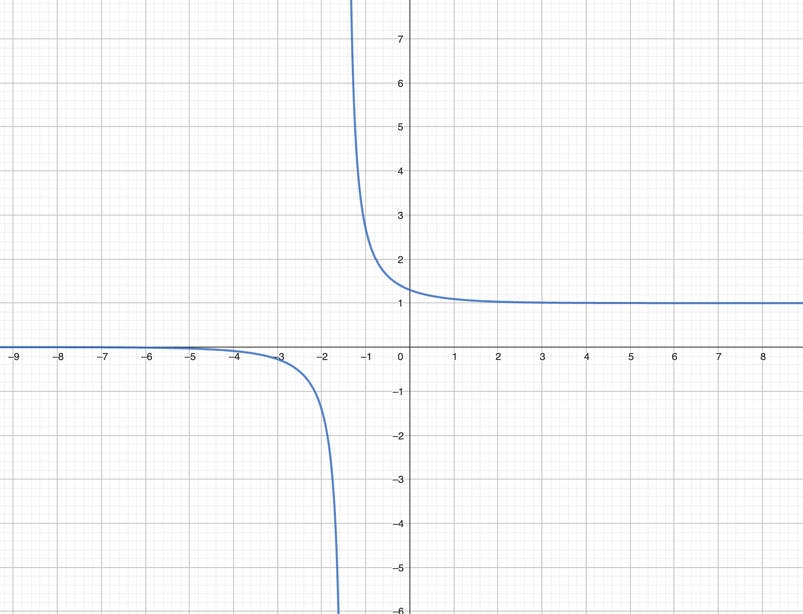
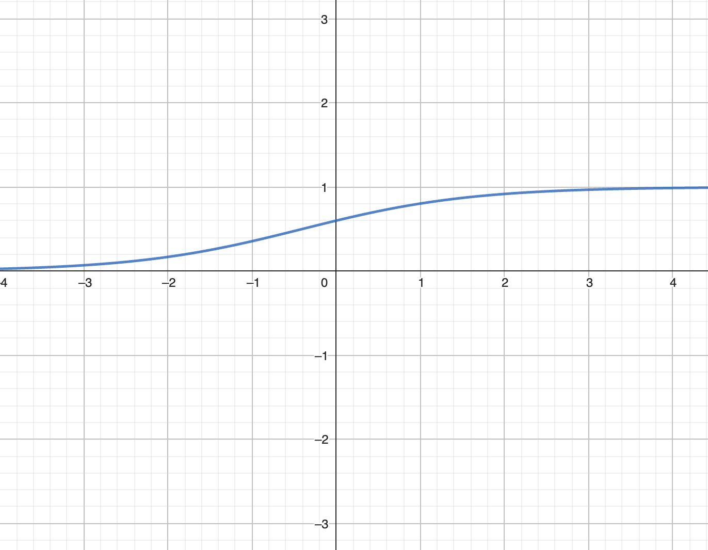
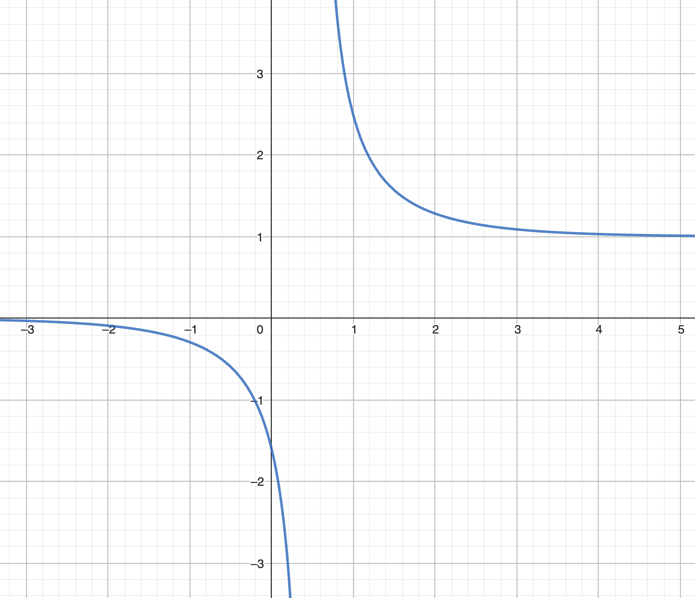
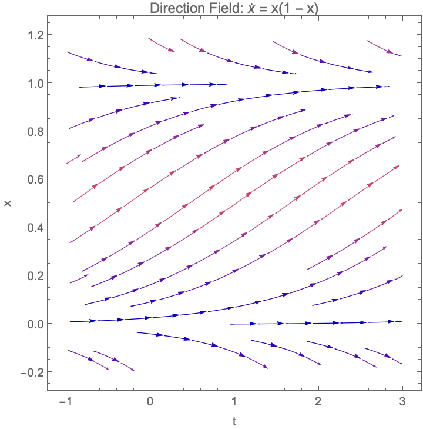
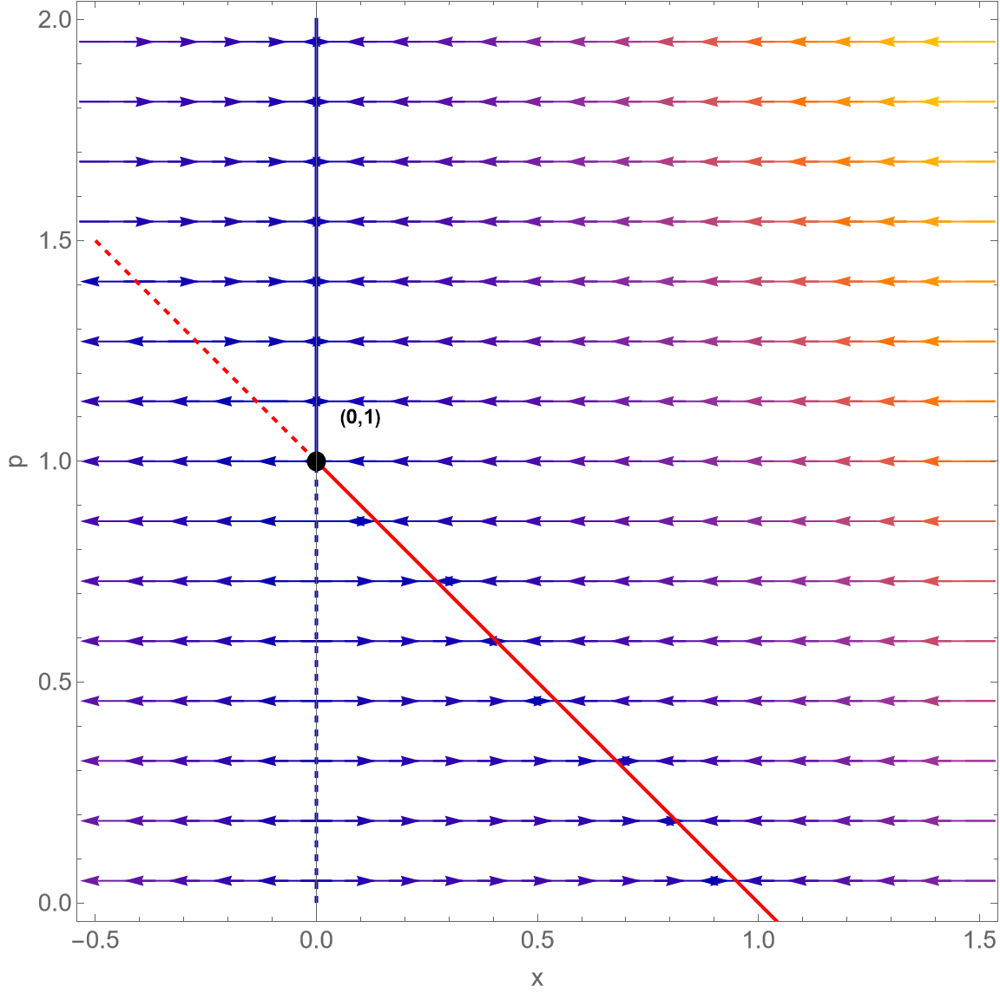
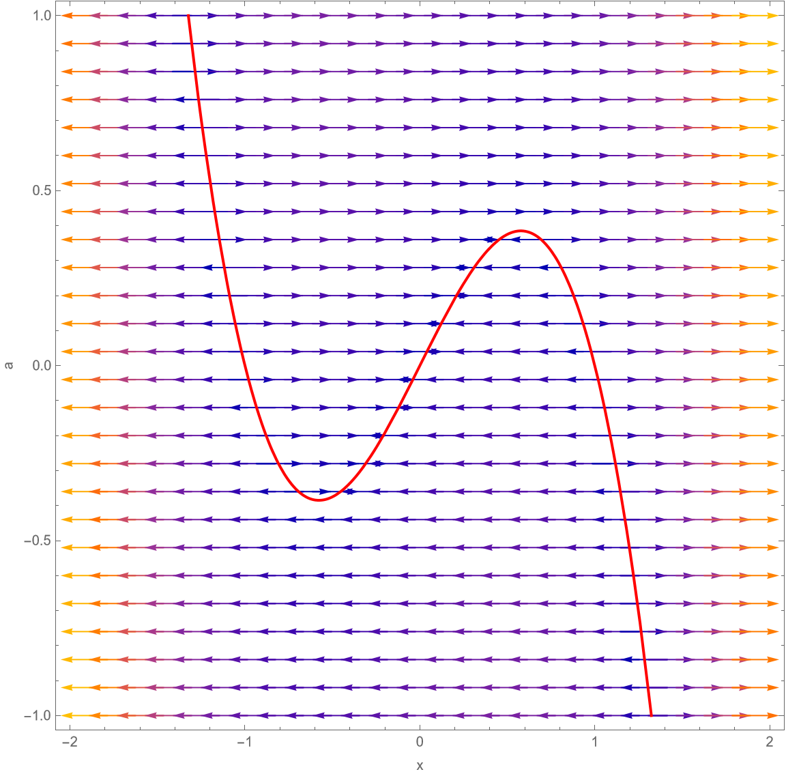
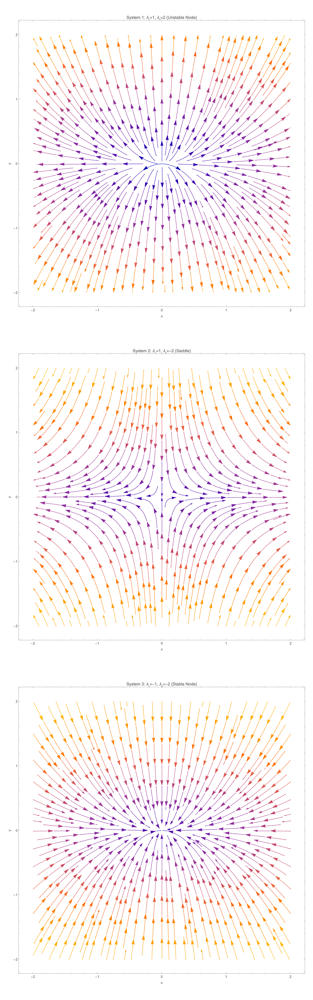
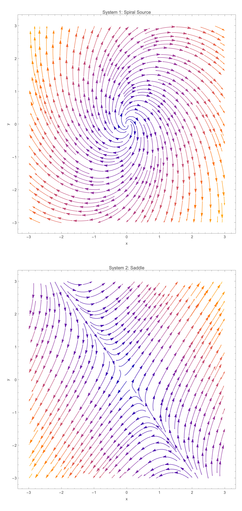
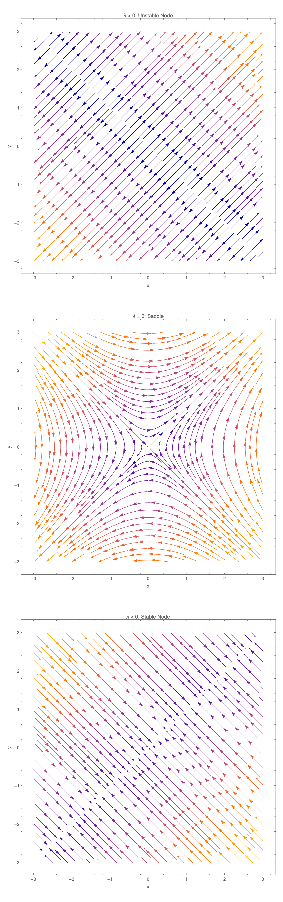

## 习题 1 
设 $c \in \mathbb{R}$，定义  
$$
\varphi_c(t) := \frac{ce^t}{1 - c + ce^t}.
$$  
画出函数 $\varphi_c$ 的图像，并研究函数 $\varphi_c$ 的凸凹性。

### 解答

$$
\varphi_c'(t) = \frac{ce_t(1-c+ce^t)-c^2e^{2t}}{(1-c+ce^t)^2}
= \frac{(1-c)ce^t}{（1-c+ce^t)^2}
$$

$$
\varphi_c''(t) = \frac{(1-c)ce^t(1-c+ce^t)^2 - (1-c)ce^t \cdot 2(1-c+ce^t)ce^t}{(1-c+ce^t)^4}\\
= \frac{(1-c)ce^t(1-c)(1-c+ce^t)}{(1-c+ce^t)^4}
= \frac{(1-c)^2ce^t}{(1-c+ce^t)^3}
$$

$c<0$时，$\varphi_c''(t)<0$，$\varphi_c(t)$在$t\in(-\infty,+\infty)$上为凹函数。
$c>1$或$0<c<1$时，$\varphi_c''(t)>0$，$\varphi_c(t)$在$t\in(-\infty,+\infty)$上为凸函数。
$c=0/1$时，$\varphi_c''(t)=0$，$\varphi_c(t)$在$t\in(-\infty,+\infty)$上为驻点。

---

## 习题 2 
考虑 Logistic 系统 $\dot{x} = x(1 - x)$。  
1) 画出系统的方向场。  
2) 对 $c > 1, 0 < c < 1, c < 0$ 分别求解初值问题  
$$
\dot{x} = x(1 - x); \quad x(0) = c.
$$  
3) 根据解的表达式对方向场作出解释。

### 解答
#### 1.

#### 2.
分离变量：
$$
\frac{1}{x(1-x)}dx = dt \Rightarrow (\frac{1}{x}+\frac{1}{1-x})dx = dt \\
 \Rightarrow \ln|x|-\ln|1-x|=t+C \Rightarrow \frac{x}{1-x}=Ce^t \Rightarrow x=\frac{Ce^t}{1+Ce^t}
$$

带入初值$x(0)=c$:
$$
c=\frac{C}{1+C} \Rightarrow C=\frac{c}{1-c} \Rightarrow x(t)=\frac{\frac{c}{1-c}e^t}{1+\frac{c}{1-c}e^t}=\frac{ce^t}{1-c+ce^t}
$$

#### 3.
- 平衡点：$x=0$（不稳定），$x=1$（稳定）。
- 若 $c>0$：解单调趋于 $x=1$，方向场箭头指向 $x=1$（$0<x<1$ 时向上，$x>1$ 时向下）。
- 若 $c<0$：解单调递减趋向 $-\infty$，方向场箭头向下。
- 若 $c=0$ 或 $1$：解恒为平衡解。

根据方向场的箭头方向：所有正初值被吸引到 $x=1$，负初值发散，$x=0$ 为分界点。

## 习题 3 
设 $p \geq 0$。考虑系统族  
$$
\dot{x} = x(1 - x) - px.
$$  
画出这一族系统的相图分岔图，并对其分岔行为给出解释。

### 解答

该系统发生在参数 $p = 1$ 处发生分岔：

- 两个平衡点 $x = 0$ 和 $x = 1 - p$ 相交；
- 它们在交点处交换稳定性：
  - 当 $p < 1$：$x = 1 - p > 0$ 稳定，$x = 0$ 不稳定；
  - 当 $p > 1$：$x = 0$ 稳定，$x = 1 - p < 0$ 不稳定。

分岔不产生或消灭平衡点，仅改变其稳定性。

---

## 习题 4 
设 $a \in \mathbb{R}$。考虑系统族  
$$
\dot{x} = x^3 - x + a.
$$  
画出这一族系统的相图分岔图，并对其分岔行为给出解释。

### 解答

该系统在 $a = \pm \frac{2\sqrt{3}}{9}$ 处发生分岔：
- 当 $|a| < \frac{2\sqrt{3}}{9}$：系统有三个平衡点（稳定-不稳定-稳定交替，实际为 不稳-稳-不稳）；
- 当 $|a| = \frac{2\sqrt{3}}{9}$：两个平衡点碰撞并湮灭（或产生）；
- 当 $|a| > \frac{2\sqrt{3}}{9}$：仅剩一个不稳定平衡点。

因此，随着 $|a|$ 增大，系统从多稳态变为单稳态，经历平衡点对的产生/消失。

---

## 习题 5 
考虑如下 3 个一阶二维系统  
$$
\dot{X} = \begin{bmatrix} 1 & 0 \\ 0 & 2 \end{bmatrix} X; \quad
\dot{X} = \begin{bmatrix} 1 & 0 \\ 0 & -2 \end{bmatrix} X; \quad
\dot{X} = \begin{bmatrix} -1 & 0 \\ 0 & -2 \end{bmatrix} X.
$$  
1) 分别画出三个系统的相图。  
2) 求解三个系统，并根据解的表达式对相图作出解释。

### 解答
#### 1.

#### 2.
- System 1
$$
x = \frac{dx}{dt} \Rightarrow \frac{1}{x}dx = dt \Rightarrow \ln|x|=t+C_1 \Rightarrow x=C_1e^t
$$
$$
y = 2\frac{dy}{dt} \Rightarrow \frac{1}{2y}dy = dt \Rightarrow \ln|y|/2=t+C_2 \Rightarrow y=C_2e^{2t}
$$
$$
\Rightarrow X(t) = \begin{bmatrix}C_1e^t \\ C_2e^{2t}\end{bmatrix}
$$

- System 2
$$
x = \frac{dx}{dt} \Rightarrow \frac{1}{x}dx = dt \Rightarrow \ln|x|=t+C_1 \Rightarrow x=C_1e^t
$$

$$
y = -2\frac{dy}{dt} \Rightarrow \frac{1}{-2y}dy = dt \Rightarrow \ln|y|/(-2)=t+C_2 \Rightarrow y=C_2e^{-2t}
$$

$$\Rightarrow X(t) = \begin{bmatrix}C_1e^t \\ C_2e^{-2t}\end{bmatrix}$$

- System 3
$$
x = -\frac{dx}{dt} \Rightarrow \frac{1}{-x}dx = dt \Rightarrow \ln|x|=-t+C_1 \Rightarrow x=C_1e^{-t}
$$
$$
y = -2\frac{dy}{dt} \Rightarrow \frac{1}{-2y}dy = dt \Rightarrow \ln|y|/(-2)=t+C_2 \Rightarrow y=C_2e^{-2t}
$$
$$\Rightarrow X(t) = \begin{bmatrix}C_1e^{-t} \\ C_2e^{-2t}\end{bmatrix}$$ 

- 系统 1：  
   $x(t)=x_0e^{t},\; y(t)=y_0e^{2t}$  
   → 所有非零解远离原点，$y$ 增长更快。  
   相图：不稳定结点。

- 系统 2：  
   $x(t)=x_0e^{t},\; y(t)=y_0e^{-2t}$  
   → 沿 $x$-轴发散，沿 $y$-轴收敛。  
   相图：鞍点（$x$-轴为不稳定流形，$y$-轴为稳定流形）。

- 系统 3：  
   $x(t)=x_0e^{-t},\; y(t)=y_0e^{-2t}$  
   → 所有解趋于原点，$y$ 衰减更快。  
   相图：稳定结点。

---

## 习题 6 
考虑如下 2 个一阶二维系统  
$$
\dot{X} = \begin{bmatrix} 1 & 1 \\ -2 & 1 \end{bmatrix} X; \quad
\dot{X} = \begin{bmatrix} 1 & 1 \\ 2 & 1 \end{bmatrix} X.
$$  
1) 分别画出 2 个系统的相图。  
2) 将系统转化为一个等价的二阶 ODE，假设其有形如 $\phi(t) = e^{\lambda t}$ 的解，并由此求解方程。  
3) 根据解的表达式对相图作出解释。

### 解答
#### 1.

#### 2.

$$
\begin{cases}
  \frac{dx}{dt} = y \\
  \frac{dy}{dt} = -2x
\end{cases}
\Rightarrow
\begin{cases}
  \frac{d^2x}{dt^2} = \frac{dy}{dt} = -2x \\
  \frac{d^2y}{dt^2} = -2\frac{dx}{dt} = -2y
\end{cases}
$$
假设其有形如$x=e^{\lambda t}$的解，代入上式得：
$$
\lambda^2e^{\lambda t} = -2e^{\lambda t} \Rightarrow \lambda = \pm \sqrt{2}i
$$
$$
\Rightarrow x = C_1\cos(\sqrt{2}t) + C_2\sin(\sqrt{2}t)
$$
$$
y = \frac{dx}{dt} = -\sqrt{2}C_1\sin(\sqrt{2}t) + \sqrt{2}C_2\cos(\sqrt{2}t)
$$
$$\Rightarrow X(t) = \begin{bmatrix}
C_1\cos(\sqrt{2}t) + C_2\sin(\sqrt{2}t) \\ 
-\sqrt{2}C_1\sin(\sqrt{2}t) + \sqrt{2}C_2\cos(\sqrt{2}t)
\end{bmatrix}$$

#### 3.
- 系统 1：
$x(t) = e^{t}(C_1\cos\sqrt{2}t + C_2\sin\sqrt{2}t)$
→ 解呈螺旋发散（实部 $>0$，复特征值）
相图：不稳定螺旋源。

- 系统 2：
$x(t) = C_1 e^{(1+\sqrt{2})t} + C_2 e^{(1-\sqrt{2})t}$
→ 一正一负实特征值
相图：鞍点（沿一个方向发散，另一方向收敛）。

---

## 习题 7 
设 $\lambda \in \mathbb{R}$。考虑如下一阶二维系统  
$$
\dot{X} = \begin{bmatrix} \lambda & 1 \\ 1 & \lambda \end{bmatrix} X.
$$  
1) 分 $\lambda > 0, \lambda = 0, \lambda < 0$ 画出系统的相图。  
2) 求解此方程（先求解 $y$ 分量，然后代入 $x$ 分量满足的方程，进而求解 $x$ 分量）。  
3) 根据解的表达式对相图作出解释。

### 解答
#### 1.

#### 2.
$$
\begin{cases}
  \frac{dx}{dt} = \lambda x+y \\
  \frac{dy}{dt} = \lambda y
\end{cases}
$$
先求解$y$:
$$
\frac{dy}{dt} = \lambda y \Rightarrow \frac{1}{y}dy = \lambda dt \Rightarrow \ln|y|=\lambda t + C_1 \Rightarrow y=C_1e^{\lambda t}
$$
再求解$x$:
$$
\frac{dx}{dt} = \lambda x + C_1e^{\lambda t} \Rightarrow \frac{dx}{dt} - \lambda x = C_1e^{\lambda t}
$$
分离变量，先求解齐次方程：
$$
\frac{dx}{dt} = \lambda x \Rightarrow \frac{1}{x}dx = \lambda dt \Rightarrow \ln|x|=\lambda t + C_2 \Rightarrow x=C_2e^{\lambda t}
$$
再求解非齐次方程，设$x=v(t)e^{\lambda t}$
$$
\frac{d(v(t)e^{\lambda t})}{dt} - \lambda v(t)e^{\lambda t} = C_1e^{\lambda t} \Rightarrow \frac{dv(t)}{dt}e^{\lambda t} = C_1e^{\lambda t} \Rightarrow \frac{dv(t)}{dt} = C_1 \Rightarrow v(t) = C_1t + C_3
$$
$$\Rightarrow x = (C_1t + C_3)e^{\lambda t}$$
$$\Rightarrow X(t) = \begin{bmatrix}
(C_1t + C_3)e^{\lambda t} \\
C_1e^{\lambda t}
\end{bmatrix}$$

#### 3.
- λ > 0：特征值 > 0 → 所有轨迹远离原点 → 不稳定结点。
- λ = 0：特征值 ±1 → 鞍点。
- λ < 0：特征值 < 0 → 所有轨迹趋于原点 → 稳定结点。
