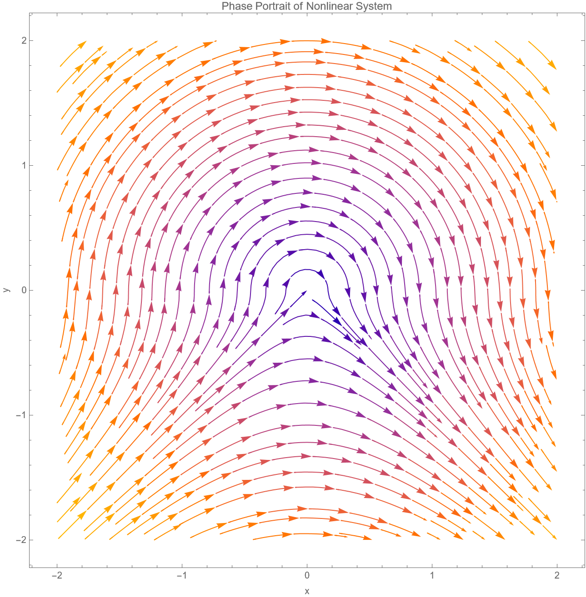

## Ex 1
考虑初值问题：
$$
\dot{X} = J_{\lambda} X; \quad X(0) = c, \quad \text{其中} \quad J_{\lambda} = \begin{bmatrix} \lambda & 1 & 0 \\ 0 & \lambda & 1 \\ 0 & 0 & \lambda \end{bmatrix}
$$
1. 求解该初值问题。
2. 计算 $e^{t J_{\lambda}}$ 并将 1) 中的解用 $e^{t J_{\lambda}}$ 表达。
3. 设 $\lambda = 0$，描述解的几何行为。

### 解答

#### 1

设 $X = \begin{bmatrix} x_1 \\ x_2 \\ x_3 \end{bmatrix}$ 和 $c = \begin{bmatrix} c_1 \\ c_2 \\ c_3 \end{bmatrix}$，则微分方程组为：
$$
\dot{x}_1 = \lambda x_1 + x_2, \quad \dot{x}_2 = \lambda x_2 + x_3, \quad \dot{x}_3 = \lambda x_3.
$$

从第三个方程开始求解：
$$
\dot{x}_3 = \lambda x_3 \implies x_3(t) = x_3(0) e^{\lambda t} = c_3 e^{\lambda t}.
$$

代入第二个方程：
$$
\dot{x}_2 = \lambda x_2 + x_3 = \lambda x_2 + c_3 e^{\lambda t}.
$$
这是一阶线性微分方程，解为：
$$
x_2(t) = e^{\lambda t} \left( \int e^{-\lambda t} c_3 e^{\lambda t} \, dt + K \right) = e^{\lambda t} \left( \int c_3 \, dt + K \right) = e^{\lambda t} (c_3 t + K),
$$
其中 $K$ 为常数。由初始条件 $x_2(0) = c_2$ 得：
$$
x_2(0) = e^0 (c_3 \cdot 0 + K) = K = c_2 \implies K = c_2,
$$
所以：
$$
x_2(t) = e^{\lambda t} (c_2 + c_3 t).
$$

代入第一个方程：
$$
\dot{x}_1 = \lambda x_1 + x_2 = \lambda x_1 + e^{\lambda t} (c_2 + c_3 t).
$$
这也是一阶线性微分方程，解为：
$$
x_1(t) = e^{\lambda t} \left( \int e^{-\lambda t} e^{\lambda t} (c_2 + c_3 t) \, dt + M \right) = e^{\lambda t} \left( \int (c_2 + c_3 t) \, dt + M \right) = e^{\lambda t} \left( c_2 t + \frac{c_3 t^2}{2} + M \right),
$$
其中 $M$ 为常数。由初始条件 $x_1(0) = c_1$ 得：
$$
x_1(0) = e^0 (0 + 0 + M) = M = c_1 \implies M = c_1,
$$
所以：
$$
x_1(t) = e^{\lambda t} \left( c_1 + c_2 t + \frac{c_3 t^2}{2} \right).
$$

因此，解为：
$$
X(t) = \begin{bmatrix} x_1(t) \\ x_2(t) \\ x_3(t) \end{bmatrix} = \begin{bmatrix} e^{\lambda t} \left( c_1 + c_2 t + \frac{c_3 t^2}{2} \right) \\ e^{\lambda t} (c_2 + c_3 t) \\ e^{\lambda t} c_3 \end{bmatrix}.
$$

#### 2

首先，计算矩阵指数 $e^{t J_{\lambda}}$。注意到 $J_{\lambda} = \lambda I + N$，其中 $N = \begin{bmatrix} 0 & 1 & 0 \\ 0 & 0 & 1 \\ 0 & 0 & 0 \end{bmatrix}$。由于 $\lambda I$ 和 $N$ 可交换，有：
$$
e^{t J_{\lambda}} = e^{t (\lambda I + N)} = e^{\lambda t I} e^{t N} = e^{\lambda t} e^{t N}.
$$

现在计算 $e^{t N}$。由于 $N$ 是幂零矩阵，满足 $N^3 = 0$，因此：
$$
e^{t N} = I + t N + \frac{t^2}{2} N^2,
$$
其中：
$$
N^2 = \begin{bmatrix} 0 & 1 & 0 \\ 0 & 0 & 1 \\ 0 & 0 & 0 \end{bmatrix} \begin{bmatrix} 0 & 1 & 0 \\ 0 & 0 & 1 \\ 0 & 0 & 0 \end{bmatrix} = \begin{bmatrix} 0 & 0 & 1 \\ 0 & 0 & 0 \\ 0 & 0 & 0 \end{bmatrix},
$$
所以：
$$
e^{t N} = \begin{bmatrix} 1 & 0 & 0 \\ 0 & 1 & 0 \\ 0 & 0 & 1 \end{bmatrix} + t \begin{bmatrix} 0 & 1 & 0 \\ 0 & 0 & 1 \\ 0 & 0 & 0 \end{bmatrix} + \frac{t^2}{2} \begin{bmatrix} 0 & 0 & 1 \\ 0 & 0 & 0 \\ 0 & 0 & 0 \end{bmatrix} = \begin{bmatrix} 1 & t & \frac{t^2}{2} \\ 0 & 1 & t \\ 0 & 0 & 1 \end{bmatrix}.
$$

因此：
$$
e^{t J_{\lambda}} = e^{\lambda t} \begin{bmatrix} 1 & t & \frac{t^2}{2} \\ 0 & 1 & t \\ 0 & 0 & 1 \end{bmatrix}.
$$

从部分 1) 的解，有 $X(t) = e^{t J_{\lambda}} c$，其中 $c = \begin{bmatrix} c_1 \\ c_2 \\ c_3 \end{bmatrix}$，所以：
$$
X(t) = e^{t J_{\lambda}} c = e^{\lambda t} \begin{bmatrix} 1 & t & \frac{t^2}{2} \\ 0 & 1 & t \\ 0 & 0 & 1 \end{bmatrix} \begin{bmatrix} c_1 \\ c_2 \\ c_3 \end{bmatrix} = e^{\lambda t} \begin{bmatrix} c_1 + c_2 t + \frac{c_3 t^2}{2} \\ c_2 + c_3 t \\ c_3 \end{bmatrix},
$$
这与部分 1) 的结果一致。

#### 3

当 $\lambda = 0$ 时，系统变为 $\dot{X} = J_0 X$，其中 $J_0 = \begin{bmatrix} 0 & 1 & 0 \\ 0 & 0 & 1 \\ 0 & 0 & 0 \end{bmatrix}$。解为：
$$
X(t) = e^{t J_0} c = \begin{bmatrix} 1 & t & \frac{t^2}{2} \\ 0 & 1 & t \\ 0 & 0 & 1 \end{bmatrix} \begin{bmatrix} c_1 \\ c_2 \\ c_3 \end{bmatrix} = \begin{bmatrix} c_1 + c_2 t + \frac{c_3 t^2}{2} \\ c_2 + c_3 t \\ c_3 \end{bmatrix}.
$$

- 向量场定义为 $\dot{X} = J_0 X$，在任意点 $X = (x_1, x_2, x_3)$ 处的切向量为 $(x_2, x_3, 0)$。这意味着切向量总位于水平面 $x_3 = C$ 上，且其方向取决于 $x_2$ 和 $x_3$。
- 由于切向量的 $x_3$ 分量为零，解轨迹被限制在初始 $x_3$ 值的水平面（即 $x_3 = c_3$）上。因此，轨迹在三维相空间中是一个二维平面上的曲线。
- 在水平面 $x_3 = c_3$ 上，切向量的具体形式为 $\dot{X}(t) = (c_2 + c_3 t, c_3, 0)$：
  - 若 $c_3 = 0$，则切向量为常数 $(c_2, 0, 0)$，轨迹为沿 $x_1$ 方向的直线（若 $c_2 \neq 0$）或静止点（若 $c_2 = 0$）。
  - 若 $c_3 \neq 0$，则切向量的 $x_1$ 分量随时间线性增加（因为 $c_2 + c_3 t$），而 $x_2$ 分量恒定（$c_3$），导致轨迹在 $x_1-x_2$ 平面上呈抛物线形状。这反映了向量场的线性剪切特性：$x_1$ 方向的速度受 $x_2$ 影响，而 $x_2$ 方向的速度受 $x_3$ 影响，但由于 $x_3$ 恒定，$x_2$ 线性变化，从而 $x_1$ 二次变化。
- 几何上，该系统对应的流 $e^{t J_0}$ 是一个剪切变换，将初始点 $c$ 沿 $x_1$ 方向拉伸，拉伸量依赖于 $x_2$ 和 $x_3$。切空间的变化显示了轨迹的弯曲程度由 $c_3$ 控制：当 $c_3 \neq 0$ 时，切方向随时间变化，轨迹弯曲；当 $c_3 = 0$ 时，切方向恒定，轨迹为直线。

## Ex2 
考虑如下的非线性方程：

$$\begin{cases}\dot{x}=|y|,\\\dot{y}=-x.\end{cases}$$

1. 画出系统的相图。

2. 求解该方程，并利用解的表达式对相图做出解释。

### 解答
#### 1

#### 2
**情况1：y ≥ 0**  
此时 $|y| = y$，系统为：
$$
\dot{x} = y, \quad \dot{y} = -x.
$$
对 x 求导得：
$$
\ddot{x} = \dot{y} = -x \implies \ddot{x} + x = 0.
$$
解为：
$$
x(t) = A \cos t + B \sin t, \quad y(t) = -A \sin t + B \cos t.
$$
其中 $A = x(0)$, $B = y(0)$。轨迹满足 $x^2 + y^2 = A^2 + B^2$，即圆弧。此解有效直至 $y(t) = 0$。

**情况2：y < 0**  
此时 $|y| = -y$，系统为：
$$
\dot{x} = -y, \quad \dot{y} = -x.
$$
对 x 求导得：
$$
\ddot{x} = -\dot{y} = x \implies \ddot{x} - x = 0.
$$
解为：
$$
x(t) = C e^t + D e^{-t}, \quad y(t) = -C e^t + D e^{-t}.
$$
轨迹满足 $x^2 - y^2 = \text{常数}$，即双曲线。

**匹配解**  
设从上半平面进入下半平面的时间为 $t_1$，此时 $y(t_1) = 0$, $x(t_1) = x_1 > 0$。匹配条件：
$$
x(t_1) = C e^{t_1} + D e^{-t_1} = x_1, \quad y(t_1) = -C e^{t_1} + D e^{-t_1} = 0.
$$
解得：
$$
D = C e^{2t_1}, \quad C = \frac{x_1}{2} e^{-t_1}, \quad D = \frac{x_1}{2} e^{t_1}.
$$
对于 $t > t_1$：
$$
x(t) = x_1 \cosh(t - t_1), \quad y(t) = -x_1 \sinh(t - t_1).
$$
由于 $t - t_1 > 0$，有 $y(t) < 0$，且随 t 增加，x 增加，y 减少，轨迹趋向无穷远。

**相图解释**  
- 上半平面的圆弧解对应相图中的圆弧轨迹，运动方向顺时针。
- 下半平面的双曲解对应相图中的双曲线轨迹，包括稳定和不稳定流形。
- 匹配解说明轨迹从上半平面进入下半平面后沿双曲线逃逸至无穷，解释了相图中从正 x 轴垂直向下进入下半平面并趋向无穷的行为。
- 稳定流形 $y = x$（x < 0）对应解趋近于原点，不稳定流形 $y = -x$（x > 0）对应解远离原点。
- 完全在下半平面的双曲线解对应从 $x \to -\infty$ 到 $x \to \infty$ 的轨迹。

## Ex3
设A为二阶实方阵，且其有一对共轭复特征根a±bi，其中$a\in\mathbb{R},b>$ $0\text{。} 记 \lambda=a+bi\text{。}$ 设复可逆阵P使得

$$A=P D P^{-1},\quad 其中 \quad D=\begin{bmatrix}\lambda&\\ &\bar{\lambda}\end{bmatrix}.$$

通过直接计算证明：$ 若 c\in\mathbb{R}^2$ 则 刂 IVP:$\dot{X}=A X;X(0)=c$ 的解

$$X(t)=P\begin{bmatrix}e^{\bar{\lambda}t}&\\ &e^{\bar{\lambda}t}\end{bmatrix}P^{-1}c.$$

是一个实解（即其虚部为零)）。

### 解答
由于 $A$ 是实矩阵，且特征值为共轭复数，特征向量也可选为共轭。不妨设 $P = [p, \bar{p}]$，其中 $p \in \mathbb{C}^2$ 是特征值 $\lambda$ 的特征向量。则 $\overline{P} = [\bar{p}, p] = P J$，其中 $J = \begin{bmatrix} 0 & 1 \\ 1 & 0 \end{bmatrix}$。注意 $J^{-1} = J$。

考虑 $X(t)$ 的复共轭：
$$
\overline{X(t)} = \overline{P \begin{bmatrix} e^{\lambda t} & 0 \\ 0 & e^{\bar{\lambda} t} \end{bmatrix} P^{-1} c} = \overline{P} \, \overline{\begin{bmatrix} e^{\lambda t} & 0 \\ 0 & e^{\bar{\lambda} t} \end{bmatrix}} \, \overline{P^{-1}} \, \bar{c}.
$$
由于 $c \in \mathbb{R}^2$，有 $\bar{c} = c$。又：
$$
\overline{\begin{bmatrix} e^{\lambda t} & 0 \\ 0 & e^{\bar{\lambda} t} \end{bmatrix}} = \begin{bmatrix} e^{\bar{\lambda} t} & 0 \\ 0 & e^{\lambda t} \end{bmatrix} = \overline{D_e},
$$
其中 $D_e = \begin{bmatrix} e^{\lambda t} & 0 \\ 0 & e^{\bar{\lambda} t} \end{bmatrix}$。同时，$\overline{P^{-1}} = (\overline{P})^{-1} = (P J)^{-1} = J^{-1} P^{-1} = J P^{-1}$。因此：
$$
\overline{X(t)} = \overline{P} \, \overline{D_e} \, \overline{P^{-1}} c = (P J) \, \overline{D_e} \, (J P^{-1}) c.
$$
计算 $J \, \overline{D_e} \, J$：
$$
J \, \overline{D_e} = \begin{bmatrix} 0 & 1 \\ 1 & 0 \end{bmatrix} \begin{bmatrix} e^{\bar{\lambda} t} & 0 \\ 0 & e^{\lambda t} \end{bmatrix} = \begin{bmatrix} 0 & e^{\lambda t} \\ e^{\bar{\lambda} t} & 0 \end{bmatrix},
$$
$$
J \, \overline{D_e} \, J = \begin{bmatrix} 0 & e^{\lambda t} \\ e^{\bar{\lambda} t} & 0 \end{bmatrix} \begin{bmatrix} 0 & 1 \\ 1 & 0 \end{bmatrix} = \begin{bmatrix} e^{\lambda t} & 0 \\ 0 & e^{\bar{\lambda} t} \end{bmatrix} = D_e.
$$
代入得：
$$
\overline{X(t)} = P (J \, \overline{D_e} \, J) P^{-1} c = P D_e P^{-1} c = X(t).
$$
故 $\overline{X(t)} = X(t)$，即 $X(t)$ 是实值函数。因此，对于任意 $c \in \mathbb{R}^2$，解 $X(t)$ 是实解。

## Ex4
设A是一个二阶实矩阵，定义其范数为

$$\|A\|:=\sup\{|A x|:|x|=1\}.$$

1. 证明：若$\|A\|<1$ ，则A的任一特征值λ满足$|\lambda|<1$ 

2. 设$\|A\|<1$ 证明矩阵列$\{S_n:n\geq1\}$ 收敛(记其极限为S)，其中

$$S_{n}=I+A+\cdots+A^{n}.$$

3. 设$\|A\|<1$ ，证明$I-A 可$ 逆，且其逆为S。

4. 对一般的m阶方阵，以上结论对吗?

### 解答

#### 1

设 $\lambda$ 是 $A$ 的一个特征值，对应的单位特征向量为 $v$。则 $Av = \lambda v$，于是 $|Av| = |\lambda v| = |\lambda| |v| = |\lambda|$。根据范数定义，$|Av| \leq \|A\| |v| = \|A\|$，因此 $|\lambda| = |Av| \leq \|A\| < 1$，即 $|\lambda| < 1$。这里需要注意的是，即使 $A$ 是实矩阵，特征值 $\lambda$ 可能为复数，但 $|\lambda|$ 表示模长，上述不等式仍然成立。

#### 2

其中 $S_n = I + A + A^2 + \cdots + A^n$。考虑矩阵范数的性质，由于 $\|A\| < 1$，且矩阵范数满足次乘性（即 $\|A^k\| \leq \|A\|^k$），对于 $n > m$，有：
$$
\|S_n - S_m\| = \|A^{m+1} + A^{m+2} + \cdots + A^n\| \\ \leq \|A^{m+1}\| + \|A^{m+2}\| + \cdots + \|A^n\| \\ \leq \|A\|^{m+1} + \|A\|^{m+2} + \cdots + \|A\|^n.
$$
由于 $\|A\| < 1$，几何级数 $\sum_{k=m+1}^n \|A\|^k$ 随 $m \to \infty$ 收敛于 $0$。具体地，对于任意 $\epsilon > 0$，存在 $N$ 使得当 $m > N$ 时，$\|A\|^{m+1}/(1 - \|A\|) < \epsilon$，于是 $\|S_n - S_m\| < \epsilon$ 对所有 $n > m > N$ 成立。因此 $\{S_n\}$ 是柯西序列。由于矩阵空间是有限维的（从而是完备的），$\{S_n\}$ 收敛，记其极限为 $S$。

#### 3

由2，$S_n \to S$。计算：
$$
S_n (I - A) = (I + A + A^2 + \cdots + A^n)(I - A) = I - A^{n+1},
$$
$$
(I - A) S_n = (I - A)(I + A + A^2 + \cdots + A^n) = I - A^{n+1}.
$$
由于 $\|A\| < 1$，有 $\|A^{n+1}\| \leq \|A\|^{n+1} \to 0$，故 $A^{n+1} \to 0$。因此：
$$
\lim_{n \to \infty} S_n (I - A) = I, \quad \lim_{n \to \infty} (I - A) S_n = I.
$$
由极限的连续性，得 $S (I - A) = I$ 和 $(I - A) S = I$，所以 $I - A$ 可逆，且其逆为 $S$。

#### 4

以上结论对一般的 $m$ 阶方阵也成立。理由如下：
- 在1中，对于任何 $m$ 阶方阵（实或复），其算子范数 $\|A\|$ 满足谱半径 $\rho(A) \leq \|A\|$，即所有特征值 $\lambda$ 满足 $|\lambda| \leq \|A\|$。因此若 $\|A\| < 1$，则 $|\lambda| < 1$。
- 在2和3中，证明依赖于矩阵范数的次乘性和矩阵空间的完备性，这些性质对一般 $m$ 阶方阵均成立。因此矩阵列 $\{S_n\}$ 收敛，且 $I - A$ 可逆，其逆为 $S$。

综上，结论对一般 $m$ 阶方阵同样适用。

## Ex5
设A是一个二阶方阵，定义

$$S_{n}:=\sum_{k=0}^{n}\frac{A^{k}}{k!}.$$

证明$S_{n}$ 收敛(考虑Jordan标准型)。定义

$$e^{A}:=\lim_{n\to\infty}S_{n}.$$

### 解答
设 $A$ 是一个二阶方阵。考虑 $A$ 的 Jordan 标准型。存在可逆矩阵 $P$ 和 Jordan 矩阵 $J$ 使得 $A = P J P^{-1}$。由于 $A$ 是二阶的，$J$ 有两种可能形式：要么是对角矩阵 $J = \begin{bmatrix} \lambda_1 & 0 \\ 0 & \lambda_2 \end{bmatrix}$，要么是 Jordan 块 $J = \begin{bmatrix} \lambda & 1 \\ 0 & \lambda \end{bmatrix}$，其中 $\lambda_1, \lambda_2, \lambda$ 是 $A$ 的特征值。

定义 $S_n = \sum_{k=0}^n \frac{A^k}{k!}$。由于 $A = P J P^{-1}$，有 $A^k = P J^k P^{-1}$，因此
$$
S_n = \sum_{k=0}^n \frac{A^k}{k!} = P \left( \sum_{k=0}^n \frac{J^k}{k!} \right) P^{-1}.
$$
只需证明 $\sum_{k=0}^n \frac{J^k}{k!}$ 收敛即可。

情况一：$J$ 是对角矩阵
若 $J = \begin{bmatrix} \lambda_1 & 0 \\ 0 & \lambda_2 \end{bmatrix}$，则
$$
J^k = \begin{bmatrix} \lambda_1^k & 0 \\ 0 & \lambda_2^k \end{bmatrix}, \quad \frac{J^k}{k!} = \begin{bmatrix} \frac{\lambda_1^k}{k!} & 0 \\ 0 & \frac{\lambda_2^k}{k!} \end{bmatrix}.
$$
因此，
$$
\sum_{k=0}^n \frac{J^k}{k!} = \begin{bmatrix} \sum_{k=0}^n \frac{\lambda_1^k}{k!} & 0 \\ 0 & \sum_{k=0}^n \frac{\lambda_2^k}{k!} \end{bmatrix}.
$$
当 $n \to \infty$ 时，$\sum_{k=0}^n \frac{\lambda_i^k}{k!}$ 收敛到 $e^{\lambda_i}$（指数函数的泰勒级数），故
$$
\lim_{n \to \infty} \sum_{k=0}^n \frac{J^k}{k!} = \begin{bmatrix} e^{\lambda_1} & 0 \\ 0 & e^{\lambda_2} \end{bmatrix}.
$$

情况二：$J$ 是 Jordan 块
若 $J = \begin{bmatrix} \lambda & 1 \\ 0 & \lambda \end{bmatrix}$，令 $N = \begin{bmatrix} 0 & 1 \\ 0 & 0 \end{bmatrix}$，则 $J = \lambda I + N$，且 $N^2 = 0$。于是，
$$
J^k = (\lambda I + N)^k = \sum_{j=0}^k \binom{k}{j} \lambda^{k-j} N^j = \lambda^k I + k \lambda^{k-1} N,
$$
因为 $N^j = 0$ 对于 $j \geq 2$。因此，
$$
\frac{J^k}{k!} = \frac{\lambda^k}{k!} I + \frac{k \lambda^{k-1}}{k!} N = \frac{\lambda^k}{k!} I + \frac{\lambda^{k-1}}{(k-1)!} N.
$$
求和得
$$
\sum_{k=0}^n \frac{J^k}{k!} = \sum_{k=0}^n \frac{\lambda^k}{k!} I + \sum_{k=1}^n \frac{\lambda^{k-1}}{(k-1)!} N,
$$
其中当 $k=0$ 时第二项为 0。令 $m = k-1$，则
$$
\sum_{k=1}^n \frac{\lambda^{k-1}}{(k-1)!} = \sum_{m=0}^{n-1} \frac{\lambda^m}{m!}.
$$
当 $n \to \infty$ 时，
$$
\sum_{k=0}^n \frac{\lambda^k}{k!} \to e^\lambda, \quad \sum_{m=0}^{n-1} \frac{\lambda^m}{m!} \to e^\lambda,
$$
故
$$
\lim_{n \to \infty} \sum_{k=0}^n \frac{J^k}{k!} = e^\lambda I + e^\lambda N = \begin{bmatrix} e^\lambda & e^\lambda \\ 0 & e^\lambda \end{bmatrix}.
$$

在两种情况下，$\sum_{k=0}^n \frac{J^k}{k!}$ 均收敛。因此，$S_n = P \left( \sum_{k=0}^n \frac{J^k}{k!} \right) P^{-1}$ 收敛，定义
$$
e^A = \lim_{n \to \infty} S_n.
$$

## Ex6
计算$e^{tJ}$ ,其中

$$J=\begin{bmatrix}0&1\\ -1&0\end{bmatrix}$$

### 解答
由几何意义：方向场为当前位置的顺时针旋转90度的向量场，其解轨迹为以原点为中心的圆周运动，且角速度为1。因此，解可以表示为：
$$X(t) = \begin{bmatrix} x(t) \\ y(t) \end{bmatrix} = \begin{bmatrix} x(0) \cos t + y(0) \sin t \\ -x(0) \sin t + y(0) \cos t \end{bmatrix}.$$
这表明矩阵指数 $e^{tJ}$ 对任意初始向量 $\begin{bmatrix} x(0) \\ y(0) \end{bmatrix}$ 的作用是将其旋转 $t$ 弧度。因此，矩阵指数为：
$$e^{tJ} = \begin{bmatrix} \cos t & \sin t \\ -\sin t & \cos t \end{bmatrix}.$$

## Ex7
考虑如下的A:

$$\begin{bmatrix}\lambda&\\ &\mu\end{bmatrix},\quad\begin{bmatrix}a&b\\ -b&a\end{bmatrix},\quad\begin{bmatrix}\lambda&1\\ &\lambda\end{bmatrix}$$

1. 直接计算$e^{tA} 以$ 及$d(e^{tA})/dt。$ 

2. 验证$e^{tA}c$ 是初值问题

$$\dot{X}=AX;\ X(0)=c $$

的解。

### 解答
第一个矩阵：$A = \begin{bmatrix} \lambda & 0 \\ 0 & \mu \end{bmatrix}$

- **计算 $e^{tA}$**:
  $$
  e^{tA} = \begin{bmatrix} e^{\lambda t} & 0 \\ 0 & e^{\mu t} \end{bmatrix}
  $$

- **计算 $\frac{d}{dt}e^{tA}$**:
  $$
  \frac{d}{dt}e^{tA} = \begin{bmatrix} \lambda e^{\lambda t} & 0 \\ 0 & \mu e^{\mu t} \end{bmatrix}
  $$

- **验证 $e^{tA}c$ 是解**:
  设 $X(t) = e^{tA}c$，则 $X(0) = e^{0}c = Ic = c$，满足初始条件。
  计算 $\dot{X} = \frac{d}{dt}e^{tA}c = \begin{bmatrix} \lambda e^{\lambda t} & 0 \\ 0 & \mu e^{\mu t} \end{bmatrix}c$。
  计算 $AX = A e^{tA}c = \begin{bmatrix} \lambda & 0 \\ 0 & \mu \end{bmatrix} \begin{bmatrix} e^{\lambda t} & 0 \\ 0 & e^{\mu t} \end{bmatrix}c = \begin{bmatrix} \lambda e^{\lambda t} & 0 \\ 0 & \mu e^{\mu t} \end{bmatrix}c$。

第二个矩阵：$A = \begin{bmatrix} a & b \\ -b & a \end{bmatrix}$

- **计算 $e^{tA}$**:
  $$
  e^{tA} = e^{at} \begin{bmatrix} \cos(bt) & \sin(bt) \\ -\sin(bt) & \cos(bt) \end{bmatrix} = \begin{bmatrix} e^{at} \cos(bt) & e^{at} \sin(bt) \\ -e^{at} \sin(bt) & e^{at} \cos(bt) \end{bmatrix}
  $$

- **计算 $\frac{d}{dt}e^{tA}$**:
  $$
  \frac{d}{dt}e^{tA} = \begin{bmatrix} a e^{at} \cos(bt) - b e^{at} \sin(bt) & a e^{at} \sin(bt) + b e^{at} \cos(bt) \\ -a e^{at} \sin(bt) - b e^{at} \cos(bt) & a e^{at} \cos(bt) - b e^{at} \sin(bt) \end{bmatrix}
  $$

- **验证 $e^{tA}c$ 是解**:
  设 $X(t) = e^{tA}c$，则 $X(0) = e^{0}c = Ic = c$，满足初始条件。
  计算:
  $$
  \dot{X} = \frac{d}{dt}e^{tA}c = \begin{bmatrix} a e^{at} \cos(bt) - b e^{at} \sin(bt) & a e^{at} \sin(bt) + b e^{at} \cos(bt) \\ -a e^{at} \sin(bt) - b e^{at} \cos(bt) & a e^{at} \cos(bt) - b e^{at} \sin(bt) \end{bmatrix}c
  $$
  计算:
  $$
  AX = A e^{tA}c = \begin{bmatrix} a & b \\ -b & a \end{bmatrix} \begin{bmatrix} e^{at} \cos(bt) & e^{at} \sin(bt) \\ -e^{at} \sin(bt) & e^{at} \cos(bt) \end{bmatrix}c \\= \begin{bmatrix} a e^{at} \cos(bt) - b e^{at} \sin(bt) & a e^{at} \sin(bt) + b e^{at} \cos(bt) \\ -a e^{at} \sin(bt) - b e^{at} \cos(bt) & a e^{at} \cos(bt) - b e^{at} \sin(bt) \end{bmatrix}c
  $$
  因此 $\dot{X} = AX$，验证通过。

第三个矩阵：$A = \begin{bmatrix} \lambda & 1 \\ 0 & \lambda \end{bmatrix}$

- **计算 $e^{tA}$**:
  $$
  e^{tA} = e^{\lambda t} \begin{bmatrix} 1 & t \\ 0 & 1 \end{bmatrix} = \begin{bmatrix} e^{\lambda t} & t e^{\lambda t} \\ 0 & e^{\lambda t} \end{bmatrix}
  $$

- **计算 $\frac{d}{dt}e^{tA}$**:
  $$
  \frac{d}{dt}e^{tA} = \begin{bmatrix} \lambda e^{\lambda t} & e^{\lambda t} + \lambda t e^{\lambda t} \\ 0 & \lambda e^{\lambda t} \end{bmatrix} = \begin{bmatrix} \lambda e^{\lambda t} & e^{\lambda t} (1 + \lambda t) \\ 0 & \lambda e^{\lambda t} \end{bmatrix}
  $$

- **验证 $e^{tA}c$ 是解**:
  设 $X(t) = e^{tA}c$，则 $X(0) = e^{0}c = Ic = c$，满足初始条件。
  计算 $\dot{X} = \frac{d}{dt}e^{tA}c$。
  计算 $AX = A e^{tA}c = \begin{bmatrix} \lambda & 1 \\ 0 & \lambda \end{bmatrix} \begin{bmatrix} e^{\lambda t} & t e^{\lambda t} \\ 0 & e^{\lambda t} \end{bmatrix}c = \begin{bmatrix} \lambda e^{\lambda t} & \lambda t e^{\lambda t} + e^{\lambda t} \\ 0 & \lambda e^{\lambda t} \end{bmatrix}c = \begin{bmatrix} \lambda e^{\lambda t} & e^{\lambda t} (1 + \lambda t) \\ 0 & \lambda e^{\lambda t} \end{bmatrix}c$。
  因此 $\dot{X} = AX$，验证通过。

综上，对于所有三个矩阵，$e^{tA}c$ 均是初值问题 $\dot{X} = AX$ 且 $X(0) = c$ 的解。