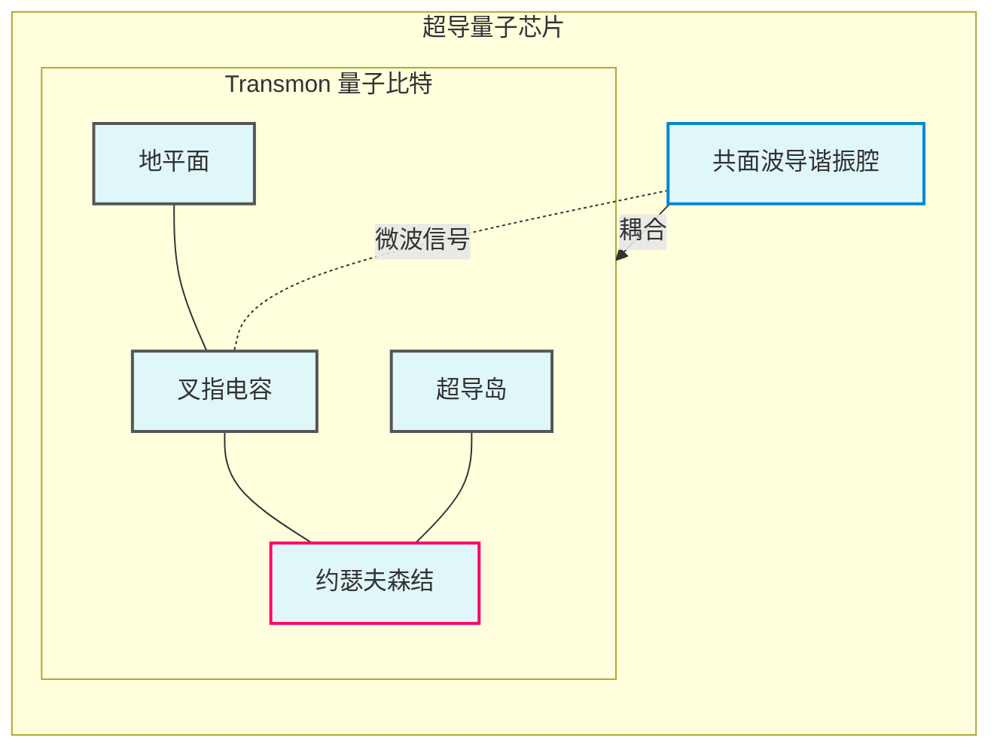

## 量子比特实现
### 约瑟夫森结  
  超导体中的库珀对（Cooper pairs）穿越绝缘势垒时，产生相位相干性。约瑟夫森效应由两个方程描述：
- 电流方程：$I = I_c \sin \delta$ （$\delta$ 为超导相位差）
- 电压方程：$V = \frac{\Phi_0}{2\pi} \frac{d\delta}{dt}$ （$\Phi_0 = h/2e$ 为磁通量子）

#### 能量计算
库珀对隧穿的势能 $U$ 与相位差 $\delta$ 直接关联。根据量子力学，电流可表示为能量的导数：
$$
I = \frac{2e}{\hbar} \frac{\partial U}{\partial \delta}
$$
代入电流方程 $I = I_c \sin \delta$：
$$
\frac{2e}{\hbar} \frac{\partial U}{\partial \delta} = I_c \sin \delta
$$
对 $\delta$ 积分得势能：
$$
U = -\frac{\hbar I_c}{2e} \cos \delta + C
$$
积分常数 $C$ 取零（以能谷为参考点），得到：
$$
E_J \equiv \frac{\hbar I_c}{2e}, \quad U = -E_J \cos \delta
$$
此处 $E_J$ 是势能幅值，称为约瑟夫森能量。

#### 电感计算
电感 $L$ 满足 $V = L \frac{dI}{dt}$。  
由约瑟夫森方程：
$$
V = \frac{\Phi_0}{2\pi} \frac{d\delta}{dt}, \quad I = I_c \sin \delta
$$
对电流求时间导数：
$$
\frac{dI}{dt} = I_c \cos \delta \cdot \frac{d\delta}{dt}
$$
代入电压表达式：
$$
V = \frac{\Phi_0}{2\pi} \frac{d\delta}{dt} = \frac{\Phi_0}{2\pi I_c \cos \delta} \cdot \left( I_c \cos \delta \frac{d\delta}{dt} \right) = \left( \frac{\Phi_0}{2\pi I_c \cos \delta} \right) \frac{dI}{dt}
$$
对比 $V = L_J \frac{dI}{dt}$，可得：
$$
L_J = \frac{\Phi_0}{2\pi I_c \cos \delta}
$$
其中 $\Phi_0 = h/2e$ 是磁通量子。非线性源于分母中的 $\cos \delta$：当 $\delta \to \pm \pi/2$ 时，$L_J \to \infty$，系统趋近不稳定。

#### 势能分析
势能函数 $U = -E_J \cos \delta$ 在 $\delta = 0$ 处展开泰勒级数：
$$
U = -E_J \left( 1 - \frac{\delta^2}{2!} + \frac{\delta^4}{4!} - \cdots \right) \approx -E_J + \frac{E_J \delta^2}{2} - \frac{E_J \delta^4}{24} + \cdots
$$
- 二次项：$\frac{E_J \delta^2}{2}$ 对应谐振子势，能级等间距：$\hbar \omega_p = \sqrt{8 E_J E_C}$（$E_C$ 为库仑能）。  
- 四次项：$-\frac{E_J \delta^4}{24}$ 引入非简谐性（Anharmonicity），使高能级间距缩小（如图）：  
  $$
  \alpha \equiv \frac{E_{1\to2} - E_{0\to1}}{\hbar} < 0
  $$
  其中 $\alpha$ 是非简谐度，典型值约 $-200\ \text{MHz}$（依赖 $E_J/E_C$ 比值）。

### Transmon比特    
约瑟夫森结通过非线性电感 ($L_J = \Phi_0/2\pi I_c \cos\delta$) 形成量子比特能级，但传统电荷量子比特对电荷噪声极其敏感。Transmon通过并联大电容 $C_B$ 重构电路，将充电能降至 $E_C = e^2/2C_\Sigma$，工作点从电荷敏感区($n_g=0.5$)移至"甜点区"($n_g=0$)，实现指数级噪声抑制。
- 物理结构：  
  - 约瑟夫森结（Al/AlOₓ/Al，~100nm²） 
  - 并联叉指电容 $C_B$（~100 fF）使 $E_J/E_C \gg 1$  
- 哈密顿量：  
$$
\hat{H} = 4E_C (\hat{n} - n_g)^2 - E_J \cos \hat{\delta}
$$  
- 能级特征（当 $E_J/E_C \approx 50$）：  
$$
\begin{align*}
\omega_{01} & \approx \sqrt{8E_C E_J}/\hbar - E_C/\hbar \\
\alpha & = \omega_{12} - \omega_{01} \approx -E_C/\hbar \quad (\text{负非谐性})
\end{align*}
$$
其相位空间基态波函数呈高斯分布：  
$$
\psi_0(\delta) \propto \exp \left( -\frac{1}{2} \sqrt{\frac{8E_J}{E_C}} \delta^2 \right)
$$  
- 物理意义：  
1. $\sqrt{8E_J/E_C}$ 增大 → 波函数宽度 $\sigma \propto (E_C/E_J)^{1/4}$ 收缩  
2. 电荷涨落敏感度指数压低：  
$$
\frac{d\omega_{01}}{dn_g} \propto e^{-\sqrt{E_J/2E_C}} \cdot \sqrt{\frac{E_C}{E_J}}
$$  
当 $E_J/E_C=50$ 时，敏感度降至传统比特的 $10^{-3}$ 倍。 

## 量子门实现
### 单量子门
- 驱动动力学：  
  施加频率 $\omega_d \approx \omega_{01}$ 的微波场：  
  $$
  \hat{H}_{d}(t) = \hbar \Omega(t) \cos(\omega_d t + \phi) \hat{\sigma}_x
  $$  
  在旋转坐标系（频率 $\omega_d$）中，哈密顿量简化为：  
  $$
  \hat{H}_{rot} = \frac{\hbar}{2} \begin{pmatrix} -\Delta & \Omega e^{-i\phi} \\ \Omega e^{i\phi} & \Delta \end{pmatrix} \quad (\Delta = \omega_{01} - \omega_d)
  $$  
  当 $\Delta = 0$ 时，实现任意轴旋转 $R_\phi(\theta) = e^{-i(\theta/2) (\cos\phi \cdot \sigma_x + \sin\phi \cdot \sigma_y)}$。  

- DRAG脉冲抑制泄漏：  
  为阻止激发到 $|2\rangle$ 能级，采用复数脉冲：  
  $$
  \Omega_x(t) = \Omega_0(t), \quad \Omega_y(t) = -\frac{\beta}{\alpha} \frac{d\Omega_0}{dt}
  $$  
  其中 $\beta \approx 0.5$ 为优化参数，$\alpha$ 是非谐性。物理本质：通过正交分量补偿高能级跃迁。  

### 双量子门 
- CZ门实现（能级避撞法）：  
  调节比特频率使 $\omega_{q1} + \omega_{q2} \approx \omega_{|11\rangle \rightarrow |02\rangle}$，通过 Stark shift 积累相位：  
  $$
  U_{CZ} = \text{diag}(1, 1, 1, e^{i\phi}), \quad \phi = \int g_{eff}(t) dt
  $$  
  耦合强度 $g_{eff}$ 可源于静态耦合（$g_{eff} \propto g^2 / \Delta$）或可调耦合器（$g_{eff} = g \cdot \epsilon(t)$）。  

- iSWAP门共振操作：  
  当 $\omega_1 = \omega_2$ 时，耦合哈密顿量 $\hat{H}_{int} = g (\sigma_+^{(1)}\sigma_-^{(2)} + \text{h.c.})$ 生成：  
  $$
  U_{iSWAP} = \begin{pmatrix} 1 & 0 & 0 & 0 \\ 0 & 0 & -i & 0 \\ 0 & -i & 0 & 0 \\ 0 & 0 & 0 & 1 \end{pmatrix}
  $$  
  物理意义：交换 $|01\rangle$ 和 $|10\rangle$ 态并添加 $-i$ 相位。  

## 量子测量实现
### 谐振腔-比特耦合
量子比特无法直接测量，需通过谐振腔实现间接读取。谐振腔通过微波场与比特耦合，形成色散区（dispersive regime）。通过测量谐振腔的微波反射/透射特性，获取比特状态信息。
- Jaynes-Cummings模型：  
  谐振腔和量子比特的相互作用可描述为：
  $$
  \hat{H} = \hbar \omega_r \hat{a}^\dagger \hat{a} + \frac{\hbar \omega_q}{2} \hat{\sigma}_z + \hbar g (\hat{a}^\dagger \hat{\sigma}_- + \hat{a} \hat{\sigma}_+)
  $$  
  其中第一项是谐振腔能量，第二项是比特能量，第三项是耦合项。

- 色散区与色散移位：
  在色散区（$|\Delta| = |\omega_q - \omega_r| \gg g$），通过 Schrieffer-Wolff变换得有效哈密顿量：  
  $$
  \hat{H}_{disp} = \hbar \left( \omega_r + \chi \hat{\sigma}_z \right) \hat{a}^\dagger \hat{a} + \frac{\hbar}{2} (\omega_q + \chi) \hat{\sigma}_z \quad (\chi = g^2/\Delta)
  $$  
- 色散移位 $\chi$：
  根据上述哈密顿量，比特状态 $|0\rangle$ 和 $|1\rangle$ 使谐振腔频率偏移 $\pm \chi$。通过测量谐振腔的微波反射相位，可以区分比特状态。

- 色散读出信噪比
色散读出信噪比（SNR）由腔光子数 $n$、测量时间 $T_m$、耦合强度 $\chi$ 和腔衰减率 $\kappa$ 决定：  
$$
\text{SNR} \propto \sqrt{n} \cdot \frac{4\chi}{\kappa} \cdot \sqrt{T_m / \kappa^{-1}}
$$  
优化方向：增大 $\chi$、延长 $T_m$（但受限于比特退相干）。
### 相位敏感探测  
- 信号解调原理：  
  输入微波 $A_{in} e^{-i\omega_p t}$，输出场相位差：  
  $$
  \theta(\omega_p) = \tan^{-1} \left( \frac{2 (\omega_r' - \omega_p) / \kappa}{1 + 4(\omega_r' - \omega_p)^2 / \kappa^2} \right)
  $$  
  其中 $\omega_r' = \omega_r \pm \chi$，$\kappa$ 为腔衰减率。关键条件：量子非破坏测量（QND）需 $\chi \gg \kappa$（典型值 $\chi/2\pi \sim 1-5 \text{ MHz}, \kappa/2\pi \sim 0.1 \text{ MHz}$）。  

### 低温信号放大链  
- 约瑟夫森参量放大器 (JPA)：  
  利用约瑟夫森结非线性实现近量子极限放大（添加噪声 ≈0.5 光子）。  
- HEMT放大器：  
  在 4K 温区提供 ≈40 dB 增益，但引入 >20 K 噪声温度（需前置JPA降噪）。  

 
### 示意图

  

