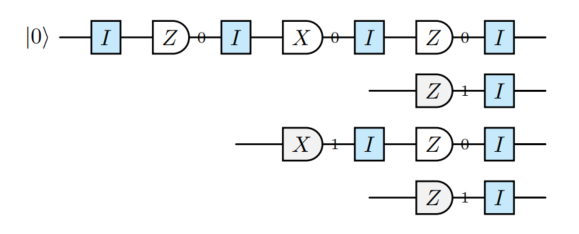
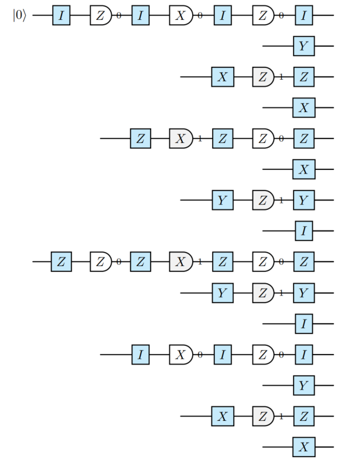

## **第2部分：模拟算法**

### **2.1：泡利框架模拟**

#### **断言**（坍缩操作）
一个坍缩操作¹⁴ 可能会引入一个新的稳定子 $S$。以下两种模拟随机测量的方法是等价的：
- 忠实地报告结果。（不对泡利框架 $\mathcal{F}$ 做任何操作。）
- 总是报告 $+1$。以 50% 的概率将 $S$ 应用于泡利框架 $\mathcal{F}$。

> ¹⁴ 初始化、重置、测量。

#### **例**（忠实地模拟 vs 泡利框架模拟）
以下两个电路是等价地模拟一个单量子比特电路（包含一次初始化和三次（随机）测量）的方法。¹⁵

> ¹⁵ 泡利框架在电路中通过蓝色块指示。

---

### **忠实地模拟**



### **泡利框架模拟**


---

#### **断言**（测量二分法）
设 $|\psi\rangle$ 是一个稳定子态，$M$ 是一个泡利可观测量。测量结果 $m \in \{+1, -1\}$ 是一个随机变量，具有以下两种可能分布之一：
- **确定性**：如果 $P$ 与 $\mathcal{S}(|\psi\rangle)$ 中的所有生成元对易，则 $m$ 服从退化分布，即要么 $Pr[m=+1]=1$，要么 $Pr[m=-1]=1$。
- **均匀随机**：如果 $P$ 与 $\mathcal{S}(|\psi\rangle)$ 中至少一个生成元反对易，则 $m \sim \mathcal{U}(\{+1, -1\})$，即 $Pr[m=+1] = Pr[m=-1] = 0.5$。

---

### **定义 14**（参考样本）
设 $\mathcal{C}$ 是一个由克利福德门、泡利噪声信道、测量和重置组成的含噪稳定子电路。参考样本 $R$ 是通过模拟理想电路 $\mathcal{C}_{\text{ref}}$ 得到的测量结果记录，其中：
1. 所有泡利噪声信道在 $\mathcal{C}$ 中被替换为恒等操作。
2. 所有坍缩操作被偏置为确定性地产生 $+1$。

---

### **定义 15**（概率赋值）
符号 $x \leftarrow_p y$ 表示变量 $x$ 以概率 $p$ 被设为 $y$，并以概率 $1-p$ 保持不变。

---

### **算法**（跟踪泡利框架）
为了使用泡利框架模拟一个含噪稳定子电路：

1. **参考样本**：令 $R$ 为从理想化电路 $\mathcal{C}_{\text{ref}}$¹⁶ 得到的参考测量记录。
2. **初始化**：设置 $\mathcal{F} \leftarrow I^{\otimes n}$。对于每个初始化为 $|0\rangle$ 的量子比特 $q$：
   $$
   \mathcal{F} \leftarrow_{0.5} \mathcal{F} Z_q
   $$
3. **执行**：对电路中的每个操作 $O_i$：
   - **克利福德门 $C$**：通过共轭更新框架：
     $$
     \mathcal{F} \leftarrow C \mathcal{F} C^\dagger
     $$
   - **重置 $q$**：
     (a) 设置 $\mathcal{F}_q \leftarrow I$。
     (b) 随机化框架 $\mathcal{F} \leftarrow_{0.5} \mathcal{F} Z_q$。
   - **泡利噪声信道 $\mathcal{E}$**：设该信道由 Kraus 算子 $E_k = \sqrt{p_k} P_k$ 给出，其中 $P_k$ 是泡利错误，出现概率为 $p_k$。从分布 $\{p_k\}$ 中采样索引 $k$，并更新框架：
     $$
     \mathcal{F} \leftarrow \mathcal{F} P_k
     $$
   - **测量 $M_q$**：令 $r \in R$ 为对应此测量的参考测量结果。
     (a) 计算框架翻转位 $b$：
       $$
       b = \begin{cases}
         1 & \text{若 } \{\mathcal{F}, M_q\} = 0 \\
         0 & \text{若 } [\mathcal{F}, M_q] = 0
       \end{cases}
       $$
     (b) 报告结果 $m = r \oplus b$。
     (c) 随机化框架 $\mathcal{F} \leftarrow_{0.5} \mathcal{F} M_q$。

> ¹⁶ 例如，通过算法 2.2。

---

### **2.2：稳定子表模拟**

#### **备注**（不变性）
概念上，$T$ 始终被维护为到目前为止已处理的克利福德前缀的累积逆的表。如果已处理的克利福德前缀是：
$$
U = C_t C_{t-1} \cdots C_1,
$$
那么不变量是：
$$
T = \text{Tableau}(U^{-1}),
$$
即，对于每个生成元 $g \in \{X_k, Z_k\}$，
$$
T(g) = U^{-1} g U.
$$

---

#### **断言**（来自表的稳定子）
设 $C$ 是作用于 $n$ 个量子比特上的一个克利福德操作。状态 $C|0\rangle^{\otimes n}$ 的稳定子群由共轭后的 $Z$ 算子生成：
$$
\mathcal{S}(C|0\rangle^{\otimes n}) = \langle CZ_1C^{-1}, \dots, CZ_nC^{-1} \rangle \quad (2.1)
$$

---

### **算法**（跟踪稳定子表）
为了使用稳定子表模拟一个稳定子电路：

1. **初始化**：将稳定子表 $T$ 初始化为单位表 $I$。
2. **执行**：遍历电路操作 $O_1, O_2, \dots, O_m$：
   - **克利福德门 $C$**：将门 $C$ 的逆表前置到当前表中：
     $$
     T \leftarrow T \circ \text{Tableau}(C)^{-1} \quad (2.2)
     $$
   - **测量 $Z_q$**：检查表 $T$ 中 $X_q$ 列，记作 $D_q$：
     - **情况 1：随机**。如果存在 $p$ 使得 $\{(D_q)_p, Z_q\} = 0$（即 $(D_q)_p \in \{X,Y\}$）：
       (a) 选择一个主量子比特索引 $p$，使得 $(D_q)_p \in \{X,Y\}$。
       (b) 通过在电路开头插入一个 CNOT$_{p \to k}$ 来约化其他所有量子比特索引 $k \neq p$，其中 $(D_q)_k \in \{X,Y\}$。这会更新表：
          $$
          T \leftarrow \text{Tableau}(\text{CNOT}_{p \to k}) \circ T \quad (2.3)
          $$
       (c) 通过在电路开头插入一个 $H_p$ 将泡利项 $(D_q)_p$ 转换为 $Z$。这会更新表：
          $$
          T \leftarrow \text{Tableau}(H_p) \circ T \quad (2.4)
          $$
       (d) 通过在电路开头附加一个 $X_p$ 以 0.5 的概率随机化测量。这会更新表：
          $$
          T \leftarrow_{0.5} \text{Tableau}(X_p) \circ T \quad (2.5)
          $$
       (e) 约化至确定性情况。
     - **情况 2：确定性**。如果 $\forall k, [(D_q)_k, Z_q] = 0$（即 $(D_q)_k \in \{I,Z\}$），根据 $T$ 中 $Z_q$ 列的符号报告测量结果：
       $$
       m = \begin{cases}
         0 & \text{若符号为 } +1 \\
         1 & \text{若符号为 } -1
       \end{cases}
       $$
   - **重置 $q$**：
     (a) 执行 $Z_q$ 的测量过程，但丢弃结果。量子比特现在处于确定态 $|0\rangle$ 或 $|1\rangle$，由 $Z_q$ 列的符号指示。
     (b) 显式设置 $Z_q$ 列的符号为 $+1$，以强制状态为 $|0\rangle$。

---

### **备注**（X 的消除）
以下两个过程是等价的；后者使用的 $X$ 更少：
$$
|a,b\rangle \xrightarrow{X \otimes X} |a \oplus 1, b \oplus 1\rangle
$$
$$
|a,b\rangle \xrightarrow{\text{CNOT}} |a, a \oplus b\rangle \xrightarrow{X \otimes I} |a \oplus 1, a \oplus b\rangle \xrightarrow{\text{CNOT}} |a \oplus 1, (a \oplus 1) \oplus (a \oplus b)\rangle = |a \oplus 1, b \oplus 1\rangle
$$

这产生了电路等价性：

```mermaid
graph LR
    subgraph Circuit Equivalence
        A[|0⟩_a] --> B[X⊗X] --> C[C]
        D[|0⟩_b] --> B
        E[|0⟩^{⊗n-2}] --> C

        F[|0⟩_a] --> G[X] --> H[C]
        I[|0⟩_b] --> J[CNOT] --> H
        K[|0⟩^{⊗n-2}] --> H
    end
```

---

#### **断言**（将随机测量约化为确定性测量）
以下电路具有相同的输出态分布：

```mermaid
graph TD
    subgraph Circuit 1
        A[|0⟩^{⊗n}] --> B[C]
        B --> C[Z]
    end

    subgraph Circuit 2
        D[|0⟩^{⊗n-1}] --> E[±X] --> F[C]
    end

    subgraph Circuit 3
        G[|+⟩] --> H[C] --> I[output +1]
        J[|0⟩^{⊗n-1}] --> H
    end

    subgraph Circuit 4
        K[|-⟩] --> L[C] --> M[output -1]
        N[|0⟩^{⊗n-1}] --> L
    end

    subgraph Circuit 5
        O[|0⟩] --> P[I] --> Q[Z] --> R[H] --> S[C]
        T[|0⟩^{⊗n-1}] --> S
    end

    subgraph Circuit 6
        U[|0⟩] --> V[X] --> W[Z] --> X[H] --> Y[C]
        Z[|0⟩^{⊗n-1}] --> Y
    end
```
