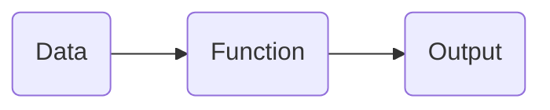

# Statistical Learning
统计学习算法是将数据经过特定运算得到一个特定结果的算法。那么我们是否应该相信统计学习算法得到的结果？本课程的目的是从统计学角度分析统计学习到底发生了什么，以及找到一个合理的对统计学习及其结果的解释。

## Separate the core question into two sub-questions

# Develop a Maxwell's Demon
## Maxwell's Demon
麦克斯韦妖（Maxwell's demon），是在物理学中假想的妖，能探测并控制单个分子的运动，于1871年由英国物理学家詹姆斯·麦克斯韦为了说明违反热力学第二定律的可能性而设想的。虽然后续的物理学发展表明，在这个过程中实际上发生了能量耗散，但我们仍可以采用该说法。我们定义：麦克斯韦妖是消耗能量，从一个数据中获取信息的实体。

然而，这个说法实际上隐含了两个假设：其一是数据真的包含信息，其二是这个实体能够正确的获取信息。故我们将探究以下这两个问题：
1. 数据包含信息吗？
2. 我们能够从数据中获取正确的信息吗？

## What is Data?

