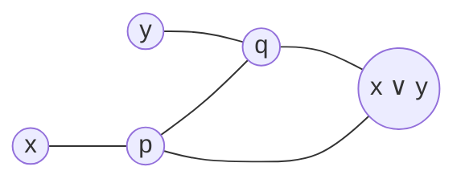

## 7.1
### 题目
设 D-SAT 为判定一个 CNF 公式 $\varphi$ 是否至少有两个满足赋值的问题。证明 D-SAT 是 NP-完全的。

### 解答
#### 1. D-SAT 属于 NP
给定一个 CNF 公式 $\varphi$ 和两个赋值 $\sigma_1$ 和 $\sigma_2$，验证算法如下：
- 检查 $\sigma_1$ 是否满足 $\varphi$：遍历 $\varphi$ 的每个子句，验证子句中至少有一个文字在 $\sigma_1$ 下为真。这可以在 $O(|\varphi|)$ 时间内完成，其中 $|\varphi|$ 是 $\varphi$ 的大小（即子句数和变量数）。
- 检查 $\sigma_2$ 是否满足 $\varphi$：同样在 $O(|\varphi|)$ 时间内完成。
- 检查 $\sigma_1 \neq \sigma_2$：比较两个赋值在至少一个变量上的取值是否不同。这可以在 $O(n)$ 时间内完成，其中 $n$ 是变量数（$n \leq |\varphi|$）。

由于验证过程的总时间复杂度为 $O(|\varphi|)$，是多项式时间，因此 D-SAT 属于 NP。

#### 2. D-SAT 是 NP-难的
我们通过将 SAT 归约到 D-SAT 来证明 D-SAT 是 NP-难的。SAT 问题是判定一个 CNF 公式是否至少有一个满足赋值，且 SAT 是 NP-完全的。

**归约过程：**
给定一个 SAT 实例，即一个 CNF 公式 $\varphi$，其变量集合为 $\{x_1, x_2, \dots, x_n\}$。构造一个 D-SAT 实例 $\psi$ 如下：
- 引入一个新变量 $y$。
- $\psi$ 的变量集合为 $\{x_1, x_2, \dots, x_n, y\}$。
- $\psi$ 的子句集与 $\varphi$ 的子句集完全相同（即不添加任何涉及 $y$ 的新子句）。

此构造可在多项式时间内完成，因为只需添加一个新变量，且 $\psi$ 的大小与 $\varphi$ 基本相同（变量数增加 1，子句数不变）。

**正确性证明：**
- **如果 $\varphi$ 是可满足的（即 $\varphi \in \text{SAT}$)**：  
  设 $\sigma$ 是 $\varphi$ 的一个满足赋值。那么，以下两个赋值均满足 $\psi$：
  - $\sigma_1: \sigma$ 扩展到 $y = \text{true}$（即 $\sigma_1(x_i) = \sigma(x_i)$ 对所有 $i$，且 $\sigma_1(y) = \text{true}$)。
  - $\sigma_2: \sigma$ 扩展到 $y = \text{false}$（即 $\sigma_2(x_i) = \sigma(x_i)$ 对所有 $i$，且 $\sigma_2(y) = \text{false}$)。  
  因为 $\psi$ 的子句与 $\varphi$ 相同，且不涉及 $y$，所以 $\sigma_1$ 和 $\sigma_2$ 都满足 $\psi$。此外，$\sigma_1 \neq \sigma_2$（因为 $y$ 的取值不同）。因此，$\psi$ 至少有两个满足赋值（即 $\psi \in \text{D-SAT}$)。
  
- **如果 $\varphi$ 是不可满足的（即 $\varphi \notin \text{SAT}$)**：  
  则没有赋值满足 $\varphi$ 的子句。由于 $\psi$ 的子句与 $\varphi$ 相同，且不涉及 $y$，因此也没有任何赋值（无论 $y$ 的取值如何）满足 $\psi$。所以，$\psi$ 没有满足赋值，即少于两个满足赋值（即 $\psi \notin \text{D-SAT}$)。

综上，$\varphi$ 是可满足的当且仅当 $\psi$ 至少有两个满足赋值。因此，SAT 多项式时间归约到 D-SAT（即 $\text{SAT} \leq_p \text{D-SAT}$)。

## 7.2
### 题目

图的着色是一种给图的顶点分配颜色的方式，使得没有相邻顶点具有相同颜色。让 3-COLORING 问题是判断给定图 $G$ 是否可以使用三种颜色进行着色。

**(a)** 我们将考虑两个图小工具。首先，三角形图强制顶点具有不同颜色，并且你可以使用 T 和 F 两种颜色来编码真（true）和假（false）。其次，以下图给出的 OR 小工具实现了逻辑 OR 操作。证明 OR 小工具具有以下性质：(1) 如果顶点 $x$ 和 $y$ 都有颜色 F，那么标记为 $x \lor y$ 的顶点也必须是 F；(2) 如果其中一个顶点有颜色 T，那么可能将顶点 $x \lor y$ 着色为 T。

**(b)** 使用上述图小工具证明 3-COLORING 是 NP 完全的。

### 解答

#### (a) 证明 OR 小工具的性质

假设 OR 小工具由以下顶点和边组成：
- 顶点：输入 $x$、输入 $y$、输出 $o = x \lor y$、内部顶点 $p$ 和 $q$。
- 边：$(x, p)$、$(p, o)$、$(y, q)$、$(q, o)$ 和 $(p, q)$.

颜色集合为 {T, F, U}，其中 T 表示 true，F 表示 false，U 是辅助颜色。小工具需满足：
1. 如果 $x$ 和 $y$ 都为 F，则 $o$ 必须为 F。
2. 如果 $x$ 或 $y$ 至少有一个为 T，则 $o$ 可以被着色为 T。

**证明性质 (1)：如果 $x$ 和 $y$ 都为 F，则 $o$ 必须为 F。**

假设 $x$ 和 $y$ 都被着色为 F。
- 由于边 $(x, p)$ 存在，且 $x = \text{F}$，所以 $p$ 不能为 F（相邻顶点颜色不同）。因此，$p$ 为 T 或 U。
- 由于边 $(y, q)$ 存在，且 $y = \text{F}$，所以 $q$ 不能为 F。因此，$q$ 为 T 或 U。
- 由于边 $(p, q)$ 存在，$p$ 和 $q$ 必须不同颜色。
- 现在考虑 $o$：由于边 $(p, o)$ 和 $(q, o)$ 存在，$o$ 必须与 $p$ 和 $q$ 都不同。

分析 $p$ 和 $q$ 的可能颜色组合：
- $p$ 和 $q$ 不能相同（因为 $(p, q)$ 边）。
- 可能情况： 
  - 情况 1: $p = \text{T}$, $q = \text{U}$
    - $o$ 与 $p$ 和 $q$ 相邻，所以 $o$ 不能为 T（因为 $p = \text{T}$)，也不能为 U（因为 $q = \text{U}$)，因此 $o$ 必须为 F。
  - 情况 2: $p = \text{U}$, $q = \text{T}$
    - $o$ 不能为 U（因为 $p = \text{U}$)，不能为 T（因为 $q = \text{T}$)，因此 $o$ 必须为 F。
- 其他情况（如 $p = \text{T}$, $q = \text{T}$ 或 $p = \text{U}$, $q = \text{U}$) 不可能，因为 $(p, q)$ 边要求 $p$ 和 $q$ 不同。

在所有可能情况下，$o$ 都必须为 F。因此，当 $x$ 和 $y$ 都为 F 时，$o$ 必须为 F。

**证明性质 (2)：如果 $x$ 或 $y$ 至少有一个为 T，则 $o$ 可以被着色为 T。**

假设至少一个输入为 T，不妨设 $x = \text{T}$（$y = \text{F}$ 或 $y = \text{T}$ 的情况类似）。
- 由于边 $(x, p)$ 存在，且 $x = \text{T}$，所以 $p$ 不能为 T。因此，$p$ 为 F 或 U。
- 由于边 $(y, q)$ 存在：
  - 如果 $y = \text{F}$，则 $q$ 不能为 F，所以 $q$ 为 T 或 U。
  - 如果 $y = \text{T}$，则 $q$ 不能为 T，所以 $q$ 为 F 或 U。
- 边 $(p, q)$ 要求 $p$ 和 $q$ 不同。
- 我们需要证明存在一种着色方式使 $o = \text{T}$。

选择颜色以使 $o$ 可以为 T：
- 子情况：$x = \text{T}$, $y = \text{F}$
  - 设置 $p = \text{F}$（因为 $p$ 不能为 T，且可为 F 或 U）。
  - 设置 $q = \text{U}$（因为 $y = \text{F}$，$q$ 不能为 F，且可为 T 或 U；选择 U 以避免冲突）。
  - 现在 $p = \text{F}$, $q = \text{U}$，二者不同（满足 $(p, q)$ 边）。
  - $o$ 与 $p$ 和 $q$ 相邻：$o$ 不能为 F（因为 $p = \text{F}$)，不能为 U（因为 $q = \text{U}$)，因此 $o$ 可以为 T（T 不同于 F 和 U）。
- 类似地，如果 $x = \text{T}$, $y = \text{T}$:
  - 设置 $p = \text{F}$ 或 U（例如 $p = \text{F}$)。
  - 设置 $q = \text{U}$（或 F，但选择 U）。
  - $p$ 和 $q$ 不同（例如 F 和 U）。
  - $o$ 可以为 T（不同于 F 和 U）。
- 如果 $y = \text{T}$, $x = \text{F}$，证明类似。

因此，当至少一个输入为 T 时，总可以选择颜色使 $o = \text{T}$。

综上，OR 小工具满足所需性质。

#### (b) 使用图小工具证明 3-COLORING 是 NP 完全的

**证明步骤：**
1. **3-COLORING 属于 NP：** 给定一个图和一种着色方案，可以在多项式时间内验证是否没有相邻顶点颜色相同（检查所有边）。因此，3-COLORING ∈ NP。
2. **3-COLORING 是 NP-难的：** 通过从 3-SAT 问题归约到 3-COLORING 来证明。3-SAT 是 NP 完全问题。给定一个 3-SAT 布尔公式，构造一个图 $G$，使得 $G$ 是 3-可着色的当且仅当该公式可满足。归约中使用：
   - **三角形小工具（用于变量）：** 强制顶点颜色不同，并用 T 和 F 编码布尔值。
   - **OR 小工具（用于子句）：** 实现子句的 OR 逻辑。

**归约构造：**
给定一个 3-SAT 公式，包含变量集合 $X = \{x_1, x_2, \ldots, x_n\}$ 和子句集合 $C = \{c_1, c_2, \ldots, c_m\}$，每个子句是三个文字的析取（literal 是变量或其否定）。

构造图 $G$ 如下：

- **全局颜色参考顶点：** 添加三个顶点 $T_g$、$F_g$、$U_g$，并添加边 $(T_g, F_g)$、$(T_g, U_g)$、$(F_g, U_g)$ 形成一个三角形。这强制它们着不同颜色，分别记为 T（true）、F（false）、U（辅助）。这些顶点固定颜色的参考。

- **变量部分（使用三角形小工具思想）：** 对每个变量 $x_i$:
  - 创建一个顶点 $v_i$ 表示变量值。
  - 添加边 $(v_i, U_g)$，这强制 $v_i$ 不能为 U（因为与 $U_g$ 相邻），所以 $v_i$ 必须为 T 或 F，编码 $x_i$ 的真假值：
    - $v_i = \text{T}$ 表示 $x_i = \text{true}$。
    - $v_i = \text{F}$ 表示 $x_i = \text{false}$。
  - 对于否定文字（如 $\neg x_i$），需要顶点表示其真假。对每个变量 $x_i$，创建一个额外顶点 $\text{not}_i$ 用于否定文字：
    - 添加边 $(\text{not}_i, v_i)$ 和 $(\text{not}_i, U_g)$。
    - 由于 $(\text{not}_i, U_g)$，$\text{not}_i$ 不能为 U，所以为 T 或 F。
    - 性质：如果 $v_i = \text{T}$，则 $\text{not}_i = \text{F}$（因为与 $v_i$ 相邻）；如果 $v_i = \text{F}$，则 $\text{not}_i = \text{T}$。这正好编码 $\neg x_i$ 的真假：
      - $\text{not}_i = \text{T}$ 当 $\neg x_i = \text{true}$（即 $x_i = \text{false}$)。
      - $\text{not}_i = \text{F}$ 当 $\neg x_i = \text{false}$（即 $x_i = \text{true}$)。

- **子句部分（使用 OR 小工具）：** 对每个子句 $c_j = (l_1 \lor l_2 \lor l_3)$（其中 $l_k$ 是文字）：
  - 为每个文字 $l_k$ 定义输入顶点：
    - 如果 $l_k$ 是正文字 $x_i$，则输入顶点为 $v_i$。
    - 如果 $l_k$ 是负文字 $\neg x_i$，则输入顶点为 $\text{not}_i$。
  - 由于 OR 小工具处理两个输入，需将三个文字组合：
    - 首先，为前两个文字 $l_1$ 和 $l_2$ 创建一个 OR 小工具（如 (a) 部分定义），输出顶点记为 $o_{j12}$。
    - 然后，为 $o_{j12}$ 和第三个文字 $l_3$ 创建另一个 OR 小工具，输出顶点记为 $o_j$（表示子句 $c_j$ 的输出）。
  - 添加边 $(o_j, F_g)$，这强制 $o_j$ 不能为 F（因为与 $F_g$ 相邻），所以 $o_j$ 必须为 T 或 U。这一约束确保：当子句可满足时，$o_j$ 可以着色；当子句不可满足时，冲突发生。

**正确性证明：**
- **如果公式可满足，则 $G$ 是 3-可着色的：**
  - 取一个满足赋值：为每个变量 $x_i$ 赋真值，使所有子句为真。
  - 着色：
    - 全局参考：固定 $T_g = \text{T}$, $F_g = \text{F}$, $U_g = \text{U}$。
    - 变量：对每个 $v_i$，如果 $x_i = \text{true}$，则设 $v_i = \text{T}$; 如果 $x_i = \text{false}$，则设 $v_i = \text{F}$。
    - 否定文字顶点：对每个 $\text{not}_i$，如上所述设置（例如，如果 $v_i = \text{T}$，则 $\text{not}_i = \text{F}$)。
    - 子句 OR 小工具：对每个子句 $c_j$，由于可满足，至少一个文字为真，所以其输入顶点为 T（正文字：$v_i = \text{T}$; 负文字：$\text{not}_i = \text{T}$）。由 OR 小工具性质 (2)，在 OR 小工具中，输出 $o_{j12}$ 和 $o_j$ 都可以被着色为 T（因为输入有至少一个 T）。设置 $o_j = \text{T}$（或 U，但 T 可行）。由于 $o_j$ 与 $F_g$ 相邻，但 $o_j = \text{T} \neq \text{F}$，无冲突。
  - 所有边约束满足，故 $G$ 是 3-可着色的。

- **如果 $G$ 是 3-可着色的，则公式可满足：**
  - 取一个有效的 3-着色。
  - 从着色导出变量赋值：对每个 $v_i$，由于 $(v_i, U_g)$，$v_i$ 为 T 或 F。设 $x_i = \text{true}$ 如果 $v_i = \text{T}$; $x_i = \text{false}$ 如果 $v_i = \text{F}$。
  - 对每个子句 $c_j$，考虑其输出顶点 $o_j$。由于 $(o_j, F_g)$，$o_j$ 不能为 F，所以 $o_j$ 为 T 或 U。
  - 但由 OR 小工具性质，如果子句 $c_j$ 的所有文字为假，则：
    - 输入顶点都为 F（正文字：$v_i = \text{F}$; 负文字：$\text{not}_i = \text{F}$）。
    - 由 OR 小工具性质 (1)，$o_{j12}$ 必须为 F。
    - 然后 $o_j$（OR 的输出）必须为 F（因为输入 $o_{j12}$ 和 $l_3$ 都为 F）。
    - 但 $o_j$ 不能为 F（与 $F_g$ 相邻），矛盾。
  - 因此，不可能所有文字为假，即每个子句至少一个文字为真，故公式可满足。

**归约复杂度：** 构造图 $G$ 需添加 $O(n + m)$ 顶点和边（每个变量和子句的处理是常数大小），为多项式时间。因此，3-SAT  $\leq$ P 3-COLORING。

综上，3-COLORING 是 NP 完全的（NP 且 NP-难）。

## 7.3

### 题目
证明 $Z(n)$ 和 $n^{Z(n)}$ 在 $n$ 的多项式时间内可计算。 $Z$ 的定义如下：枚举所有图灵机 $M_1, M_2, \ldots$。不失一般性，假设 $M_i$ 的运行时间最多为 $n^i$，并且每个机器在此序列中有无限多个编码。定义 $Z(1) = 1$。假设 $Z(n - 1) = i$。如果对于所有长度不超过 $\log n$ 的 $x$， $M_i$ 计算 $\text{SAT}_Z(x)$，则定义 $Z(n) = i$。否则，定义 $Z(n) = \min\{i + 1, \log\log n\}$。注意，我们要求 $Z(n)$ 增长得比 $\log\log n$ 慢，以便 $M_i$ 的时间复杂度最多是 $n$ 的多项式。

### 解答
#### 1. $Z(n)$ 在多项式时间内可计算
我们设计一个算法计算 $Z(n)$，并分析其时间复杂度
**算法描述：**  
- **初始化：** 设置 $Z(1) = 1$。  
- **递归计算：** 对于每个整数 $k$ 从 2 到 $n$（按顺序计算 $Z(k)$)：  
  - 令 $i = Z(k-1)$。  
  - 检查条件：对于所有长度 $|x| \leq \log k$ 的字符串 $x$，验证 $M_i(x)$ 输出是否等于 $\text{SAT}_Z(x)$。  
    - 如果所有 $x$ 都满足条件，则设置 $Z(k) = i$。  
    - 否则，设置 $Z(k) = \min\{i + 1, \lfloor \log\log k \rfloor\}$（其中 $\log$ 以 2 为底，且 $\lfloor \cdot \rfloor$ 表示向下取整，以确保结果为整数）。  

**关键细节：**  
- **计算 $\text{SAT}_Z(x)$:** $\text{SAT}_Z$ 是 Ladner 构造中定义的语言，通常依赖于 $Z$。对于输入 $x$ 满足 $|x| \leq \log k$，由于 $|x| < k$（当 $k \geq 2$ 时），$Z$ 在 $|x|$ 及更小的位置已在前步计算完成。因此，$\text{SAT}_Z(x)$ 可以显式计算：  
  - 在标准 Ladner 构造中，$\text{SAT}_Z(x)$ 等价于 SAT 的相对化版本（例如，如果 $Z(|x|)$ 为偶数，则输出 SAT($x$)，否则输出 0）。  
  - SAT($x$) 可以通过暴力搜索计算：枚举所有可能的布尔赋值（共 $2^{|x|}$ 个），并验证是否满足 $x$。  
- **模拟 $M_i(x)$:** 给定索引 $i$，可以访问图灵机 $M_i$ 的描述（假设枚举是固定的）。模拟 $M_i$ 在输入 $x$ 上运行，时间上限为 $|x|^i$。  
- **处理 $\log$ 和 $\min$:** $\log k$ 和 $\log\log k$ 可以通过计算 $\log_2 k$（例如，通过位长度计算）和取整得到，时间多项式于 $k$。  

**时间复杂度分析：**  
计算 $Z(n)$ 需要计算所有 $Z(k)$ for $k = 1$ to $n$。对每个 $k$:  
- **字符串数量：** 长度 $|x| \leq \log k$ 的 $x$ 的数量为 $\sum_{l=0}^{\lfloor \log k \rfloor} 2^l \leq 2^{\log k + 1} = 2 \cdot k$，即 $O(k)$。  
- **每个 $x$ 的计算：**  
  - 计算 $\text{SAT}_Z(x)$: 暴力搜索 SAT($x$) 的时间为 $O(2^{|x|}) \leq O(2^{\log k}) = O(k)$（因为 $|x| \leq \log k$)。访问 $Z(|x|)$ 是常数时间，因为 $Z$ 值已预计算。  
  - 模拟 $M_i(x)$: $i = Z(k-1) \leq \log\log (k-1) \leq \log\log k$（由定义保证），且 $|x| \leq \log k$，所以运行时间上限为 $|x|^i \leq (\log k)^{\log\log k}$。  
    - 分析 $(\log k)^{\log\log k}$: 令 $v = \log_2 k$，则 $(\log k)^{\log\log k} = v^{\log_2 v}$。  
    - $\ln(v^{\log_2 v}) = \log_2 v \cdot \ln v = \frac{\ln v}{\ln 2} \cdot \ln v = \frac{(\ln v)^2}{\ln 2}$。  
    - 由于 $\frac{(\ln v)^2}{\ln 2} \leq v$ 对于足够大的 $v$（因为 $(\ln v)^2 / v \to 0$)，有 $v^{\log_2 v} \leq 2^v = k$（当 $k$ 足够大）。因此，$|x|^i \leq O(k)$。  
  - 比较结果：常数时间。  
- **每个 $k$ 的总时间：** $O(k)$ 个 $x$，每个 $x$ 耗时 $O(k)$（SAT 计算和 $M_i$ 模拟各 $O(k)$)，所以每个 $k$ 的时间为 $O(k) \times O(k) = O(k^2)$。  
- **求和从 $k=1$ 到 $n$:** $\sum_{k=1}^n O(k^2) = O(n^3)$（因为 $\sum_{k=1}^n k^2 = \Theta(n^3)$)。  

因此，计算 $Z(n)$ 的总时间为 $O(n^3)$，是多项式时间（以数值 $n$ 为输入大小）。

#### 2. $n^{Z(n)}$ 在多项式时间内可计算
一旦 $Z(n)$ 被计算，我们计算 $n^{Z(n)}$。利用 $Z(n) \leq \log\log n$ 的性质。

**算法描述：**  
- 先计算 $Z(n)$（使用上述算法）。  
- 令 $k = Z(n)$。  
- 计算 $n^k$ 通过重复乘法：初始化 $\text{result} = 1$，重复 $k$ 次 $\text{result} = \text{result} \times n$（或使用快速幂，但 $k$ 小，简单乘法即可）。  

**时间复杂度分析：**  
- 计算 $Z(n)$ 的时间为 $O(n^3)$。  
- 计算 $n^k$:  
  - $k = Z(n) \leq \log\log n$，所以 $k$ 很小。  
  - 乘法次数：$k$ 次（从 $n^1$ 到 $n^k$)。  
  - 第 $j$ 次乘法：计算 $n^j \times n$。  
    - $n^j$ 的二进制长度为 $\Theta(j \log n)$（因为 $\log_2(n^j) = j \log_2 n$)。  
    - 与 $n$（长度 $\Theta(\log n)$) 相乘：使用标准乘法算法（如 Karatsuba 或 schoolbook），时间 $O( (\text{length})^2 ) = O( (j \log n)^2 )$。  
  - 总乘法时间：$\sum_{j=1}^{k-1} O( (j \log n)^2 ) = O( (\log n)^2 ) \sum_{j=1}^{k-1} j^2$。  
    - $\sum_{j=1}^{k-1} j^2 = \Theta(k^3)$。  
    - $k \leq \log\log n$，所以 $k^3 \leq (\log\log n)^3$。  
    - 因此，总时间为 $O( (\log n)^2 (\log\log n)^3 )$。  
- 输出 $n^k$: 其二进制长度为 $\Theta(k \log n) = \Theta( \log n \cdot \log\log n )$，输出时间为 $O( \log n \cdot \log\log n )$。  
- **总时间：** 由计算 $Z(n)$ 的 $O(n^3)$ 主导（因为 $O( (\log n)^2 (\log\log n)^3 ) = o(n^3)$)，所以整体为 $O(n^3)$。  

因此，$n^{Z(n)}$ 也可在 $O(n^3)$ 时间内计算。
