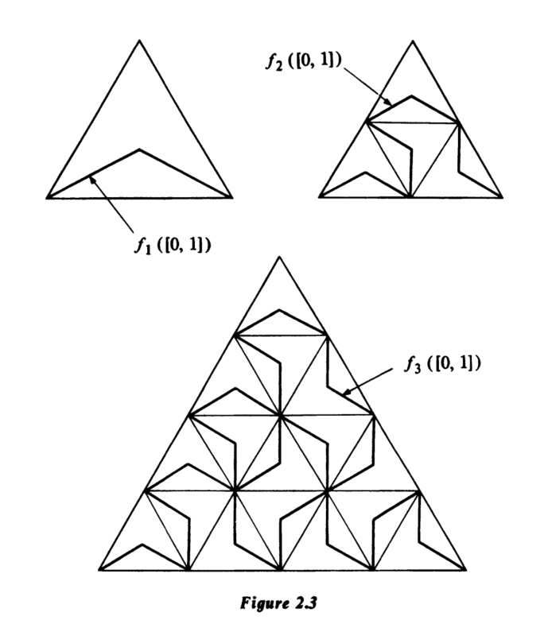

# 2.1 开集与闭集
在第一章中，我们通过“邻域”公理化地定义了拓扑空间。虽然该定义直观，但在实际操作中，基于**开集**的公理体系通常更为便捷。本节将建立这两种定义的等价性，并深入研究开集、闭集及其相关概念。

## 从邻域到开集
设 $X$ 是一个拓扑空间。若子集 $O \subseteq X$ 是其自身每一个点的邻域，则称 $O$ 为**开集**。由邻域公理可直接导出开集的基本性质：任意多个开集的并仍是开集；有限个开集的交仍是开集；全集 $X$ 和空集 $\varnothing$ 都是开集。

在标准欧氏空间 $\mathbb{E}^n$ 中，一个集合是开集当且仅当其每一点都有一个包含于该集合的开球邻域。例如，三维空间中的上半空间 $(z > 0)$ 和单位开球 $(x^2+y^2+z^2 < 1)$ 是开集；而闭上半空间 $(z \geq 0)$ 不是开集，因为边界平面上的点无法被完全包含在内的球体包围。

## 拓扑空间的等价定义
上述开集的性质是基本的，因此我们可以将其作为拓扑空间的**出发点**。

### 定义 2.1：拓扑空间
一个集合 $X$ 上的**拓扑**，是指一个满足以下三条公理的子集族（称为**开集**）：
1. 任意多个开集的并是开集。  
2. 有限多个开集的交是开集。  
3. $X$ 和 $\varnothing$ 是开集。
配备了这样一个拓扑的集合 $X$ 称为**拓扑空间**。

给定此定义后，我们可以反推**邻域**的概念

### 定义：邻域
$N \subseteq X$ 且存在开集 $O$，使得 $x \in O \subseteq N$。称 $N$ 是点 $x$ 的邻域，

可以验证，这样定义的邻域系统完全满足第一章中的公理1-4。因此，基于开集的定义与基于邻域的定义是等价的，今后我们将主要采用开集的定义。

$\mathbb{E}^n$ 上的**通常拓扑**即由所有满足“每点都有含于其中的开球”的子集构成。若 $X$ 是拓扑空间，$Y \subseteq X$，则 $Y$ 上的**子空间拓扑**定义为：$U \subseteq Y$ 是开集当且仅当存在 $X$ 中的开集 $O$，使得 $U = O \cap Y$。

## 离散拓扑

在集合 $X$ 上，若规定**每一个**子集都是开集，则得到的拓扑称为**离散拓扑**。这是该集合上可能有的“最大”的拓扑。例如，$\mathbb{E}^n$ 中所有整数坐标点构成的集合，在子空间拓扑下是一个离散空间。

## 闭集及其刻画

与开集对偶的概念是闭集。

### 定义：闭集
拓扑空间 $X$ 的子集 $A$ 称为**闭集**，如果其补集 $X - A$ 是开集。

根据开集的性质，通过德摩根律可知：任意多个闭集的交是闭集；有限多个闭集的并是闭集。

一个集合可以既不开也不闭。例如，在平面 $\mathbb{E}^2$ 中，集合 $\{(x,y) | x \geq 0, y > 0\}$ 即非开也非闭。一个集合也可以同时既开又闭（称为“开闭集”），例如在子空间 $X = \{(x,y) | x \geq 1 \text{ 或 } x \leq -1\}$ 中，子集 $\{(x,y) \in X | x > 0\}$ 就是开闭集。

为了更本质地刻画闭集，我们引入极限点的概念。

### 定义：极限点（聚点）
设 $A$ 是拓扑空间 $X$ 的子集。点 $p \in X$ 称为 $A$ 的**极限点**（或**聚点**），如果 $p$ 的每一个邻域都包含 $A$ 中除 $p$ 本身以外的点（即 $(N \cap A) - \{p\} \neq \varnothing$）。

极限点本身可能属于 $A$，也可能不属于 $A$。例如：
1.  在实直线 $\mathbb{R}$ 上，集合 $A = \{1/n | n \in \mathbb{N}\}$ 的极限点只有 $0$，而 $0 \notin A$。
2.  区间 $A = [0, 1)$ 的每个点都是其极限点，并且 $1$ 也是它的极限点。
3.  $\mathbb{E}^3$ 中所有坐标均为有理数的点集，其极限点是整个 $\mathbb{E}^3$。
4.  $\mathbb{E}^3$ 中所有坐标为整数的点集没有极限点。
5.  在实数集的“有限补拓扑”（开集定义为补集为有限的集合）下，任何无限子集的极限点都是整个空间 $X$。

### 定理 2.2：闭集的刻画
一个集合是闭集，当且仅当它包含其所有的极限点。

#### 证明
**必要性**：若 $A$ 闭，则 $X-A$ 开。$X-A$ 中任一点都有一个开邻域（即 $X-A$ 本身）与 $A$ 不相交，故不可能是 $A$ 的极限点。因此 $A$ 的极限点必在 $A$ 中。
**充分性**：若 $A$ 包含其所有极限点，则对任意 $x \in X-A$，存在一个邻域 $N_x$ 与 $A$ 不相交。这些 $N_x$ 的并集是开集且等于 $X-A$，故 $X-A$ 开，$A$ 闭。

## 闭包、内部与边界

基于极限点的概念，我们可以定义几个重要的算子。

### 定义：闭包
集合 $A$ 的**闭包**，记作 $\bar{A}$ 或 $\mathrm{cl}(A)$，是 $A$ 与其所有极限点的并集。

### 定理 (2.3)：闭包的性质
$A$ 的闭包是包含 $A$ 的最小闭集。等价地，$\bar{A}$ 等于所有包含 $A$ 的闭集的交集。

#### 证明
首先，根据定理(2.2)，$\bar{A}$ 是闭集（因为它包含了自身的所有极限点）。其次，任何包含 $A$ 的闭集 $B$ 也必须包含 $A$ 的所有极限点，故 $\bar{A} \subseteq B$。因此 $\bar{A}$ 是所有这种闭集的交集。

### 推论 2.4：闭集的判别法
一个集合 $A$ 是闭集，当且仅当 $A = \bar{A}$。

若 $\bar{A} = X$，则称 $A$ 在 $X$ 中**稠密**。例如，$\mathbb{E}^3$ 中的有理点集是稠密的。稠密集与空间中任何一个非空开集都有交集。

### 定义：内部
集合 $A$ 的**内部**，记作 $\overset{\circ}{A}$ 或 $\mathrm{int}(A)$，是所有包含于 $A$ 的开集的并集。点 $x$ 属于 $A$ 的内部，当且仅当 $A$ 是 $x$ 的一个邻域。

### 定义：边界
集合 $A$ 的**边界**，记作 $\partial A$，是其闭包与补集闭包的交集：$\partial A = \bar{A} \cap \overline{(X-A)}$。等价地，边界由那些既不在 $A$ 内部也不在 $X-A$ 内部的点构成。

例如，在平面 $\mathbb{E}^2$ 中，单位圆盘 $D$、其内部 $\overset{\circ}{D}$ 和单位圆周 $C$ 三者的边界都是 $C$。而 $\mathbb{E}^3$ 中有理点集的边界是整个 $\mathbb{E}^3$。

## 拓扑基
有时，通过指定一组“生成元”来描述拓扑会更加方便。

### 定义：拓扑基
拓扑空间 $X$ 的一个开集族 $\beta$ 称为该拓扑的一个**基**（或**拓扑基**），如果每一个开集都可以表示为 $\beta$ 中某些成员的并集。$\beta$ 中的集合称为**基本开集**。

等价描述：$\beta$ 是一个基，当且仅当对任意点 $x$ 及其任意邻域 $N$，总存在 $B \in \beta$，使得 $x \in B \subseteq N$。

例如，实直线 $\mathbb{R}$ 上所有开区间构成其通常拓扑的一个基；所有端点坐标为有理数的开区间构成一个可数基。

我们关心：一个子集族何时能成为某个拓扑的基？

### 定理 2.5：基的判别法
设 $\beta$ 是集合 $X$ 的一个非空子集族。若满足：
1. $\beta$ 中任意有限个成员的交集本身仍属于 $\beta$。
2. $\beta$ 中所有成员的并集等于 $X$（即 $\beta$ 覆盖 $X$）。

则 $\beta$ 是 $X$ 上某个拓扑的基。该拓扑的开集 precisely 是 $\beta$ 中成员的任意并集。

#### 证明
直接以 $\beta$ 中元素的所有可能并集作为开集族，验证其满足拓扑公理1-3。条件1保证了有限交的封闭性，条件2保证了 $X$ 是开集。

# 2.2 连续函数

用开集的语言来表述连续性的概念特别简洁。设 $X$ 和 $Y$ 为拓扑空间。

### 定理 2.6：连续函数的等价定义
一个从 $X$ 到 $Y$ 的函数是连续的，当且仅当 $Y$ 中每个开集的原像在 $X$ 中是开集。

#### 证明
回忆第一章中给出的连续性定义：函数 $f: X \to Y$ 是连续的，当且仅当对 $X$ 中每一点 $x$ 及其在 $Y$ 中的任一邻域 $N$，原像 $f^{-1}(N)$ 是 $x$ 在 $X$ 中的一个邻域。

现在，若 $f$ 是连续的，且 $O$ 是 $Y$ 中的一个开集，则 $O$ 是其内部每一点的邻域，因此 $f^{-1}(O)$ 必须是 $X$ 中其内部每一点的邻域，故 $f^{-1}(O)$ 是 $X$ 中的一个开集。

反之，若 $Y$ 中每个开集的原像在 $X$ 中是开集，则对任意 $x \in X$ 及其在 $Y$ 中的邻域 $N$，由于 $N$ 包含一个开集 $O$，则 $f^{-1}(O)$ 是 $X$ 中的开集，且包含 $x$，因此是 $x$ 的一个邻域。这证明了 $f$ 的连续性。

> 注：连续函数常被简称为**映射**（map）。之后，我们将继续使用“映射”一词来指代连续函数。

### 定理 2.7：连续映射的复合
两个映射的复合仍然是一个映射。

#### 证明
设 $f: X \to Y$ 和 $g: Y \to Z$ 均为连续映射。令 $O$ 为 $Z$ 中的一个开集。注意到 $(g \circ f)^{-1}(O) = f^{-1}(g^{-1}(O))$。由于 $g$ 连续，$g^{-1}(O)$ 是 $Y$ 中的开集；又因 $f$ 连续，$f^{-1}(g^{-1}(O))$ 是 $X$ 中的开集。因此，$g \circ f$ 是连续的。

### 定理 2.8：子空间限制映射的连续性
设 $f: X \to Y$ 是连续函数，且子集 $A \subseteq X$ 配备子空间拓扑。则限制映射 $f|_A: A \to Y$ 也是连续的。

#### 证明
令 $O$ 为 $Y$ 中的一个开集。注意到 $(f|_A)^{-1}(O) = A \cap f^{-1}(O)$。由于 $f$ 连续，$f^{-1}(O)$ 是 $X$ 中的开集。因此，$(f|_A)^{-1}(O)$ 是子空间拓扑下 $A$ 中的开集。根据定理 (2.6)，$f|_A$ 是连续的。

## 恒等映射与包含映射

从 $X$ 到 $X$、将每个点 $x$ 映射到其自身的映射称为 $X$ 的**恒等映射**，记作 $1_X$。若我们将 $1_X$ 限制到 $X$ 的子空间 $A$ 上，便得到**包含映射** $i: A \to X$。

### 定理 2.9：连续映射的多重刻画
下列命题等价：
1. $f: X \to Y$ 是一个映射。
2. 若 $\beta$ 是 $Y$ 拓扑的一个基，则 $\beta$ 中每个成员的原像在 $X$ 中都是开集。
3. 对于 $X$ 的任意子集 $A$，有 $f(\bar{A}) \subseteq \overline{f(A)}$。
4. 对于 $Y$ 的任意子集 $B$，有 $\overline{f^{-1}(B)} \subseteq f^{-1}(\bar{B})$。
5. $Y$ 中每个闭集的原像在 $X$ 中都是闭集。

#### 证明
最有效的方法是验证这五个命题之间的循环蕴含关系：1 ⇒ 2 ⇒ 3 ⇒ 4 ⇒ 5 ⇒ 1。
- **证明 1 ⇒ 2**：设 $B \in \beta$。由于 $f$ 是映射，$B$ 是 $Y$ 中的开集，因此根据定理 (2.6)，$f^{-1}(B)$ 是 $X$ 中的开集。

- **证明 2 ⇒ 3**：设 $A \subseteq X$。显然，$f(A)$ 的所有点都在 $\overline{f(A)}$ 中，我们需要证明：若 $x \in \bar{A} - A$ 且 $f(x) \notin f(A)$，则 $f(x)$ 是 $f(A)$ 的极限点。设 $N$ 是 $f(x)$ 在 $Y$ 中的一个邻域，则存在基本开集 $B \in \beta$，使得 $f(x) \in B \subseteq N$。由 2，$f^{-1}(B)$ 是 $X$ 中的开集，且是 $x$ 的邻域。但 $x$ 是 $A$ 的极限点，所以 $f^{-1}(B)$ 必然包含 $A$ 中的一个点。因此，$B$ 包含 $f(A)$ 中的一个点，即 $N$ 包含 $f(A)$ 中的一个点，如所要求。

- **证明 3 ⇒ 4**：设 $B \subseteq Y$。注意到 $f^{-1}(\bar{B})$ 包含 $f^{-1}(B)$。我们需要证明：若 $x \in \overline{f^{-1}(B)} - f^{-1}(B)$，则 $f(x) \in \bar{B}$。由于 $x \notin f^{-1}(B)$，所以 $f(x) \notin B$。设 $N$ 是 $f(x)$ 在 $Y$ 中的一个邻域，则 $f^{-1}(N)$ 是 $x$ 在 $X$ 中的一个邻域。由于 $x$ 是 $f^{-1}(B)$ 的极限点，$f^{-1}(N)$ 必然包含 $f^{-1}(B)$ 中的一个点。因此，$N$ 包含 $B$ 中的一个点，即 $f(x)$ 是 $B$ 的极限点，如所要求。

- **证明 4 ⇒ 5**：若 $B$ 是 $Y$ 中的闭集，则 $\bar{B} = B$。假设 4 成立，则有 $\overline{f^{-1}(B)} \subseteq f^{-1}(\bar{B}) = f^{-1}(B)$。因此，$f^{-1}(B)$ 等于其自身闭包，故为闭集。

- **证明 5 ⇒ 1**：设 $O$ 是 $Y$ 中的一个开集，则 $Y - O$ 是闭集。由于 5 成立，$f^{-1}(Y - O)$ 是 $X$ 中的闭集，因此其补集 $f^{-1}(O)$ 是 $X$ 中的开集。根据定理 (2.6)，$f$ 是映射。

### 例子

设 $C$ 表示复平面上的单位圆周，配备子空间拓扑；给区间 $[0,1)$ 赋予由实直线诱导的拓扑。定义函数 $f: [0,1) \to C$ 为 $f(x) = e^{2\pi i x}$。易见该函数是连续的。

我们可以取 $C$ 上所有开弧段作为拓扑基。若 $S$ 是这样一个弧段，且不包含复数 $1$，则 $f^{-1}(S)$ 是形如 $(a,b)$ 的开区间，其中 $0 < a < b < 1$，因此在 $[0,1)$ 中是开集。

若 $S$ 恰好包含 $1$，则 $f^{-1}(S)$ 的形式为 $[0,a) \cup (b,1)$，其中 $0 < a < b < 1$。这个集合在 $[0,1)$ 中是开集，因为它是开集 $(-1,a) \cup (b,1)$ 与 $[0,1)$ 的交集。

定理 (2.9) 的第 2 条现在确立了 $f$ 的连续性。该函数显然是单射和满射，但其逆函数不是连续的。为了说明这一点，我们只需找到一个 $[0,1)$ 中的开集 $O$，使得 $(f^{-1})^{-1}(O) = f(O)$ 不是 $C$ 中的开集。

例如，取 $O = [0, \frac{1}{2})$，它在 $[0,1)$ 中是开集。但在指数映射下，它的像由所有满足 $0 \leq \arg z < \pi$ 的复数 $z \in C$ 组成，这个集合在 $C$ 中不是开集。

## 同胚
### 定义：同胚
设 $X$ 和 $Y$ 是两个拓扑空间。若存在一个双射 $h: X \to Y$，使得 $h$ 和其逆映射 $h^{-1}$ 都是连续的，则称 $h$ 为 $X$ 和 $Y$ 之间的一个**同胚**。若存在这样的同胚，则称 $X$ 和 $Y$ 是**同胚的**，记作 $X \cong Y$。

由定理 (2.6) 可知，一个集合 $O$ 在 $X$ 中是开集，当且仅当 $h(O)$ 在 $Y$ 中是开集。因此，$h$ 在 $X$ 和 $Y$ 的拓扑之间建立了一个一一对应的关系，这证明了我们将 $X$ 和 $Y$ 视为同一拓扑空间的说法是合理的。

### 例子

设 $S^n$ 表示 $n$ 维球面，即 $\mathbb{E}^{n+1}$ 中距离原点为 1 的所有点构成的空间，配备子空间拓扑。我们声称：从 $S^n$ 中移除一个点后，所得空间与 $\mathbb{E}^n$ 同胚。

移除哪个点无关紧要，因为我们总可以通过旋转将任何点移到北极点 $p = (0,\dots,0,1)$。现在考虑 $\mathbb{E}^{n+1}$ 中所有最后一个坐标为 0 的点构成的集合，它显然与 $\mathbb{E}^n$ 同胚。

我们定义一个函数 $h: S^n - \{p\} \to \mathbb{E}^n$，称为**球极投影**，如下：对于 $x \in S^n - \{p\}$，$h(x)$ 是 $\mathbb{E}^n$ 与连接 $x$ 和 $p$ 的直线的交点。（当 $n=2$ 时的示意图参见图 1.24。）

显然，$h$ 是单射和满射。若 $O$ 是 $\mathbb{E}^n$ 中的一个开集，我们构造一个新的集合 $U \subset \mathbb{E}^{n+1}$，它由所有从 $p$ 出发、穿过 $O$ 中点（但不包括 $p$ 自身）的半直线上的点组成。容易验证 $U$ 在 $\mathbb{E}^{n+1}$ 中是开集。而 $h^{-1}(O)$ 正好是 $U$ 与 $S^n - \{p\}$ 的交集，因此在 $S^n - \{p\}$ 中是开集。这确立了 $h$ 的连续性，一个类似的论证可处理 $h^{-1}$。因此，$h$ 是一个同胚。

## 关于曲面的预备结果
给出几个关于曲面的预备结果，这些结果将在后续章节中反复使用。

我们称一个空间为**圆盘**（disc），如果它同胚于 $\mathbb{E}^2$ 中的闭单位圆盘 $D$。通常，$C$ 表示单位圆周。若 $A$ 是一个圆盘，且 $h: A \to D$ 是一个同胚，则 $h^{-1}(C)$ 称为 $A$ 的**边界**，记作 $\partial A$。直观上，该定义与同胚 $h$ 的选择无关。我们将在定理 (5.24) 中严格证明这一点：任何从 $D$ 到自身的同胚都必须将 $C$ 映射到 $C$。

### 引理 2.10：同胚的延拓
任何从圆盘边界到其自身的同胚都可以延拓为整个圆盘的一个同胚。

#### 证明
设 $A$ 是一个圆盘，并选取一个同胚 $h: A \to D$。给定一个边界上的同胚 $g: \partial A \to \partial A$，我们可以很容易地将 $hgh^{-1}: C \to C$ 延拓为 $D$ 的一个同胚，方法如下：将 0 映射到 0，对于 $x \in D - \{0\}$，将其映射到点 $\|x\| \cdot hgh^{-1}(x/\|x\|)$。换句话说，按锥形方式延拓。如果我们称此延拓为 $f$，则 $h^{-1}fh$ 将 $g$ 延拓为 $A$ 的一个同胚，符合要求。

### 引理 2.11：圆盘的并
设 $A$ 和 $B$ 是两个沿边界上一段弧相交的圆盘。则它们的并集 $A \cup B$ 也是一个圆盘。

#### 证明
令 $\gamma$ 表示交集 $A \cap B$，并用 $\alpha, \beta$ 表示分别位于 $A$ 和 $B$ 边界上的互补弧段。
我们在引理 (2.10) 的帮助下，构造一个从 $A \cup B$ 到 $D$ 的同胚。平面中的 $y$ 轴将 $D$ 分割为两个圆盘 $D_1$ 和 $D_2$ 的并集。我们将构成 $D_1$ 和 $D_2$ 边界的三条弧标记为 $\alpha', \beta', \gamma'$。$\alpha$ 和 $\alpha'$ 均同胚于闭单位区间 $[0,1]$，因此我们可以找到一个从 $\alpha$ 到 $\alpha'$ 的同胚。我们首先将这个同胚延拓到 $\gamma$ 上，得到从 $\alpha \cup \gamma$ 到 $\alpha' \cup \gamma'$ 的同胚；然后延拓到 $A$ 上，得到从 $A$ 到 $D_1$ 的同胚，使 $\gamma$ 映射到 $\gamma'$，利用引理 (2.10)。最后，我们通过常识将同胚延拓到 $\beta$ 上，使其映射到 $\beta'$，再通过对 $B$ 应用引理 (2.10) 再次延拓。最终结果是一个从 $A \cup B$ 到 $D_1 \cup D_2 = D$ 的同胚。因此，$A \cup B$ 是一个圆盘。

# 2.3 一条空间填充曲线

在上个世纪末，朱塞佩·皮亚诺（Giuseppe Peano）做出了一个令人惊讶、初看之下甚至自相矛盾的发现。他指出：存在一个定义在实数轴上某个闭区间上的连续函数，其图像能覆盖平面上的一个二维区域，比如一个正方形或三角形。这样的函数被称为**皮亚诺曲线**（Peano curve），或称**空间填充曲线**。人们通常将它的图像想象为一条穿过目标二维区域内每一个点的曲线。

空间填充曲线的存在表明，在定义空间的“维度”时必须格外谨慎。若我们将空间 $X$ 的维度定义为描述其每一点所需的最少连续参数个数，则这个定义并不理想——因为根据皮亚诺的例子，正方形在这种定义下会被归为一维空间。

皮亚诺构造有多种版本。下面介绍一种较简单的版本，其图像为一个等边三角形。这条空间填充曲线将是某个更简单曲线序列的极限，随着序列推进，这些曲线会越来越“填满”三角形。设 $\Delta$ 是平面内一个边长为 $1/2$ 的等边三角形，并按如下方式构造一系列连续函数 $f_n: [0,1] \to \Delta$。前三个函数可通过图 2.3 充分描述，后续函数则通过迭代该过程得到。在任意特定阶段，$\Delta$ 被划分为若干个全等的小三角形，每个小三角形内部的曲线部分看起来与 $f_1$ 的图像完全一致，并以一条折线连接三角形的两个顶点，且该折线经过三角形的重心。进入下一阶段时，我们将每个三角形再细分为四个更小的全等三角形，并插入更复杂的曲线，如图 2.3 中 $f_2$ 所示的图像。

假设 $n \geq m$，那么对于任意 $t \in [0,1]$，我们可以找到一个包含 $f_m(t)$ 和 $f_n(t)$ 且边长为 $1/2^m$ 的三角形。因此，对于 $[0,1]$ 中的每一个 $t$，都有 $\|f_m(t) - f_n(t)\| \leq 1/2^m$，这证明了序列 $\{f_n\}$ 是一致收敛的。令 $f: [0,1] \to \Delta$ 表示该极限函数。由于每个 $f_n$ 都是连续的，故 $f$ 也是连续的。

我们还需证明，函数 $f$ 的图像确实覆盖了整个三角形 $\Delta$。首先注意到，对任意 $n$，函数 $f_n$ 的图像与 $\Delta$ 中任意一点的距离都不超过 $1/2^n$。假设我们给定 $\Delta$ 中的一点 $x$ 及其在 $\mathbb{E}^2$ 中的一个邻域 $U$。选择足够大的 $N$，使得以 $x$ 为中心、半径为 $1/2^{N-1}$ 的圆盘完全位于 $U$ 内部；再从 $[0,1]$ 中选取一点 $t_0$，使得 $\|x - f_N(t_0)\| \leq 1/2^N$。由于对所有 $t \in [0,1]$，都有 $\|f_N(t) - f(t)\| \leq 1/2^N$，根据三角不等式可得：
$$
\|x - f(t_0)\| \leq 1/2^{N-1}
$$
因此，$f(t_0)$ 必然落在 $U$ 内部。这一论证表明，$\Delta$ 中的每一点都是集合 $f([0,1])$ 的极限点。但正如我们将在下一章看到的（定理 3.4 和 3.9），从 $[0,1]$ 到 $\mathbb{E}^2$ 的连续函数的像必然是 $\mathbb{E}^2$ 的一个闭子集，因而必须包含其所有的极限点。由此我们得出结论：函数 $f$ 的图像覆盖了整个三角形 $\Delta$。

# 2.4 Tietze扩张定理

设 $X$ 是一个拓扑空间，$A$ 是 $X$ 的一个子空间。给定一个定义在 $A$ 上的实值连续函数，很自然地会问：我们是否总能将其延拓到整个 $X$？换句话说，我们能否找到一个定义在 $X$ 上的实值连续函数，使其在 $A$ 上的限制恰好是给定的函数？答案通常是**否**。例如，令 $X = [0,1]$，$A = (0,1)$，并定义 $f: (0,1) \to \mathbb{E}^1$ 为：
$$
f(x) = \log \frac{x}{1 - x}
$$
此时，$f$ 是从 $(0,1)$ 到实直线的一个同胚映射，但它无法延拓到闭单位区间 $[0,1]$，因为任何定义在 $[0,1]$ 上的连续函数都必须是有界的。本节的目标是描述一种特殊情形，在这种情形下，我们总能延拓连续函数。

### 定义 2.12：度量空间

集合 $X$ 上的一个**度量**（或**距离函数**）是一个定义在笛卡尔积 $X \times X$ 上的实值函数 $d$，满足对所有 $x, y, z \in X$：

1. $d(x,y) \geq 0$，且等号成立当且仅当 $x = y$；  
2. $d(x,y) = d(y,x)$；  
3. $d(x,y) + d(y,z) \geq d(x,z)$。

配备了一个度量的集合 $X$ 称为**度量空间**。

度量空间的概念在分析中非常有用，读者可能已熟悉多个例子。任何欧氏空间（具有通常点间距离）都是度量空间；同样，定义在 $[0,1]$ 上的所有实值连续函数所构成的集合，若赋予两个函数间的距离：
$$
d(f,g) = \sup_{t \in [0,1]} |f(t) - g(t)|,
$$
也是一个度量空间。

度量空间的任何子集都可以从全空间继承一个度量，因此 $\mathbb{E}^3$ 中的曲面也是一个度量空间。

### 度量诱导的拓扑

集合 $X$ 上的一个度量 $d$ 可以诱导出一个拓扑结构，定义如下：对于 $x \in X$，称集合 $\{y \in X \mid d(x,y) \leq \varepsilon\}$ 为以 $x$ 为中心、半径为 $\varepsilon$ 的**球**（或 $\varepsilon$-球），记作 $B(x,\varepsilon)$。我们称 $X$ 的子集 $O$ 为开集，如果对任意 $x \in O$，存在一个正实数 $\varepsilon$，使得 $B(x,\varepsilon)$ 包含于 $O$ 内。

容易验证，这些开集满足拓扑公理。

注意，同一个集合上不同的度量可能诱导出相同的拓扑。例如，我们可以用三种不同方式将欧氏 $n$ 维空间中的点集构造成度量空间。设典型点 $x = (x_1, x_2, \dots, x_n)$，并定义：

1. $d_1(x,y) = \left[(x_1 - y_1)^2 + \dots + (x_n - y_n)^2\right]^{1/2}$；  
2. $d_2(x,y) = \max_{1 \leq i \leq n} |x_i - y_i|$；  
3. $d_3(x,y) = |x_1 - y_1| + \dots + |x_n - y_n|$。

### 豪斯多夫空间

在度量空间中，给定两个不同的点，我们总能找到包含它们的互不相交的开集。具体而言，若 $d(x,y) = \delta > 0$，令 $U = \{z \in X \mid d(x,z) < \delta/2\}$，$V = \{z \in X \mid d(y,z) < \delta/2\}$。则 $U$ 和 $V$ 都是开集（实际上是 $B(x,\delta/2)$ 和 $B(y,\delta/2)$ 的内部），它们互不相交，且 $x \in U$，$y \in V$。集合 $U$ 通常被称为以 $x$ 为中心、半径为 $\delta/2$ 的**开球**。

一个拓扑空间若具有“任意两个不同点总可被互不相交的开集分离”的性质，则称为**豪斯多夫空间**。并非所有拓扑空间都是豪斯多夫空间；例如，若我们在全体实数集上赋予“有限补拓扑”（即开集定义为补集为有限的集合），则任意两个非空开集必然重叠。

## 点到集合的距离

若 $d$ 是 $X$ 上的一个度量，且 $A$ 是 $X$ 的子集，则点 $x$ 到集合 $A$ 的距离 $d(x,A)$ 定义为所有 $d(x,a)$（其中 $a \in A$）的下确界。

### 引理 2.13
由 $x \mapsto d(x,A)$ 定义的实值函数在 $X$ 上是连续的。

#### 证明
设 $x \in X$，$N$ 是 $d(x,A)$ 在实直线上的一个邻域。选择足够小的 $\varepsilon > 0$，使得区间 $(d(x,A) - \varepsilon, d(x,A) + \varepsilon)$ 包含于 $N$。令 $U$ 为以 $x$ 为中心、半径为 $\varepsilon/2$ 的开球，并选取点 $a \in A$ 使得 $d(x,a) < d(x,A) + \varepsilon/2$。若 $z \in U$，则有：
$$
d(z,A) \leq d(z,a) \leq d(z,x) + d(x,a) < d(x,A) + \varepsilon
$$
类似地，交换 $x$ 和 $z$ 的角色，可得 $d(x,A) < d(z,A) + \varepsilon$。因此，$U$ 被映射进 $(d(x,A) - \varepsilon, d(x,A) + \varepsilon)$，从而进入 $N$。这表明该函数的逆像在 $x$ 处是邻域，故函数连续。

### 引理 2.14
若 $A$ 和 $B$ 是度量空间 $X$ 中两个互不相交的闭子集，则存在一个定义在 $X$ 上的连续实值函数，它在 $A$ 上取值为 1，在 $B$ 上取值为 -1，而在 $X - (A \cup B)$ 上严格介于 $\pm 1$ 之间。

#### 证明
由于 $A$ 和 $B$ 均为闭集且互不相交，表达式 $d(x,A) + d(x,B)$ 永远不会为零（参见习题 27）。因此，我们可以在 $X$ 上定义实值函数：
$$
f(x) = \frac{d(x,B) - d(x,A)}{d(x,A) + d(x,B)}
$$
显然，$f$ 取值符合要求，其连续性由引理 (2.13) 直接推出。

### 定理 2.15：Tietze扩张定理
任何定义在度量空间某个闭子集上的实值连续函数，均可延拓到整个空间。

#### 证明
设 $X$ 为度量空间，$C$ 为其闭子集，$f: C \to \mathbb{E}^1$ 为一个映射。首先假设 $f$ 有界，即 $|f(x)| \leq M$ 对所有 $x \in C$ 成立。

令 $A_1$ 为 $C$ 中满足 $f(x) \geq M/3$ 的点集，$B_1$ 为满足 $f(x) \leq -M/3$ 的点集。显然 $A_1$ 和 $B_1$ 互不相交，且均为 $X$ 的闭子集（因为它们分别是闭集 $[M/3, \infty)$ 和 $(-\infty, -M/3]$ 在 $C$ 中的原像，而 $C$ 闭）。根据引理 (2.14)，存在映射 $g_1: X \to [-M/3, M/3]$，它在 $A_1$ 上取值 $M/3$，在 $B_1$ 上取值 $-M/3$，其余点取值在 $(-M/3, M/3)$ 之间。注意，在 $C$ 上，$|f(x) - g_1(x)| \leq 2M/3$。

现在考虑函数 $f(x) - g_1(x)$，并令 $A_2$ 为 $C$ 中满足 $f(x) - g_1(x) \geq 2M/9$ 的点集，$B_2$ 为满足 $f(x) - g_1(x) \leq -2M/9$ 的点集。再次应用引理 (2.14)，得到映射 $g_2: X \to [-2M/9, 2M/9]$，使得在 $C$ 上 $|f(x) - g_1(x) - g_2(x)| < 4M/9$。

重复此过程，可构造一个函数序列 $g_n: X \to [-2^{n-1}M/3^n, 2^{n-1}M/3^n]$，满足：

1. $|f(x) - g_1(x) - \dots - g_n(x)| \leq 2^n M / 3^n$ 在 $C$ 上成立；  
2. $|g_n(x)| < 2^{n-1} M / 3^n$ 在 $X - C$ 上成立。

级数 $\sum_{n=1}^\infty g_n(x)$ 在 $X$ 上一致收敛（由魏尔斯特拉斯 M-判别法），因此其和函数 $g(x)$ 是良定义的连续函数。此外，$f$ 和 $g$ 在 $C$ 上一致，故 $g$ 将 $f$ 延拓至整个 $X$。

若 $f$ 无界，选择一个从实直线到区间 $(-1,1)$ 的同胚映射 $h$，并考虑复合映射 $h \circ f$。该函数有界，可按上述方法延拓为 $X$ 上的连续函数 $g$，其值域严格位于 $(-1,1)$ 内。于是，复合映射 $h^{-1} \circ g$ 是良定义的，并依构造延拓了 $f$ 至 $X$。证毕。
