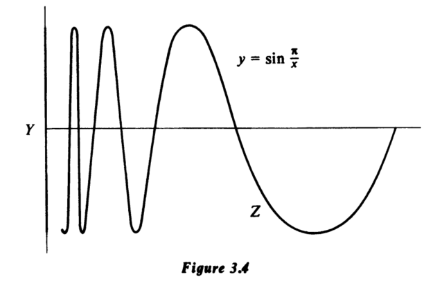

# 3.5 连通性
直观上，“连通”意味着“全部在一个整体中”。因此，如果 $X$ 是一个连通空间，并且将 $X$ 写成两个非空子集 $A \cup B$ 的并集，那么我们期望 $A$ 和 $B$ 要么相交，要么至少在 $X$ 中彼此“邻接”。可以用数学方式表达这一点，即要求以下之一：
$$
\bar{A} \cap B, \quad A \cap \bar{B}
$$
是非空的：换句话说，要么 $A$ 和 $B$ 有一个公共点，要么 $B$ 的某个点是 $A$ 的极限点，或者 $A$ 的某个点是 $B$ 的极限点。例如，如果我们把闭区间 $[0,1]$ 分解为 $[0,\frac{1}{2}) \cup [\frac{1}{2},1]$，那么点 $\frac{1}{2}$ 位于 $[0,\frac{1}{2}) \cap [\frac{1}{2},1]$ 中。

## 定义 3.17：连通空间
一个空间 $X$ 是连通的，如果每当它被分解为两个非空子集 $A \cup B$ 的并集时，总有 $\bar{A} \cap B \neq \varnothing$ 或 $A \cap \bar{B} \neq \varnothing$。

## 定理 3.18
实直线是一个连通空间。

### 证明
假设 $\mathbb{R} = A \cup B$，其中 $A$ 和 $B$ 均为非空集，且 $A \cap B = \varnothing$。我们将证明 $A$ 的某个点是 $B$ 的极限点，或者 $B$ 的某个点是 $A$ 的极限点。选取点 $a \in A$、$b \in B$，并且不失一般性，假设 $a < b$。令 $X$ 为 $A$ 中所有小于 $b$ 的点组成的集合，记 $s$ 为 $X$ 的上确界。这个点 $s$ 可能在也可能不在 $A$ 中；然而，如果 $s$ 不在 $A$ 中，则根据上确界的定义，$s$ 必定在 $\bar{A}$ 中。我们将分别考虑这两种可能性。假设 $s$ 在 $A$ 中，则 $s < b$，并且由于 $s$ 是 $X$ 的上界，所有介于 $s$ 和 $b$ 之间的点都在 $B$ 中。因此，$s$ 是 $B$ 的一个极限点。如果 $s$ 不属于 $A$，则它自动属于 $B$，因为 $A$ 和 $B$ 填满了整个 $\mathbb{R}$。我们前面提到过，在这种情况下 $s$ 是 $A$ 的一个极限点。因此，我们已证明 $\bar{A}$ 与 $B$ 相交，或者 $A$ 与 $\bar{B}$ 相交。

和往常一样，我们说一个拓扑空间的子集是连通的，如果赋予其诱导拓扑后它成为一个连通空间。我们将称实直线的一个子集 $X$ 为**区间**，如果当我们在 $X$ 中取两个不同的点 $a, b \in X$ 时，所有大于 $a$ 且小于 $b$ 的点也都在 $X$ 中。这是区间的通常概念，它包括了开区间、闭区间、半开区间，或者向某个方向无限延伸的可能性。直观上看，区间应该是实直线上唯一的连通子集，因为其他所有子集内部都有“间隙”，由多个不同的部分组成。

## 定理 3.19：实数的连通子集
实直线的一个非空子集是连通的当且仅当它是一个区间。

### 证明
定理 3.18 的证明很容易调整以表明任何区间都是连通的。如果 $X$ 不是一个区间，那么我们可以找到点 $a, b \in X$ 和一个点 $p$，它位于 $X$ 外但满足 $a < p < b$。令 $A$ 表示 $X$ 中所有小于 $p$ 的点组成的子集，令 $B = X - A$。由于 $p$ 不在 $X$ 中，$A$ 在 $X$ 中的闭包中的每个点都小于 $p$，而 $B$ 在 $X$ 中的闭包中的每个点都大于 $p$。因此 $\bar{A} \cap B$ 和 $A \cap \bar{B}$ 都是空集，我们看到 $X$ 不是连通的。

连通性的定义可以用多种方式表述。

## 定理 3.20：连通性的刻画

下列关于空间 $X$ 的条件是等价的：

1. $X$ 是连通的。

2. $X$ 中既是开集又是闭集的子集只有 $X$ 和空集。

3. $X$ 不能表示为两个不相交的非空开集的并集。

4. 不存在从 $X$ 到包含多于一点的离散空间的满连续函数。

### 证明
$1 \Rightarrow 2$:
假设 $X$ 是连通的，令 $A$ 是 $X$ 的一个既是开集又是闭集的子集。若 $B = X - A$，则 $B$ 也是既是开集又是闭集。由于 $A$ 和 $B$ 都是闭集，我们有 $\bar{A} = A$ 且 $\bar{B} = B$，从而 $\bar{A} \cap B = A \cap \bar{B} = A \cap B = \varnothing$。但 $X$ 是连通的，因此 $A$ 和 $B$ 中必有一个为空集，另一个为全空间。这证

$2 \Rightarrow 3$ 的蕴含关系是显然的。

$3 \Rightarrow 4$:
假设 $3$ 成立，令 $Y$ 为一个包含多于一点的离散空间，设 $f: X \to Y$ 是一个满连续函数。将 $Y$ 分解为两个不相交的非空开集的并集 $U \cup V$。那么 $X = (f^{-1}U) \cup (f^{-1}V)$，与 $3$ 矛盾。

$4 \Rightarrow 1$。令 $X$ 为一个满足 $4$ 的空间，假设 $X$ 不连通。将 $X$ 分解为 $A \cup B$，其中 $A$ 和 $B$ 非空，且满足 $\bar{A} \cap B = A \cap \bar{B} = \varnothing$。我们注意到 $A$ 和 $B$ 都是开集，例如，$B$ 是闭集 $\bar{A}$ 的补集，我们定义一个从 $X$ 到实直线子空间 $\{-1,1\}$ 的函数 $f$ 如下：

$$
f(x) =
\begin{cases}
-1 & \text{若 } x \in A \\
1 & \text{若 } x \in B.
\end{cases}
$$

那么 $f$ 是连续且满射的，这与 $X$ 满足 $4$ 相矛盾。

直观上看，一个连续函数不应能将一个空间撕裂成几块（即，将一个连通空间映射到一个不连通的空间）。我们现在可以正式证明这一点。

## 定理 3.21：连续映射保持连通性
连通空间的连续像是连通的 

### 证明
设 $f: X \to Y$ 是一个满连续函数，且假设 $X$ 是连通的。若 $A$ 是 $Y$ 的一个既是开集又是闭集的子集，则 $f^{-1}(A)$ 在 $X$ 中既是开集又是闭集。由于 $X$ 是连通的，$f^{-1}(A)$ 必须是整个 $X$ 或空集，根据定理 3.20 的条件 2。因此 $A$ 等于 $Y$ 或空集，我们证明了 $Y$ 是连通的。

## 推论 3.22

若 $h: X \to Y$ 是一个同胚映射，则 $X$ 是连通的当且仅当 $Y$ 是连通的。简言之，连通性是一个空间的拓扑性质。

## 定理 3.23

设 $X$ 为一个拓扑空间，$Z$ 为其子集。若 $Z$ 是连通的，且 $Z$ 在 $X$ 中稠密，则 $X$ 是连通的。

### 证明

令 $A$ 为 $X$ 的一个既是开集又是闭集的非空子集。由于 $Z$ 在 $X$ 中稠密，我们知道 $Z$ 必须与 $X$ 的每一个非空开子集相交，因此 $A \cap Z$ 是非空的。现在 $A \cap Z$ 在 $Z$ 中既是开集又是闭集，且由于 $Z$ 是连通的，我们推断出 $A \cap Z = Z$，即 $Z \subseteq A$。因此 $X = \bar{Z} \subseteq \bar{A} = A$，得到 $X = A$，如所要求。

## 推论 3.24

若 $Z$ 是拓扑空间 $X$ 的一个连通子集，且 $Z \subseteq Y \subseteq \bar{Z}$，则 $Y$ 是连通的。特别地，$Z$ 的闭包 $\bar{Z}$ 是连通的。

### 证明

注意到 $Z$ 在 $Y$ 中的闭包就是整个 $Y$，并将定理 3.23 应用于对 $Z \subseteq Y$。

我们需要更多的术语。如果 $A$ 和 $B$ 是空间 $X$ 的子集，且 $\bar{A} \cap \bar{B}$ 是空集，我们说 $A$ 和 $B$ 在 $X$ 中是分离的。

## 定理 3.25

设 $\mathscr{F}$ 是空间 $X$ 的一族子集，其并集为整个 $X$。如果 $\mathscr{F}$ 的每个成员都是连通的，并且 $\mathscr{F}$ 中任意两个成员在 $X$ 中都不分离，则 $X$ 是连通的。

### 证明

设 $A$ 是 $X$ 的一个既是开集又是闭集的子集。我们将证明 $A$ 要么是空集，要么等于整个 $X$。$\mathscr{F}$ 的每个成员都是连通的，所以对于 $\mathscr{F}$ 中的任意 $Z$，我们知道 $Z \cap A$ 要么是空集，要么是整个 $Z$。如果对于 $\mathscr{F}$ 中的所有 $Z$，$Z \cap A = \varnothing$，则 $A = \varnothing$。另一种可能是，我们可以找到某个 $\mathscr{F}$ 中的元素 $Z$，使得 $Z \cap A = Z$，即 $Z$ 包含于 $A$ 中。假设 $W$ 是 $\mathscr{F}$ 中的另一个元素。如果 $W \cap A = \varnothing$，则 $W$ 和 $Z$ 在 $X$ 中是分离的。（因为 $W \cap A = \varnothing$ 给出 $\bar{W} \subseteq \overline{X - A}$，而由于 $X - A$ 是闭集，我们有 $\bar{W} \subseteq X - A$。现在将其与 $\bar{Z} \subseteq \bar{A} = A$ 结合。）然而，我们被告知 $\mathscr{F}$ 中没有两个子集在 $X$ 中是分离的。因此，对于所有 $W \in \mathscr{F}$，都有 $W \subseteq A$，且 $A = \bigcup \mathscr{F} = X$。

## 定理 3.26

如果 $X$ 和 $Y$ 是连通空间，则乘积空间 $X \times Y$ 是连通的。

### 证明

如果 $x$ 是 $X$ 的一个点，则子空间 $\{x\} \times Y$ 是连通的，因为它与 $Y$ 同胚。类似地，对于 $Y$ 的任意点 $y$，$X \times \{y\}$ 是连通的。现在 $\{x\} \times Y$ 和 $X \times \{y\}$ 在点 $(x,y)$ 处重叠，因此 $Z(x,y) = (\{x\} \times Y) \cup (X \times \{y\})$ 是连通的。（对空间 $Z(x,y)$ 应用定理 3.25。）同时，$X \times Y = \bigcup_{\substack{x \in X \\ y \in Y}} Z(x,y)$，且任意两个 $Z(x,y)$ 有非空交集。因此，定理 3.25 的第二次应用表明 $X \times Y$ 是连通的。

这个最后的结果立即告诉我们欧几里得 $n$ 维空间是连通的，因为它是有限个实直线副本的乘积。现在考虑单位球面 $S^n$ 在 $\mathbb{E}^{n+1}$ 中，其中 $n \geqslant 1$。如果我们从 $S^n$ 中移除一个点，我们得到一个与 $\mathbb{E}^n$ 同胚的空间。但当 $n \geqslant 1$ 时，$S^n$ 减去一个点的闭包就是整个 $S^n$。因此，根据定理 3.23，$S^n$ 对于 $n \geqslant 1$ 是一个连通空间。我们还看到环面是连通的，因为我们可以将其视为乘积空间 $S^1 \times S^1$。

我们应该指出，如果乘积空间 $X \times Y$ 是连通的，且 $X \times Y$ 非空，则因子 $X$ 和 $Y$ 必须是连通的。这源于投影的连续性。

如果一个空间不是连通的，那么它会分解为连通部分的并集，其中任意两个部分在空间中是分离的。我们称这些部分为**分量**。更正式地说，拓扑空间 $X$ 的一个分量是一个极大的连通子集。

## 定理 3.27

拓扑空间的每个分量是一个闭集，且不同的分量在空间中是相互分离的。

### 证明

设 $C$ 为 $X$ 的一个分量。则 $C$ 是连通的，因此根据推论 3.24，$\bar{C}$ 也是连通的。但 $C$ 是 $X$ 的一个极大连通子集，因此 $C = \bar{C}$，我们看到 $C$ 是闭集。如果 $D$ 是 $X$ 的另一个分量，且 $D$ 在 $X$ 中不与 $C$ 分离，则 $C \cup D$ 是连通的，根据定理 3.25。这与 $C$（和 $D$）的极大性矛盾。

我们注意到，空间的每一个连通子集都包含在一个分量内。因为如果 $A \subseteq X$ 且 $A$ 是连通的，则定义 $C$ 为包含 $A$ 的所有 $X$ 的连通子集的并集。这个集合 $C$ 根据定理 3.25 是连通的，并且根据其构造是极大的。因此 $C$ 是一个包含 $A$ 的分量。

下面一两个例子应该有助于理解。

## 例子

1. 一个连通空间，比如环面，只有一个分量。在另一极端，离散拓扑空间的每个点都是该空间的一个分量。
2. $\mathbb{E}^1 - S^0$ 有三个分量，即 $(-\infty, -1)$、$(-1, 1)$ 和 $(1, \infty)$。对于 $n \geqslant 1$，空间 $\mathbb{E}^{n+1} - S^n$ 有两个分量，由条件 $\|x\| > 1$ 和 $\|x\| < 1$ 给出。
3. 有理数 $\mathbb{Q}$ 的每个点（赋予从实直线诱导的拓扑）是一个分量。注意 $\mathbb{Q}$ 不是一个离散空间。像这样每个点都是一个分量的空间，被称为**完全不连通**的。

# 3.6 道路连通性

## 定义：路径
拓扑空间 $X$ 中的一条**路径**是一个连续函数 $\gamma: [0,1] \to X$。点 $\gamma(0)$ 和 $\gamma(1)$ 分别称为该路径的**起点**和**终点**，而 $\gamma$ 被称为**连接** $\gamma(0)$ 到 $\gamma(1)$。注意，如果 $\gamma^{-1}$ 定义为 $\gamma^{-1}(t) = \gamma(1 - t)$，其中 $0 \leqslant t \leqslant 1$，那么 $\gamma^{-1}$ 是 $X$ 中的一条路径，它连接 $\gamma(1)$ 到 $\gamma(0)$。

## 定义 3.28：道路连通空间

一个空间是**道路连通的**，如果它的任意两点都可以由一条路径连接。

若 $\gamma$ 是 $X$ 中的一条路径，且 $f: X \to Y$ 是一个连续函数，则复合映射

$$
[0,1] \xrightarrow{\gamma} X \xrightarrow{f} Y
$$

是 $Y$ 中的一条路径。从这个观察可以清楚地看出，如果 $h: X \to Y$ 是一个同胚映射，且 $X$ 是道路连通的，则 $Y$ 也是道路连通的。换句话说，道路连通性，如同紧致性和连通性一样，是一个空间的拓扑性质。

## 定理 3.29

一个道路连通的空间是连通的。

### 证明

设 $X$ 是一个道路连通的空间，令 $A$ 是 $X$ 的一个非空子集，它在 $X$ 中既是开集又是闭集。假设 $A$ 不等于整个 $X$，选取点 $x \in A$，$y \in X - A$，并用 $X$ 中的一条路径 $\gamma$ 连接 $x$ 到 $y$。那么 $\gamma^{-1}(A)$ 是 $[0,1]$ 的一个非空真子集（因为 $\gamma(0) = x \in A$，$\gamma(1) = y \notin A$），并且由于 $\gamma$ 的连续性，$\gamma^{-1}(A)$ 在 $[0,1]$ 中既是开集又是闭集。这与 $[0,1]$ 是连通的事实相矛盾。因此，我们最初的假设 $A \neq X$ 必须是错误的，从而有 $A = X$，如所要求。

注意，如果我们有点 $x, y, z$ 在空间 $X$ 中，以及分别连接 $x$ 到 $y$、$y$ 到 $z$ 的路径 $\alpha, \beta$，则由下式定义的路径 $\gamma$：

$$
\gamma(t) =
\begin{cases}
\alpha(2t) & 0 \leqslant t \leqslant \frac{1}{2} \\
\beta(2t - 1) & \frac{1}{2} \leqslant t \leqslant 1
\end{cases}
$$

连接 $x$ 到 $z$。

## 定理 3.30

欧几里得空间的一个连通开子集是道路连通的。

### 证明

设 $X$ 是 $\mathbb{E}^n$ 的一个连通开子集。给定 $x \in X$，记 $U(x)$ 为 $X$ 中所有可以通过一条路径连接到 $x$ 的点的集合。我们的目标是证明 $U(x)$ 就是整个 $X$。由于 $U(x)$ 显然是道路连通的，这将证明该定理。取 $y \in U(x)$，并选择一个完全包含在 $X$ 中的以 $y$ 为中心的球 $B$。如果 $z \in B$，则我们可以在 $X$ 中通过一条直线连接 $z$ 到 $y$，然后沿着从 $y$ 到 $x$ 的路径继续前进。因此 $B$ 包含在 $U(x)$ 中，我们看到 $U(x)$ 在 $X$ 中是开集。此外，$U(x)$ 在 $X$ 中的补集是族 $\{U(y) \mid y \in X - U(x)\}$ 的并集，因此是开集。所以 $U(x)$ 在 $X$ 中是闭集。由于 $X$ 是连通的，且 $U(x)$ 非空（至少包含点 $x$），我们得到 $U(x) = X$。

## 定理
存在连通但不是道路连通的空间。

### 证明
定义

$$
Y = \{(0,y) \in \mathbb{E}^2 \mid -1 \leqslant y \leqslant 1\}
$$

$$
Z = \left\{ \left(x, \sin \frac{\pi}{x}\right) \in \mathbb{E}^2 \mid 0 < x \leqslant 1 \right\}
$$

并令 $X = Y \cup Z$。现在 $Z$ 是一个连通空间，因为它是 $(0,1]$ 在一个连续函数下的像。容易验证 $Z$ 在 $\mathbb{E}^2$ 中的闭包恰好是 $X$，所以 $X$ 是连通的。为了证明 $X$ 不是道路连通的，我们将证明不可能在 $X$ 中用一条路径连接 $Y$ 中的一点到 $Z$ 中的一点。令 $y \in Y$，并令 $\gamma: [0,1] \to X$ 是一条从 $y$ 开始的路径。由于 $Y$ 在 $\mathbb{E}^2$ 中是闭集，$\gamma^{-1}(Y)$ 是闭集，因此在 $[0,1]$ 中是闭集。现在 $\gamma^{-1}(Y)$ 当然非空（它包含 $0$），所以如果我们能证明它在 $[0,1]$ 中是开集，我们就会有 $\gamma^{-1}(Y) = [0,1]$，即 $\gamma([0,1]) \subseteq Y$，如所要求。假设 $t \in \gamma^{-1}(Y)$ 并选择足够小的 $\varepsilon > 0$，使得 $\gamma((t - \varepsilon, t + \varepsilon))$ 包含在以 $\gamma(t)$ 为中心、半径为 $\frac{1}{2}$ 的闭圆盘 $D$ 中。该圆盘与我们的空间 $X$ 的交集由 $y$ 轴上的一个闭区间以及曲线 $y = \sin \frac{\pi}{x}$ 的若干段组成，每一段都同胚于一个闭区间。此外，这些集合中的任意两个在 $D \cap X$ 中彼此分离。因此 $D \cap Y$ 是 $D \cap X$ 的一个分量。由于 $\gamma(t) \in D \cap Y$，且 $(t - \varepsilon, t + \varepsilon)$ 是连通的，我们必须有 $\gamma((t - \varepsilon, t + \varepsilon))$ 全部位于 $D \cap Y$ 中。这证明了 $\gamma^{-1}(Y)$ 在 $[0,1]$ 中是开集，并完成了我们对 $X$ 不是道路连通的验证。

一个空间 $X$ 的**道路分量**（类比“分量”的概念）是 $X$ 的一个极大道路连通子集。每个道路分量都是连通的，因此包含在一个分量内。然而，道路分量通常并不彼此分离，也不一定是闭集。例如，图 3.4 所示空间的道路分量恰好是集合 $Y$ 和 $Z$。它们彼此不分离，且 $Z$ 不是闭集。