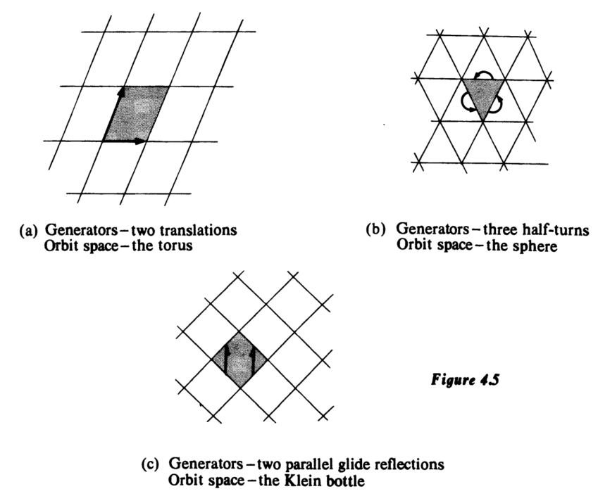

# 4.3 拓扑群
考虑一些除了拓扑结构外还具有群结构的空间。一个典型例子是圆周，可将其视作模为1的复数集合。其拓扑由平面诱导，群结构则由复数乘法构成。注意以下两个映射
$$
S^1 \times S^1 \to S^1, \quad (e^{i\theta}, e^{i\phi}) \mapsto e^{i(\theta + \phi)} \quad \text{(群乘法)}
$$
$$
S^1 \to S^1, \quad e^{i\theta} \mapsto e^{-i\theta} \quad \text{(取逆元)}
$$
都是连续的，因此拓扑结构与代数结构完全相容。

## 定义 4.14

拓扑群 $G$ 是一个豪斯多夫拓扑空间，同时也是一个群，且两种结构相容，即群乘法 $m: G \times G \to G$ 以及将每个元素映射为其逆元的映射 $i: G \to G$ 均连续。

本节内容主要通过例子展开，包括矩阵群的例子。在第4.4节，我们将回到商空间，定义拓扑群在空间上的作用，展示此类作用如何产生商空间，并考察由此得到的各种商空间。

## 拓扑群的例子

1.  **实直线**：群结构为实数加法。
2.  **圆周**：如上所述。
3.  **离散群**：任何抽象群赋予离散拓扑。
4.  **环面**：视为两个圆周的乘积，采用乘积拓扑与乘积群结构。（两个拓扑群的乘积仍为拓扑群。）
5.  **三维球面**：视为四元数空间 $\mathbb{H}$（拓扑同胚于 $\mathbb{E}^4$ 并具有四元数代数结构）中的单位球。
6.  **欧几里得 $n$ 维空间**：记作 $\mathbb{R}^n$ 以强调其作为拓扑群（通常以加法为群结构），而非单纯的拓扑空间 $\mathbb{E}^n$。
7.  **一般线性群 $\mathrm{GL}(n)$**：由实数域上 $n \times n$ 可逆矩阵构成，群结构为矩阵乘法。将矩阵 $A = (a_{ij})$ 与点 $(a_{11}, \dots, a_{nn}) \in \mathbb{E}^{n^2}$ 等同，赋予子空间拓扑。定理(4.12)将验证 $\mathrm{GL}(n)$ 是一个拓扑群。
8.  **正交群 $\mathrm{O}(n)$**：由 $n \times n$ 正交实矩阵构成，其拓扑与代数结构均从 $\mathrm{GL}(n)$ 诱导而来，是 $\mathrm{GL}(n)$ 的子群。其中行列式为 $+1$ 的矩阵构成**特殊正交群** $\mathrm{SO}(n)$。

对于拓扑群，“同构”与“子群”需同时考虑拓扑与代数结构。因此，拓扑群之间的同构既是同胚也是群同构；子群需在代数上是子群，并具有子空间拓扑。

**例**：整数集 $\mathbb{Z}$ 赋予离散拓扑构成 $\mathbb{R}$ 的子群。商群 $\mathbb{R}/\mathbb{Z}$ 赋予商拓扑（划分由 $\mathbb{Z}$ 的陪集给出）同构于圆周 $S^1$。映射 $f: \mathbb{R} \to S^1, f(x)=e^{2\pi i x}$ 是商映射，诱导同胚 $\mathbb{R}/\mathbb{Z} \cong S^1$，该同胚也是群同构。

**例**：将每个 $(n-1)\times(n-1)$ 正交矩阵 $A$ 对应到 $n\times n$ 矩阵 $\begin{pmatrix}1 & 0 \\ 0 & A\end{pmatrix}$，表明 $\mathrm{O}(n-1)$ 同构于 $\mathrm{O}(n)$ 的一个子群。

设 $G$ 为拓扑群，$x \in G$。映射 $L_x(g)=xg$（左平移）与 $R_x(g)=gx$（右平移）均为同胚。这表明拓扑群具有“齐性”：任意两点 $x,y \in G$，存在同胚 $L_{yx^{-1}}$ 将 $x$ 映至 $y$，故 $G$ 在各点附近局部拓扑相同。

## 定理 4.15

设 $G$ 为拓扑群，$K$ 为包含单位元 $e$ 的连通分支。则 $K$ 是 $G$ 的闭正规子群。对于 $G = \mathrm{O}(n)$，有 $K = \mathrm{SO}(n)$（证明稍后给出）。

*证明*：连通分支总是闭的。对任意 $x \in K$，集合 $Kx^{-1}=R_{x^{-1}}(K)$ 连通且包含 $e$，故 $Kx^{-1} \subseteq K$，从而 $KK^{-1}=K$，即 $K$ 为子群。对任意 $g \in G$，$gKg^{-1}=R_{g^{-1}}L_g(K)$ 连通且包含 $e$，故 $gKg^{-1} \subseteq K$，即 $K$ 正规。

## 定理 4.16：单位元的邻域是生成元

在连通拓扑群中，单位元的任意邻域都能生成整个群。

*证明*：设 $G$ 连通，$V$ 是 $e$ 的邻域，令 $H=\langle V \rangle$。对任意 $h \in H$，邻域 $hV=L_h(V) \subseteq H$，故 $H$ 开。下证 $G-H$ 亦开：若 $g \in G-H$，则邻域 $gV$ 若与 $H$ 相交将导致 $g \in H$，矛盾，故 $gV \subseteq G-H$。由于 $G$ 连通且 $H$ 非空，必有 $G-H=\varnothing$，即 $G=H$。

## 定理 4.17

矩阵群 $\mathrm{GL}(n)$ 是拓扑群。

*证明*：记 $\mathbb{M}$ 为所有 $n\times n$ 实矩阵集合，通过对应 $(a_{ij}) \leftrightarrow (a_{11},\dots,a_{nn}) \in \mathbb{E}^{n^2}$ 赋予拓扑。矩阵乘法 $m: \mathbb{M} \times \mathbb{M} \to \mathbb{M}$ 连续，因为其各分量 $\pi_{ij} \circ m(A,B)=\sum_k a_{ik}b_{kj}$ 是多项式，故连续。$\mathrm{GL}(n)$ 取子空间拓扑，则乘法 $\mathrm{GL}(n) \times \mathrm{GL}(n) \to \mathrm{GL}(n)$ 连续。

验证逆映射 $i: \mathrm{GL}(n) \to \mathrm{GL}(n)$ 连续：$i$ 的分量映射将 $A$ 映至 $A^{-1}$ 的 $(j,k)$ 元，即 $(1/\det A)$ 乘以 $A$ 的相应余子式。由于 $\det A$ 及余子式均为 $A$ 的元素的多元多项式，且 $\det A \ne 0$，故各分量连续，从而 $i$ 连续。

$\mathrm{GL}(n)$ 是行列式函数 $\det: \mathbb{M} \to \mathbb{R}$ 下非零实数的原像，故为 $\mathbb{M}$ 的开子集，非紧。其可划分为行列式正、负两个连通分支。

## 定理 4.18

$\mathrm{O}(n)$ 与 $\mathrm{SO}(n)$ 是紧致的。

*证明*：$\mathrm{O}(n)$ 由满足 $AA^t = I$ 的矩阵构成。定义映射 $f_{ik}: \mathbb{M} \to \mathbb{E}^1$，$f_{ik}(A)=\sum_j a_{ij}a_{kj}$。则 $\mathrm{O}(n)$ 是所有 $f_{ik}^{-1}(0) (i\ne k)$ 与 $f_{ii}^{-1}(1)$ 的交集，故为 $\mathbb{M}$ 中闭集。由条件 $\sum_j a_{ij}^2=1$ 知矩阵各元绝对值 $\le 1$，故 $\mathrm{O}(n)$ 有界，从而是 $\mathbb{E}^{n^2}$ 的紧子集。$\mathrm{SO}(n)$ 作为 $\mathrm{O}(n)$ 的闭子集亦紧。

!!! note 注记
    $\mathrm{SO}(2) \cong S^1$（对应 $e^{i\theta} \leftrightarrow \begin{pmatrix}\cos\theta & -\sin\theta \\ \sin\theta & \cos\theta\end{pmatrix}$）；$\mathrm{SO}(3) \cong P^3$（通过将单位四元数 $S^3$ 共轭作用视为三维旋转，诱导商映射 $S^3 \to \mathrm{SO}(3)$，其核为 $\{\pm1\}$，故得同构 $P^3 = S^3/\{\pm1\} \cong \mathrm{SO}(3)$）。

# 4.4 轨道空间

无限循环群 $\mathbb{Z}$ 可自然地视作实直线上的一个同胚变换群，其中每个整数 $n \in \mathbb{Z}$ 确定一个平移变换 $x \mapsto x + n$。

考虑正交矩阵群 $O(n)$，每个矩阵诱导出欧几里得 $n$ 维空间的一个线性变换。由于 $O(n)$ 的元素可逆且保持欧几里得度量（因而将单位向量映为单位向量），每个正交矩阵给出了单位球面 $S^{n-1}$ 到自身的同胚。正交群在球面上的作用与 $O(n)$ 及 $S^{n-1}$ 的拓扑相容，因为映射
$$
O(n) \times S^{n-1} \to S^{n-1}, \quad (A, x) \mapsto Ax
$$
连续。我们称 $O(n)$ “作用”于空间 $S^{n-1}$。

若赋予 $\mathbb{Z}$ 由 $\mathbb{R}$ 诱导的自然离散拓扑，则上述两例均符合以下一般框架。

## 定义 4.14

设 $G$ 为拓扑群，$X$ 为拓扑空间。若满足以下条件，则称 $G$ 作为同胚变换群作用于 $X$：

1.  对所有 $g,h \in G$ 及 $x \in X$，有 $hg(x) = h(g(x))$；
2.  对所有 $x \in X$，有 $e(x) = x$，其中 $e$ 是 $G$ 的单位元；
3.  映射 $G \times X \to X$，$(g,x) \mapsto g(x)$，连续。

对任意 $x \in X$，每个 $g \in G$ 对应的同胚或固定 $x$，或将其映至新点 $g(x)$。当 $g$ 取遍 $G$ 时，所有像 $g(x)$ 构成的子集称为 $x$ 的**轨道**，记作 $O(x)$。若两轨道相交，则它们必重合。关系 $x \sim y \iff \exists g \in G,\ x = g(y)$ 是 $X$ 上的等价关系，其等价类恰为轨道。因此轨道构成 $X$ 的一个划分，相应的商空间称为**轨道空间**，记作 $X/G$。构造 $X/G$ 即通过 $G$ “除” $X$：两点被视为相同当且仅当它们相差某个同胚 $x \mapsto g(x)$。

在第一例中，实数 $x$ 的轨道包含所有形如 $x + n$（$n \in \mathbb{Z}$）的点。故在构成 $\mathbb{R}/\mathbb{Z}$ 时，我们将 $\mathbb{R}$ 中相差整数的点等同，如前节所述，得到轨道空间为圆周。

球面上的正交作用是**传递作用**之例，即任意点的轨道均为整个空间（此处为 $S^{n-1}$）。证明简述如下：设 $e_1, e_2, \dots, e_n$ 为 $\mathbb{E}^n$ 的标准正交基，对任意 $x \in S^{n-1}$，构造以 $x$ 为首个基向量的新正交基。记该新基相对于 $e_1, e_2, \dots, e_n$ 的过渡矩阵为 $A$，则 $A$ 正交且 $A(e_1) = x$。这即表明 $e_1$ 的轨道为整个 $S^{n-1}$。当作用传递（仅有一个轨道）时，轨道空间显然为单点。

## 更多示例

1.  **环面**：将第一例与其自身作积，自然地得到 $\mathbb{Z} \times \mathbb{Z}$ 在平面上的作用：$(m,n) \in \mathbb{Z} \times \mathbb{Z}$ 将 $(x,y) \in \mathbb{E}^2$ 映至 $(x+m, y+n)$。轨道空间是两个圆周的积，即环面。几何上，此作用保持由过整数坐标点的水平与垂直线划分的单位正方形网格。每个正方形包含每个轨道的一点，在商映射 $\pi: \mathbb{E}^2 \to \mathbb{E}^2 / (\mathbb{Z} \times \mathbb{Z}) = T$ 下，正方形的边按通常方式等同，得到环面 $T$。

2.  **射影空间**：定义 $\mathbb{Z}_2$ 在 $n$ 维球面 $S^n$ 上的作用，使其轨道空间为射影空间 $P^n$。$\mathbb{Z}_2$ 仅含两个元素：单位元对应恒等同胚，生成元对应**对径映射** $x \mapsto -x$（注意此同胚的平方为恒等）。轨道为对径点对，轨道空间即对应第 4.2 节中 $P^n$ 的一种描述。

3.  **环面上的三种 $\mathbb{Z}_2$ 作用**：考虑 $\mathbb{E}^3$ 中由圆 $(x - 3)^2 + z^2 = 1$ 绕 $z$ 轴旋转生成的环面 $T$。令 $g$ 为 $\mathbb{Z}_2$ 的生成元，定义：
    1.  $g(x,y,z) = (x, -y, -z)$（绕 $x$ 轴旋转 $\pi$）；
    2.  $g(x,y,z) = (-x, -y, z)$（绕 $z$ 轴旋转 $\pi$）；
    3.  $g(x,y,z) = (-x, -y, -z)$（关于原点的反射）。
    每个同胚确定 $\mathbb{Z}_2$ 在 $T$ 上的一个作用，其轨道空间分别为球面、环面与克莱因瓶（见图 4.3）。每种情形下，$g$ 交换两柱面 $C_1$ 与 $C_2$，故为构造轨道空间可忽略 $C_2$，仅需在 $C_1$ 的边界圆上进行适当等同。

4.  **子群的左作用与右作用**：设 $G$ 为拓扑群，$H \leq G$。$H$ 通过左平移 $L_h(g) = hg$ 作用于 $G$，映射 $H \times G \to G$ 连续（因乘法连续）。两元素 $g, g'$ 属于同一轨道当且仅当 $g' \in Hg$，故轨道为 $H$ 在 $G$ 中的右陪集。类似地，$H$ 也有右作用 $(h,g) \mapsto R_{h^{-1}}(g) = gh^{-1}$，此时轨道为左陪集。这两种轨道空间同胚，均记作 $G/H$。

5.  **正交群的齐性空间**：回到 $O(n)$ 在 $S^{n-1}$ 上的作用。若 $A \in O(n)$ 满足 $A(e_1) = e_1$，则 $A$ 形如
    $$
    \begin{pmatrix}
    1 & 0 \\
    0 & B
    \end{pmatrix},
    $$
    其中 $B$ 正交；反之亦然。故固定 $e_1$ 的子群同构于 $O(n-1)$。定义连续满射 $f: O(n) \to S^{n-1}$，$f(A)=A(e_1)$。由于 $O(n)$ 紧致且 $S^{n-1}$ 豪斯多夫，$f$ 为商映射（推论 4.4）。对 $x \in S^{n-1}$，取 $A \in O(n)$ 使 $A(e_1)=x$，则 $f^{-1}(x)$ 恰为左陪集 $AO(n-1)$。故 $f$ 诱导的划分与子群 $O(n-1)$ 的左陪集分解一致，由定理 4.2 知 $O(n)/O(n-1) \cong S^{n-1}$。类似有 $SO(n)/SO(n-1) \cong S^{n-1}$。
    由此可归纳证明 $SO(n)$ 连通：$SO(1)$ 为单点；对 $n \geq 1$，$S^n$ 连通，且由以下定理保证归纳步骤。

    **定理 4.15** 设 $G$ 作用于 $X$。若 $G$ 与 $X/G$ 均连通，则 $X$ 连通。
    *证明概要*：若 $X$ 可分解为两非空不相交开子集 $U, V$ 之并，则由于商映射 $\pi$ 将开集映为开集且 $X/G$ 连通，$\pi(U)$ 与 $\pi(V)$ 必相交。取 $\pi(x) \in \pi(U) \cap \pi(V)$，则 $U \cap O(x)$ 与 $V \cap O(x)$ 非空且构成轨道 $O(x)$ 的一个分割。但 $O(x)$ 作为连续映射 $g \mapsto g(x)$ 的像连通，矛盾。

6.  **透镜空间**：设 $p, q$ 为互素整数。视三维球面为复二维空间中的单位球面：
    $$
    S^3 = \{(z_0, z_1) \in \mathbb{C}^2 \mid |z_0|^2 + |z_1|^2 = 1\}.
    $$
    令 $g$ 为循环群 $\mathbb{Z}_p$ 的生成元，定义 $\mathbb{Z}_p$ 在 $S^3$ 上的作用为
    $$
    g(z_0, z_1) = (e^{2\pi i / p} z_0, e^{2\pi i q / p} z_1).
    $$
    $g$ 作用 $p$ 次后回到恒等。商空间 $S^3/\mathbb{Z}_p$ 称为**透镜空间**，记作 $L(p,q)$。它是局部欧几里得的三维流形，其基本群同构于 $\mathbb{Z}_p$。

7.  **环面上的无理流**：此例给出实直线在环面上的一个作用，其中每条轨道是环面的一个稠密真子集。将环面等同于 $S^1 \times S^1$，定义 $r \in \mathbb{R}$ 诱导的同胚为
    $$
    (e^{2\pi i x}, e^{2\pi i y}) \mapsto (e^{2\pi i (x + r)}, e^{2\pi i (y + r\sqrt{2})}).
    $$
    令 $\pi: \mathbb{E}^2 \to S^1 \times S^1$ 为商映射 $(x,y) \mapsto (e^{2\pi i x}, e^{2\pi i y})$，则作用的轨道即 $\pi$ 下平面中斜率为 $\sqrt{2}$ 的直线的像。由于 $\sqrt{2}$ 无理，$\pi$ 限制在此类直线上为单射。考察点 $\pi(0,0)$ 的轨道：它是过原点（或任意整点）斜率为 $\sqrt{2}$ 的直线在 $\pi$ 下的像。该轨道在环面上反复缠绕，构成一个稠密集但非整个环面。此作用称为环面上的**无理流**，轨道称为**流线**。

8.  **平面晶体学群**：考虑保持平面某种凸多边形铺砌图案的等距变换群。图 4.5 给出三例生成元示意：平移用箭头 $\longrightarrow$ 表示；**滑动反射**（沿直线的反射复合沿该直线的平移）用半箭头 $\longrightarrow$ 表示；绕线段中点的 $180^\circ$ 旋转（**半转**）用 $\curvearrowright$ 表示。每图中阴影区域为该群的**基本区域**，即其在所有群元素下的像铺满平面，且任意两像之交仅含边界点。基本区域不唯一。
    1.  生成元：两个平移；轨道空间：环面。
    2.  生成元：三个半转；轨道空间：球面。
    3.  生成元：两个平行滑动反射；轨道空间：克莱因瓶。

    

    这些群可置于以下统一框架：平面等距变换群可表为有序对 $(\theta, \mathbf{v})$，其中 $\theta \in O(2)$，$\mathbf{v} \in \mathbb{E}^2$。作用为 $(\theta, \mathbf{v})(\mathbf{x}) = \theta(\mathbf{x}) + \mathbf{v}$，群乘法为 $(\theta, \mathbf{v})(\phi, \mathbf{w}) = (\theta\phi, \theta(\mathbf{w}) + \mathbf{v})$。赋予其 $O(2) \times \mathbb{E}^2$ 的乘积拓扑，所得拓扑群称为**欧几里得群** $E(2)$（代数结构为 $O(2)$ 与 $\mathbb{E}^2$ 的半直积）。

    若 $G$ 是 $E(2)$ 的离散子群（诱导拓扑使 $G$ 离散），且轨道空间 $\mathbb{E}^2/G$ 紧致，则称 $G$ 为**平面晶体学群**。上述三例均为平面晶体学群。对这样的 $G$，若取 $p \in \mathbb{E}^2$ 不被任何非单位元固定，则集合
    $$
    \{x \in \mathbb{E}^2 \mid \|x - p\| \leqslant \|x - g(p)\|,\ \forall g \in G\}
    $$
    是一个凸多边形基本区域，且 $G$ 是平面对称群的一个有限指数子群。$\mathbb{E}^2/G$ 的紧致性保证该区域有界。

    平面晶体学群可完全分类，共 17 个不同同构类。高维晶体学群可类似定义，对固定维数，其同构类数目有限。